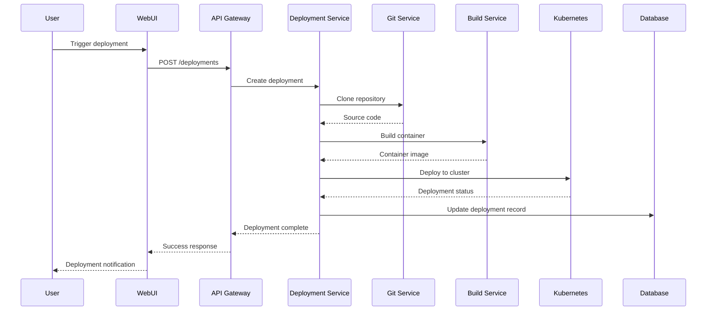
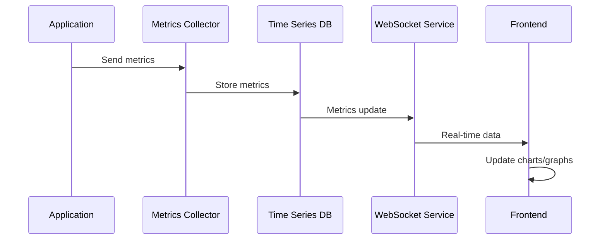

# Platform Architecture Analysis: Railway.com-like System

## 🏗 High-Level Architecture Overview

Railway.com operates as a modern Platform-as-a-Service (PaaS) built on microservices architecture with container orchestration at its core. Understanding this architecture is crucial for building a similar platform.

## 🎯 Core System Components

### **1. Frontend Layer**
```
┌─────────────────────────────────────────────────────────┐
│                  Web Dashboard                          │
│  ┌─────────────┐  ┌─────────────┐  ┌─────────────┐    │
│  │   Project   │  │  Deployment │  │  Monitoring │    │
│  │ Management  │  │   Console   │  │ Dashboard   │    │
│  └─────────────┘  └─────────────┘  └─────────────┘    │
│                                                         │
│  React/TypeScript + WebSocket Connections              │
└─────────────────────────────────────────────────────────┘
```

**Key Features:**
- Single-page application built with React/TypeScript
- Real-time updates via WebSocket connections
- Project management interface
- Live deployment logs and metrics
- Resource usage monitoring

### **2. API Gateway Layer**
```
┌─────────────────────────────────────────────────────────┐
│                    API Gateway                          │
│  ┌─────────────┐  ┌─────────────┐  ┌─────────────┐    │
│  │   GraphQL   │  │ REST APIs   │  │  WebSocket  │    │
│  │   Endpoint  │  │             │  │   Gateway   │    │
│  └─────────────┘  └─────────────┘  └─────────────┘    │
│                                                         │
│  Authentication, Rate Limiting, Request Routing        │
└─────────────────────────────────────────────────────────┘
```

**Responsibilities:**
- Request authentication and authorization
- Rate limiting and DDoS protection
- Request routing to appropriate microservices
- Response aggregation and caching
- API versioning and documentation

### **3. Microservices Layer**

#### **Deployment Service**
```go
// Core deployment engine
type DeploymentService struct {
    GitService     GitService
    BuildService   BuildService
    ContainerService ContainerService
    K8sClient      kubernetes.Interface
}

func (d *DeploymentService) Deploy(req DeploymentRequest) error {
    // 1. Clone repository
    repo := d.GitService.Clone(req.RepoURL, req.Branch)
    
    // 2. Detect buildpack/Dockerfile
    buildConfig := d.BuildService.DetectBuildpack(repo)
    
    // 3. Build container image
    image := d.BuildService.Build(repo, buildConfig)
    
    // 4. Deploy to Kubernetes
    return d.K8sClient.Deploy(image, req.Environment)
}
```

**Key Features:**
- Git repository integration (GitHub, GitLab, Bitbucket)
- Automatic buildpack detection
- Multi-language support (Node.js, Python, Go, Rust, etc.)
- Environment variable management
- Rolling deployments with zero downtime

#### **Database Service**
```go
type DatabaseService struct {
    PostgreSQLManager DatabaseManager
    MySQLManager     DatabaseManager
    RedisManager     DatabaseManager
    MongoManager     DatabaseManager
}

type DatabaseManager interface {
    Create(dbConfig DatabaseConfig) (*Database, error)
    Backup(dbID string) error
    Restore(dbID string, backupID string) error
    Scale(dbID string, resources ResourceSpec) error
    Monitor(dbID string) (*Metrics, error)
}
```

**Capabilities:**
- Multi-database support (PostgreSQL, MySQL, Redis, MongoDB)
- Automated backups and point-in-time recovery
- Connection pooling and performance optimization
- Database scaling (vertical and horizontal)
- Security isolation between tenants

#### **User Management Service**
```go
type UserService struct {
    AuthProvider  AuthProvider
    RBAC         RoleBasedAccessControl
    TeamManager  TeamManager
    BillingService BillingService
}

type AuthProvider interface {
    Register(user User) error
    Login(email, password string) (*Token, error)
    ValidateToken(token string) (*User, error)
    RefreshToken(refreshToken string) (*Token, error)
}
```

**Features:**
- OAuth2 and JWT-based authentication
- Role-based access control (Owner, Admin, Member)
- Team and organization management
- Usage tracking and billing integration
- API key management

#### **Monitoring Service**
```go
type MonitoringService struct {
    MetricsCollector prometheus.Collector
    LogAggregator   LogAggregator
    AlertManager    AlertManager
    NotificationService NotificationService
}

func (m *MonitoringService) CollectMetrics() {
    // CPU, Memory, Network, Disk I/O
    // Application-specific metrics
    // Custom user-defined metrics
}
```

**Monitoring Capabilities:**
- Real-time resource usage metrics
- Application performance monitoring (APM)
- Custom metrics and alerting
- Log aggregation and search
- Uptime monitoring and SLA tracking

### **4. Container Orchestration Layer**

#### **Kubernetes Architecture**
```yaml
# Production-ready Kubernetes setup
apiVersion: v1
kind: Namespace
metadata:
  name: railway-workloads
---
apiVersion: apps/v1
kind: Deployment
metadata:
  name: user-app
  namespace: railway-workloads
spec:
  replicas: 3
  selector:
    matchLabels:
      app: user-app
      tenant: user-123
  template:
    metadata:
      labels:
        app: user-app
        tenant: user-123
    spec:
      securityContext:
        runAsNonRoot: true
        runAsUser: 1000
      containers:
      - name: app
        image: registry.railway.internal/user-123/app:latest
        resources:
          requests:
            memory: "128Mi"
            cpu: "100m"
          limits:
            memory: "512Mi"
            cpu: "500m"
        env:
        - name: DATABASE_URL
          valueFrom:
            secretKeyRef:
              name: user-123-db-secret
              key: url
```

**Key Components:**
- **Namespaces**: Tenant isolation and resource quotas
- **Deployments**: Application lifecycle management
- **Services**: Internal service discovery and load balancing
- **Ingress**: External traffic routing and SSL termination
- **Secrets**: Secure environment variable management

### **5. Infrastructure Layer**

#### **Multi-Cloud Architecture**
```hcl
# Terraform infrastructure configuration
provider "aws" {
  region = var.primary_region
}

provider "google" {
  project = var.gcp_project_id
  region  = var.secondary_region
}

# EKS Cluster (Primary)
module "eks_cluster" {
  source = "./modules/eks"
  
  cluster_name = "railway-primary"
  node_groups = {
    general = {
      instance_types = ["m5.large", "m5.xlarge"]
      min_size      = 3
      max_size      = 20
      desired_size  = 5
    }
    compute = {
      instance_types = ["c5.large", "c5.xlarge"]
      min_size      = 0
      max_size      = 50
      desired_size  = 0
    }
  }
}

# GKE Cluster (Secondary)
module "gke_cluster" {
  source = "./modules/gke"
  
  cluster_name = "railway-secondary"
  # Similar configuration for disaster recovery
}
```

**Infrastructure Components:**
- **Compute**: Auto-scaling Kubernetes clusters across multiple regions
- **Storage**: Persistent volumes, object storage, and CDN integration
- **Networking**: VPC, load balancers, and service mesh
- **Security**: IAM, encryption at rest and in transit, network policies

### **6. Data Layer Architecture**

#### **Multi-Tenant Database Design**
```sql
-- Tenant isolation strategy
CREATE SCHEMA tenant_123;

-- User applications table
CREATE TABLE tenant_123.applications (
    id UUID PRIMARY KEY DEFAULT gen_random_uuid(),
    name VARCHAR(255) NOT NULL,
    repository_url VARCHAR(500),
    deployment_config JSONB,
    created_at TIMESTAMP DEFAULT NOW(),
    updated_at TIMESTAMP DEFAULT NOW()
);

-- Deployment history
CREATE TABLE tenant_123.deployments (
    id UUID PRIMARY KEY DEFAULT gen_random_uuid(),
    application_id UUID REFERENCES tenant_123.applications(id),
    status VARCHAR(50) NOT NULL,
    commit_hash VARCHAR(40),
    environment VARCHAR(50),
    logs TEXT,
    created_at TIMESTAMP DEFAULT NOW()
);

-- Resource usage metrics
CREATE TABLE metrics.resource_usage (
    tenant_id UUID NOT NULL,
    application_id UUID NOT NULL,
    timestamp TIMESTAMP NOT NULL,
    cpu_usage DECIMAL(5,2),
    memory_usage DECIMAL(10,2),
    network_in BIGINT,
    network_out BIGINT,
    PRIMARY KEY (tenant_id, application_id, timestamp)
) PARTITION BY RANGE (timestamp);
```

**Data Architecture Patterns:**
- **Schema-based multi-tenancy**: Each customer gets their own schema
- **Time-series data**: Metrics stored in time-partitioned tables
- **Event sourcing**: All state changes stored as immutable events
- **CQRS**: Separate read and write data models

## 🔄 Request Flow Architecture

### **Deployment Flow**


### **Real-time Monitoring Flow**


## 🛡 Security Architecture

### **Multi-Layered Security**
```
┌─────────────────────────────────────────────────────────┐
│                  Security Layers                        │
│                                                         │
│  ┌─ Edge Security ─────────────────────────────────┐   │
│  │ • DDoS Protection (CloudFlare)                  │   │
│  │ • WAF (Web Application Firewall)                │   │
│  │ • Rate Limiting                                  │   │
│  └─────────────────────────────────────────────────┘   │
│                                                         │
│  ┌─ Application Security ──────────────────────────┐   │
│  │ • OAuth2 + JWT Authentication                   │   │
│  │ • Role-Based Access Control (RBAC)              │   │
│  │ • API Rate Limiting                             │   │
│  └─────────────────────────────────────────────────┘   │
│                                                         │
│  ┌─ Infrastructure Security ───────────────────────┐   │
│  │ • Network Policies (Kubernetes)                 │   │
│  │ • Pod Security Standards                        │   │
│  │ • Secrets Management (Vault)                    │   │
│  └─────────────────────────────────────────────────┘   │
│                                                         │
│  ┌─ Data Security ─────────────────────────────────┐   │
│  │ • Encryption at Rest (AES-256)                  │   │
│  │ • Encryption in Transit (TLS 1.3)               │   │
│  │ • Database Row-Level Security                   │   │
│  └─────────────────────────────────────────────────┘   │
└─────────────────────────────────────────────────────────┘
```

### **Tenant Isolation Strategy**
```go
type TenantIsolation struct {
    NetworkPolicies  NetworkPolicyManager
    ResourceQuotas   ResourceQuotaManager
    SecurityContext  SecurityContextManager
    DataIsolation   DataIsolationManager
}

func (t *TenantIsolation) IsolateWorkload(tenantID string, workload Workload) error {
    // 1. Network isolation
    if err := t.NetworkPolicies.Apply(tenantID, workload); err != nil {
        return fmt.Errorf("network isolation failed: %w", err)
    }
    
    // 2. Resource limits
    if err := t.ResourceQuotas.Apply(tenantID, workload); err != nil {
        return fmt.Errorf("resource quota failed: %w", err)
    }
    
    // 3. Security context
    if err := t.SecurityContext.Apply(tenantID, workload); err != nil {
        return fmt.Errorf("security context failed: %w", err)
    }
    
    // 4. Data isolation
    return t.DataIsolation.Apply(tenantID, workload)
}
```

## ⚡ Performance & Scaling Architecture

### **Auto-Scaling Strategy**
```yaml
# Horizontal Pod Autoscaler
apiVersion: autoscaling/v2
kind: HorizontalPodAutoscaler
metadata:
  name: app-hpa
spec:
  scaleTargetRef:
    apiVersion: apps/v1
    kind: Deployment
    name: user-app
  minReplicas: 1
  maxReplicas: 10
  metrics:
  - type: Resource
    resource:
      name: cpu
      target:
        type: Utilization
        averageUtilization: 70
  - type: Resource
    resource:
      name: memory
      target:
        type: Utilization
        averageUtilization: 80
  behavior:
    scaleUp:
      stabilizationWindowSeconds: 30
      policies:
      - type: Percent
        value: 100
        periodSeconds: 15
    scaleDown:
      stabilizationWindowSeconds: 300
      policies:
      - type: Percent
        value: 10
        periodSeconds: 60
```

### **Caching Strategy**
```
┌─────────────────────────────────────────────────────────┐
│                 Caching Layers                          │
│                                                         │
│  ┌─ CDN Cache (CloudFlare) ──────────────────────┐     │
│  │ • Static assets (JS, CSS, images)              │     │
│  │ • API responses (with proper headers)          │     │
│  │ • Geographic distribution                      │     │
│  └────────────────────────────────────────────────┘     │
│                                                         │
│  ┌─ Application Cache (Redis) ────────────────────┐     │
│  │ • Session data                                  │     │
│  │ • Frequently accessed data                     │     │
│  │ • API response caching                         │     │
│  └────────────────────────────────────────────────┘     │
│                                                         │
│  ┌─ Database Cache ───────────────────────────────┐     │
│  │ • Query result caching                         │     │
│  │ • Connection pooling                           │     │
│  │ • Read replicas                                │     │
│  └────────────────────────────────────────────────┘     │
└─────────────────────────────────────────────────────────┘
```

## 🔍 Observability Architecture

### **Metrics, Logs, and Traces**
```go
type ObservabilityStack struct {
    Metrics MetricsCollector  // Prometheus
    Logs    LogCollector     // Loki/ElasticSearch
    Traces  TraceCollector   // Jaeger
    Alerts  AlertManager     // AlertManager
}

func (o *ObservabilityStack) InstrumentService(service Service) {
    // Add Prometheus metrics
    prometheus.MustRegister(
        prometheus.NewCounterVec("http_requests_total", "Total HTTP requests", []string{"method", "status"}),
        prometheus.NewHistogramVec("http_request_duration", "HTTP request duration", []string{"method"}),
    )
    
    // Add structured logging
    logger := logrus.WithFields(logrus.Fields{
        "service": service.Name,
        "version": service.Version,
    })
    
    // Add distributed tracing
    tracer := opentracing.GlobalTracer()
    
    service.SetObservability(o)
}
```

## 🏆 Key Architectural Decisions

### **1. Microservices vs Monolith**
**Decision**: Microservices architecture
**Rationale**: 
- Independent scaling of components
- Technology flexibility per service
- Team autonomy and faster development
- Fault isolation

### **2. Container Orchestration**
**Decision**: Kubernetes
**Rationale**:
- Industry standard for container orchestration
- Rich ecosystem and tooling
- Multi-cloud portability
- Strong security and networking features

### **3. Database Strategy**
**Decision**: Multi-database approach with PostgreSQL as primary
**Rationale**:
- PostgreSQL for relational data and ACID compliance
- Redis for caching and session storage
- Time-series databases for metrics
- Flexibility to add specialized databases

### **4. Programming Languages**
**Decision**: Go for backend services, TypeScript for frontend
**Rationale**:
- Go: High performance, excellent concurrency, cloud-native
- TypeScript: Type safety, excellent tooling, React ecosystem

## 📊 Architecture Metrics

| Component | Availability Target | Response Time | Throughput |
|-----------|-------------------|---------------|------------|
| **API Gateway** | 99.99% | < 100ms | 10,000 RPS |
| **Deployment Service** | 99.9% | < 30s (deployment) | 100 concurrent |
| **Database Service** | 99.99% | < 50ms | 5,000 QPS |
| **Monitoring Service** | 99.9% | < 200ms | 50,000 metrics/sec |

## 🎯 Next Steps

This architecture analysis provides the foundation for understanding how to build a Railway.com-like platform. The next documents will dive deeper into:

1. **[Technology Stack Requirements](./technology-stack-requirements.md)** - Specific technology choices
2. **[Implementation Guide](./implementation-guide.md)** - Step-by-step development plan
3. **[Network & Security Architecture](./network-security-architecture.md)** - Detailed security patterns

---

**Navigation:**
- **Previous:** [Executive Summary](./executive-summary.md)
- **Next:** [Technology Stack Requirements](./technology-stack-requirements.md)
- **Home:** [Railway Platform Creation](./README.md)