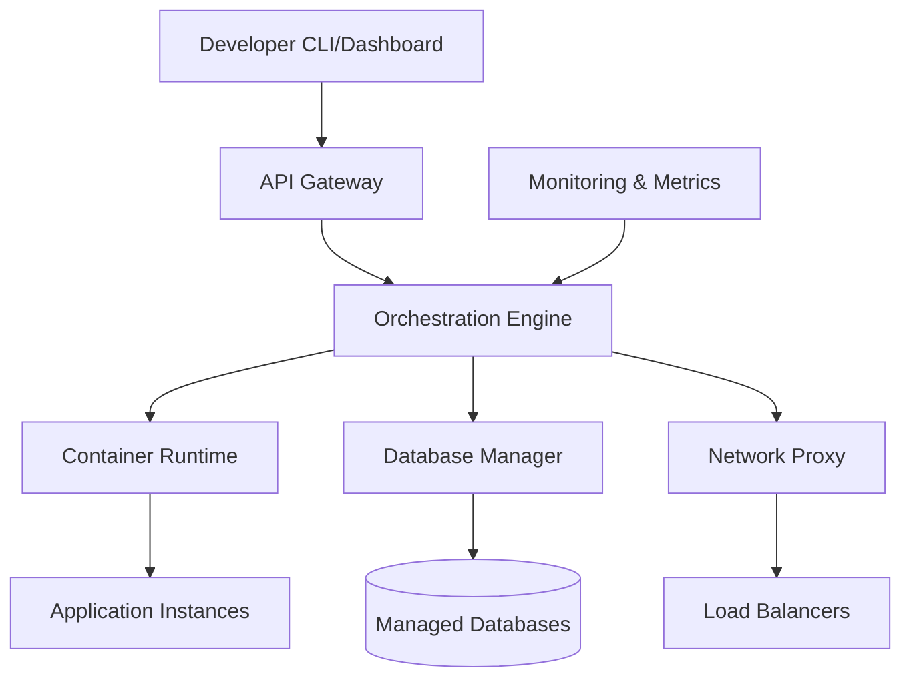

# Executive Summary - Railway.com Platform Research

## 🎯 Key Findings

**Validation of Learning Requirements**: Building a Railway.com-like platform absolutely requires comprehensive expertise across **Full Stack Web Development**, **DevOps/Cloud Infrastructure**, **Network Engineering**, and **Security**. This is not just recommended—it's essential for creating a production-ready PaaS platform.

## 🚀 What is Railway.com?

Railway is a modern Platform-as-a-Service (PaaS) that simplifies application deployment and infrastructure management. Founded in 2020 by Jake Cooper, it has raised over $30M in funding and serves thousands of developers worldwide.

**Core Value Proposition:**
- **One-click deployments** from Git repositories
- **Automatic scaling** based on traffic and resource usage
- **Zero-config databases** (PostgreSQL, MySQL, Redis, MongoDB)
- **Built-in CI/CD** with Git integration
- **Developer-friendly pricing** with usage-based billing

## 🏗️ Platform Architecture Overview

### High-Level System Components

**Core Technical Architecture:**
1. **API Layer**: RESTful API with GraphQL for complex queries
2. **Orchestration Engine**: Kubernetes-based container management
3. **Edge Network**: Global CDN with intelligent routing
4. **Database Layer**: Managed PostgreSQL, Redis, and other databases
5. **Monitoring Stack**: Real-time metrics, logging, and alerting
6. **Security Layer**: OAuth2, network isolation, TLS termination

## 💡 Critical Skills Validation

### ✅ Full Stack Web Development (Essential)
- **Frontend Dashboard**: React/TypeScript for user interfaces
- **Backend APIs**: Node.js/Go for platform services
- **Database Integration**: PostgreSQL, Redis data management
- **Real-time Updates**: WebSockets for live deployment status

### ✅ DevOps & Cloud Infrastructure (Critical)
- **Container Orchestration**: Kubernetes for application management
- **CI/CD Pipelines**: Automated testing and deployment workflows
- **Infrastructure as Code**: Terraform for cloud resource provisioning
- **Service Mesh**: Istio/Linkerd for microservices communication

### ✅ Network Engineering (Required)
- **Load Balancing**: Traffic distribution and failover strategies
- **DNS Management**: Custom domains and subdomain routing
- **CDN Integration**: Global content delivery optimization
- **Network Security**: VPC configuration and firewall rules

### ✅ Security Engineering (Mandatory)
- **Authentication**: OAuth2/OIDC implementation
- **Authorization**: RBAC and resource-level permissions
- **Network Security**: TLS/SSL, VPN, network isolation
- **Compliance**: SOC2, GDPR, data protection requirements

## 📈 Technology Stack Analysis

### Backend Infrastructure
| Component | Railway's Approach | Recommended Implementation |
|-----------|-------------------|---------------------------|
| **Container Runtime** | Kubernetes + Docker | Same - industry standard |
| **API Framework** | Go + gRPC/REST | Go/Rust for performance |
| **Database** | Managed PostgreSQL | PostgreSQL + Redis cluster |
| **Message Queue** | NATS | NATS or RabbitMQ |
| **Monitoring** | Prometheus + Custom | Prometheus + Grafana |

### Frontend & Developer Tools
| Component | Railway's Approach | Recommended Implementation |
|-----------|-------------------|---------------------------|
| **Web Dashboard** | React + TypeScript | React/TypeScript + Vite |
| **CLI Tool** | Go binary | Go or Rust for cross-platform |
| **Real-time Updates** | WebSockets | WebSockets + SSE |
| **Authentication** | OAuth2 + JWT | Same approach |

## 💰 Business Model Insights

**Revenue Streams:**
1. **Compute Resources**: $0.02/hour per 1GB RAM, 1 vCPU
2. **Database Hosting**: $0.02/hour per 1GB storage
3. **Bandwidth**: $0.10/GB for egress traffic
4. **Enterprise Features**: Custom pricing for teams

**Market Position:**
- **Heroku Alternative**: Simpler pricing, better performance
- **Vercel Competitor**: More flexible than frontend-focused platforms  
- **AWS AppRunner Alternative**: Developer-friendly with less complexity

## 🎯 Implementation Complexity Assessment

### Phase 1: MVP Platform (6-12 months)
- **Core Skills Needed**: Full Stack + Basic DevOps + Cloud fundamentals
- **Key Features**: Git-based deployments, basic container management
- **Estimated Effort**: 2-3 developers, full-time

### Phase 2: Production Platform (12-18 months)
- **Advanced Skills Needed**: Kubernetes expertise, Security engineering, Network optimization
- **Key Features**: Auto-scaling, managed databases, monitoring
- **Estimated Effort**: 5-8 developers across multiple domains

### Phase 3: Enterprise Platform (18+ months)
- **Expert Skills Needed**: All domains at advanced level
- **Key Features**: Multi-region deployment, enterprise security, compliance
- **Estimated Effort**: 10+ developers with specialized expertise

## 🚨 Critical Success Factors

1. **Developer Experience**: Intuitive CLI and dashboard interfaces
2. **Reliability**: 99.9%+ uptime with automatic failover
3. **Performance**: Sub-second deployment starts and fast builds
4. **Security**: Enterprise-grade security and compliance
5. **Pricing**: Competitive and transparent cost structure

## 📋 Recommended Learning Path

### Year 1: Foundation Building
1. **Q1-Q2**: Full Stack Development (React, Node.js, PostgreSQL)
2. **Q3**: DevOps Fundamentals (Docker, CI/CD, Linux)
3. **Q4**: Cloud Basics (AWS/GCP, networking fundamentals)

### Year 2: Platform Development
1. **Q1**: Kubernetes and container orchestration
2. **Q2**: Security engineering and compliance
3. **Q3-Q4**: Build MVP platform with core features

## 🔍 Key Takeaways

1. **Multi-Domain Expertise Required**: No single technology domain is sufficient
2. **Infrastructure Complexity**: Platform engineering requires deep systems knowledge
3. **Business Complexity**: Technical excellence must be paired with market understanding
4. **Learning Investment**: 18-24 months of focused learning before attempting full platform
5. **Team Requirement**: Solo development is possible for MVP, but team needed for production

**Bottom Line**: Your assessment is correct—building a Railway.com-like platform requires comprehensive knowledge across Full Stack Development, DevOps, Cloud Infrastructure, Network Engineering, and Security. This is an excellent project for learning these domains through practical application.

---

## 🔗 Navigation

← [Back to Overview](./README.md) | [Next: Platform Architecture Analysis →](./platform-architecture-analysis.md)

## 📚 Citations & References

1. [Railway.com Official Documentation](https://docs.railway.app/)
2. [Railway Architecture Blog Posts](https://blog.railway.app/p/railway-architecture)
3. [Jake Cooper - Railway Founder Interviews](https://www.youtube.com/results?search_query=jake+cooper+railway)
4. [Platform Engineering Survey 2024](https://platformengineering.org/state-of-platform-engineering-2024)
5. [CNCF Cloud Native Landscape](https://landscape.cncf.io/)
6. [Kubernetes Documentation](https://kubernetes.io/docs/)
7. [Modern PaaS Architecture Patterns](https://martinfowler.com/articles/platform-engineering.html)
8. [Railway vs Heroku Comparison](https://railway.app/vs/heroku)