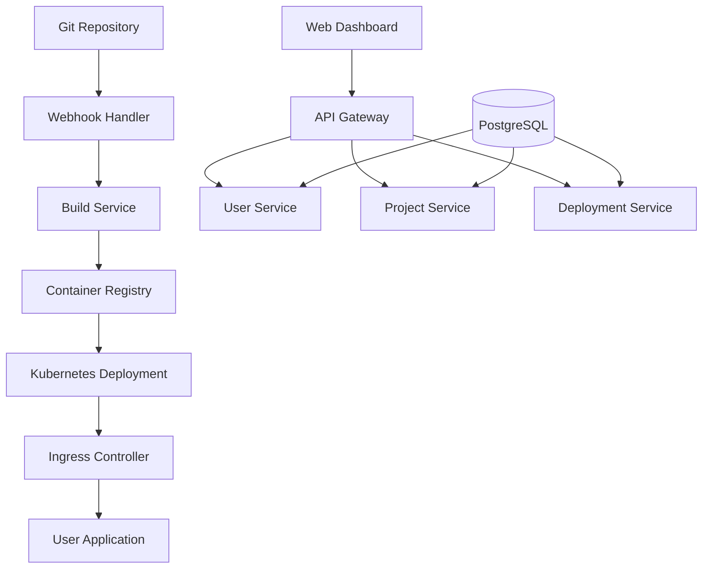

# Implementation Roadmap - Building a Railway.com-like Platform

## 🗺️ Strategic Development Plan

This roadmap provides a step-by-step approach to building a Railway.com-like Platform-as-a-Service (PaaS), structured in phases to manage complexity and validate the business model incrementally.

## 📊 Development Phases Overview

| Phase | Duration | Team Size | Features | Investment | Revenue Target |
|-------|----------|-----------|----------|------------|----------------|
| **MVP** | 6 months | 2-3 developers | Basic deployments | $50-100K | $1K MRR |
| **Beta** | 6 months | 4-6 developers | Auto-scaling, databases | $200-300K | $10K MRR |
| **Production** | 12 months | 8-12 developers | Enterprise features | $500K-1M | $100K MRR |
| **Scale** | Ongoing | 15+ team | Multi-region, compliance | $1M+ | $500K+ MRR |

## 🚀 Phase 1: MVP Platform (Months 1-6)

### Core Objectives
- Validate the core deployment workflow
- Build fundamental user experience
- Establish basic infrastructure foundations
- Prove product-market fit with early adopters

### Technical Architecture



### Month 1-2: Foundation & Infrastructure

**Week 1-2: Development Environment Setup**
```bash
# Initial project structure
railway-platform/
├── infrastructure/
│   ├── terraform/
│   │   ├── aws-eks/
│   │   ├── networking/
│   │   └── databases/
│   └── k8s-manifests/
├── services/
│   ├── api/
│   ├── webhook-handler/
│   ├── build-service/
│   └── deployment-service/
├── frontend/
│   ├── dashboard/
│   └── landing-page/
├── cli/
└── docs/
```

**Week 3-4: Core Infrastructure**
```yaml
# Basic Kubernetes cluster setup
apiVersion: v1
kind: Namespace
metadata:
  name: railway-system
---
apiVersion: apps/v1
kind: Deployment
metadata:
  name: api-server
  namespace: railway-system
spec:
  replicas: 2
  selector:
    matchLabels:
      app: api-server
  template:
    metadata:
      labels:
        app: api-server
    spec:
      containers:
      - name: api
        image: railway/api:v0.1.0
        ports:
        - containerPort: 8080
        env:
        - name: DATABASE_URL
          valueFrom:
            secretKeyRef:
              name: database-secret
              key: url
        resources:
          requests:
            memory: "128Mi"
            cpu: "100m"
          limits:
            memory: "256Mi"
            cpu: "200m"
```

**Week 5-8: Database & Authentication**
```sql
-- Core database schema for MVP
CREATE DATABASE railway_platform;

-- Users table
CREATE TABLE users (
    id UUID PRIMARY KEY DEFAULT gen_random_uuid(),
    email VARCHAR(255) UNIQUE NOT NULL,
    github_id INTEGER UNIQUE,
    display_name VARCHAR(255),
    avatar_url TEXT,
    created_at TIMESTAMP DEFAULT NOW(),
    updated_at TIMESTAMP DEFAULT NOW()
);

-- Projects table
CREATE TABLE projects (
    id UUID PRIMARY KEY DEFAULT gen_random_uuid(),
    name VARCHAR(255) NOT NULL,
    slug VARCHAR(255) UNIQUE NOT NULL,
    owner_id UUID REFERENCES users(id),
    repository_url TEXT,
    description TEXT,
    created_at TIMESTAMP DEFAULT NOW(),
    updated_at TIMESTAMP DEFAULT NOW()
);

-- Services table
CREATE TABLE services (
    id UUID PRIMARY KEY DEFAULT gen_random_uuid(),
    project_id UUID REFERENCES projects(id),
    name VARCHAR(255) NOT NULL,
    source_type VARCHAR(50) DEFAULT 'github',
    build_config JSONB,
    env_vars JSONB,
    created_at TIMESTAMP DEFAULT NOW(),
    updated_at TIMESTAMP DEFAULT NOW()
);

-- Deployments table
CREATE TABLE deployments (
    id UUID PRIMARY KEY DEFAULT gen_random_uuid(),
    service_id UUID REFERENCES services(id),
    status VARCHAR(50) DEFAULT 'pending',
    git_commit_sha VARCHAR(40),
    image_url TEXT,
    deployed_at TIMESTAMP,
    created_at TIMESTAMP DEFAULT NOW()
);
```

### Month 3-4: Core Features Implementation

**Week 9-12: Build System**
```go
// Build service implementation
package main

import (
    "context"
    "fmt"
    "os/exec"
    "path/filepath"
    
    "github.com/railway/platform/pkg/git"
    "github.com/railway/platform/pkg/docker"
)

type BuildService struct {
    gitClient    *git.Client
    dockerClient *docker.Client
    registry     string
}

type BuildRequest struct {
    ServiceID    string `json:"service_id"`
    GitURL       string `json:"git_url"`
    GitRef       string `json:"git_ref"`
    BuildConfig  map[string]interface{} `json:"build_config"`
}

func (bs *BuildService) Build(ctx context.Context, req *BuildRequest) error {
    // 1. Clone repository
    workdir := filepath.Join("/tmp", "builds", req.ServiceID)
    if err := bs.gitClient.Clone(req.GitURL, req.GitRef, workdir); err != nil {
        return fmt.Errorf("git clone failed: %w", err)
    }
    
    // 2. Detect language/framework
    language, err := bs.detectLanguage(workdir)
    if err != nil {
        return fmt.Errorf("language detection failed: %w", err)
    }
    
    // 3. Generate Dockerfile if needed
    if !bs.hasDockerfile(workdir) {
        if err := bs.generateDockerfile(workdir, language); err != nil {
            return fmt.Errorf("dockerfile generation failed: %w", err)
        }
    }
    
    // 4. Build container image
    imageTag := fmt.Sprintf("%s/%s:%s", bs.registry, req.ServiceID, req.GitRef[:8])
    if err := bs.dockerClient.Build(workdir, imageTag); err != nil {
        return fmt.Errorf("docker build failed: %w", err)
    }
    
    // 5. Push to registry
    if err := bs.dockerClient.Push(imageTag); err != nil {
        return fmt.Errorf("docker push failed: %w", err)
    }
    
    return nil
}

func (bs *BuildService) detectLanguage(workdir string) (string, error) {
    // Simple language detection logic
    if bs.fileExists(workdir, "package.json") {
        return "nodejs", nil
    }
    if bs.fileExists(workdir, "requirements.txt") {
        return "python", nil
    }
    if bs.fileExists(workdir, "go.mod") {
        return "golang", nil
    }
    return "unknown", fmt.Errorf("unable to detect language")
}
```

**Week 13-16: Deployment Engine**
```yaml
# Kubernetes deployment template
apiVersion: apps/v1
kind: Deployment
metadata:
  name: "{{.ServiceName}}"
  namespace: "{{.ProjectNamespace}}"
  labels:
    app: "{{.ServiceName}}"
    project: "{{.ProjectID}}"
spec:
  replicas: 1
  selector:
    matchLabels:
      app: "{{.ServiceName}}"
  template:
    metadata:
      labels:
        app: "{{.ServiceName}}"
    spec:
      containers:
      - name: app
        image: "{{.ImageURL}}"
        ports:
        - containerPort: {{.Port}}
        env:
        {{range .EnvVars}}
        - name: "{{.Key}}"
          value: "{{.Value}}"
        {{end}}
        resources:
          requests:
            memory: "128Mi"
            cpu: "100m"
          limits:
            memory: "512Mi"
            cpu: "500m"
        livenessProbe:
          httpGet:
            path: /
            port: {{.Port}}
          initialDelaySeconds: 30
          periodSeconds: 10
        readinessProbe:
          httpGet:
            path: /
            port: {{.Port}}
          initialDelaySeconds: 5
          periodSeconds: 5
---
apiVersion: v1
kind: Service
metadata:
  name: "{{.ServiceName}}"
  namespace: "{{.ProjectNamespace}}"
spec:
  selector:
    app: "{{.ServiceName}}"
  ports:
  - port: 80
    targetPort: {{.Port}}
---
apiVersion: networking.k8s.io/v1
kind: Ingress
metadata:
  name: "{{.ServiceName}}"
  namespace: "{{.ProjectNamespace}}"
  annotations:
    kubernetes.io/ingress.class: nginx
    cert-manager.io/cluster-issuer: letsencrypt-prod
spec:
  tls:
  - hosts:
    - "{{.ServiceName}}-{{.ProjectID}}.railway.dev"
    secretName: "{{.ServiceName}}-tls"
  rules:
  - host: "{{.ServiceName}}-{{.ProjectID}}.railway.dev"
    http:
      paths:
      - path: /
        pathType: Prefix
        backend:
          service:
            name: "{{.ServiceName}}"
            port:
              number: 80
```

### Month 5-6: Frontend Dashboard & CLI

**Week 17-20: React Dashboard**
```tsx
// Dashboard main page
import React from 'react';
import { useQuery } from '@tanstack/react-query';
import { ProjectCard } from '../components/ProjectCard';
import { DeploymentStatus } from '../components/DeploymentStatus';
import { CreateProjectModal } from '../components/CreateProjectModal';

interface Project {
  id: string;
  name: string;
  slug: string;
  repository_url: string;
  services: Service[];
  latest_deployment?: Deployment;
}

export const Dashboard: React.FC = () => {
  const { data: projects, isLoading } = useQuery({
    queryKey: ['projects'],
    queryFn: async () => {
      const response = await fetch('/api/v1/projects');
      return response.json();
    },
  });

  if (isLoading) return <div>Loading...</div>;

  return (
    <div className="max-w-7xl mx-auto px-4 sm:px-6 lg:px-8">
      <div className="py-8">
        <div className="flex justify-between items-center mb-8">
          <h1 className="text-3xl font-bold text-gray-900">Projects</h1>
          <CreateProjectModal />
        </div>
        
        <div className="grid grid-cols-1 md:grid-cols-2 lg:grid-cols-3 gap-6">
          {projects?.map((project: Project) => (
            <ProjectCard key={project.id} project={project} />
          ))}
        </div>
      </div>
    </div>
  );
};
```

**Week 21-24: CLI Tool**
```go
// CLI implementation
package main

import (
    "fmt"
    "os"
    
    "github.com/spf13/cobra"
    "github.com/railway/cli/pkg/auth"
    "github.com/railway/cli/pkg/project"
    "github.com/railway/cli/pkg/deploy"
)

var rootCmd = &cobra.Command{
    Use:   "railway",
    Short: "Railway CLI for application deployment",
}

var deployCmd = &cobra.Command{
    Use:   "deploy",
    Short: "Deploy current project",
    RunE: func(cmd *cobra.Command, args []string) error {
        // Check authentication
        token, err := auth.GetToken()
        if err != nil {
            return fmt.Errorf("please login first: railway login")
        }
        
        // Detect project
        proj, err := project.Detect(".")
        if err != nil {
            return fmt.Errorf("no railway project found. Run 'railway init' first")
        }
        
        // Deploy
        deployer := deploy.New(token, proj)
        return deployer.Deploy()
    },
}

var initCmd = &cobra.Command{
    Use:   "init",
    Short: "Initialize a new Railway project",
    RunE: func(cmd *cobra.Command, args []string) error {
        return project.Init(".")
    },
}

func init() {
    rootCmd.AddCommand(deployCmd)
    rootCmd.AddCommand(initCmd)
}

func main() {
    if err := rootCmd.Execute(); err != nil {
        fmt.Println(err)
        os.Exit(1)
    }
}
```

### MVP Success Metrics
- ✅ 100+ successful deployments
- ✅ 50+ registered users
- ✅ 99% deployment success rate
- ✅ <2 minute average deployment time
- ✅ $1,000 MRR from early adopters

## 🌟 Phase 2: Beta Platform (Months 7-12)

### Enhanced Features
- **Auto-scaling**: Horizontal Pod Autoscaler implementation
- **Managed Databases**: PostgreSQL, Redis provisioning
- **Custom Domains**: SSL certificate management
- **Team Collaboration**: User roles and permissions
- **Enhanced Monitoring**: Metrics, logs, and alerts

### Month 7-8: Auto-scaling & Performance

**Horizontal Pod Autoscaler:**
```yaml
apiVersion: autoscaling/v2
kind: HorizontalPodAutoscaler
metadata:
  name: "{{.ServiceName}}-hpa"
  namespace: "{{.ProjectNamespace}}"
spec:
  scaleTargetRef:
    apiVersion: apps/v1
    kind: Deployment
    name: "{{.ServiceName}}"
  minReplicas: 1
  maxReplicas: 10
  metrics:
  - type: Resource
    resource:
      name: cpu
      target:
        type: Utilization
        averageUtilization: 70
  - type: Resource
    resource:
      name: memory
      target:
        type: Utilization
        averageUtilization: 80
  behavior:
    scaleDown:
      stabilizationWindowSeconds: 300
      policies:
      - type: Percent
        value: 50
        periodSeconds: 60
    scaleUp:
      stabilizationWindowSeconds: 60
      policies:
      - type: Percent
        value: 100
        periodSeconds: 15
```

### Month 9-10: Managed Databases

**Database Operator Implementation:**
```go
package database

import (
    "context"
    "fmt"
    
    "github.com/railway/platform/pkg/k8s"
    appsv1 "k8s.io/api/apps/v1"
    corev1 "k8s.io/api/core/v1"
    metav1 "k8s.io/apimachinery/pkg/apis/meta/v1"
)

type DatabaseService struct {
    k8sClient *k8s.Client
}

type DatabaseRequest struct {
    ProjectID    string            `json:"project_id"`
    DatabaseType string            `json:"database_type"` // postgres, redis, mongodb
    Name         string            `json:"name"`
    Config       map[string]string `json:"config"`
}

func (ds *DatabaseService) CreateDatabase(ctx context.Context, req *DatabaseRequest) error {
    namespace := fmt.Sprintf("project-%s", req.ProjectID)
    
    switch req.DatabaseType {
    case "postgres":
        return ds.createPostgreSQL(ctx, namespace, req)
    case "redis":
        return ds.createRedis(ctx, namespace, req)
    default:
        return fmt.Errorf("unsupported database type: %s", req.DatabaseType)
    }
}

func (ds *DatabaseService) createPostgreSQL(ctx context.Context, namespace string, req *DatabaseRequest) error {
    // Create secret for database credentials
    secret := &corev1.Secret{
        ObjectMeta: metav1.ObjectMeta{
            Name:      fmt.Sprintf("%s-credentials", req.Name),
            Namespace: namespace,
        },
        Data: map[string][]byte{
            "username": []byte("postgres"),
            "password": []byte(generatePassword()),
            "database": []byte(req.Name),
        },
    }
    
    // Create PostgreSQL deployment
    deployment := &appsv1.Deployment{
        ObjectMeta: metav1.ObjectMeta{
            Name:      req.Name,
            Namespace: namespace,
        },
        Spec: appsv1.DeploymentSpec{
            Replicas: int32Ptr(1),
            Selector: &metav1.LabelSelector{
                MatchLabels: map[string]string{
                    "app": req.Name,
                },
            },
            Template: corev1.PodTemplateSpec{
                ObjectMeta: metav1.ObjectMeta{
                    Labels: map[string]string{
                        "app": req.Name,
                    },
                },
                Spec: corev1.PodSpec{
                    Containers: []corev1.Container{
                        {
                            Name:  "postgres",
                            Image: "postgres:15",
                            Env: []corev1.EnvVar{
                                {
                                    Name: "POSTGRES_PASSWORD",
                                    ValueFrom: &corev1.EnvVarSource{
                                        SecretKeyRef: &corev1.SecretKeySelector{
                                            LocalObjectReference: corev1.LocalObjectReference{
                                                Name: secret.Name,
                                            },
                                            Key: "password",
                                        },
                                    },
                                },
                            },
                            VolumeMounts: []corev1.VolumeMount{
                                {
                                    Name:      "data",
                                    MountPath: "/var/lib/postgresql/data",
                                },
                            },
                        },
                    },
                    Volumes: []corev1.Volume{
                        {
                            Name: "data",
                            VolumeSource: corev1.VolumeSource{
                                PersistentVolumeClaim: &corev1.PersistentVolumeClaimVolumeSource{
                                    ClaimName: fmt.Sprintf("%s-data", req.Name),
                                },
                            },
                        },
                    },
                },
            },
        },
    }
    
    // Apply resources to cluster
    if err := ds.k8sClient.Create(ctx, secret); err != nil {
        return err
    }
    
    return ds.k8sClient.Create(ctx, deployment)
}
```

### Month 11-12: Advanced Features

**Custom Domains & SSL:**
```yaml
# cert-manager ClusterIssuer
apiVersion: cert-manager.io/v1
kind: ClusterIssuer
metadata:
  name: letsencrypt-prod
spec:
  acme:
    server: https://acme-v02.api.letsencrypt.org/directory
    email: admin@railway.app
    privateKeySecretRef:
      name: letsencrypt-prod
    solvers:
    - http01:
        ingress:
          class: nginx
```

### Beta Success Metrics
- ✅ 1,000+ active users
- ✅ 10,000+ deployments per month
- ✅ 99.5% uptime SLA
- ✅ $10,000 MRR
- ✅ Enterprise customer pilots

## 🏢 Phase 3: Production Platform (Months 13-24)

### Enterprise Features
- **Multi-region deployment**
- **Advanced monitoring & alerting**
- **Compliance (SOC2, GDPR)**
- **Enterprise SSO & RBAC**
- **SLA guarantees & support**

### Month 13-15: Multi-region Architecture

**Global Infrastructure Setup:**
```hcl
# Terraform multi-region setup
module "us_east_cluster" {
  source = "./modules/k8s-cluster"
  
  region = "us-east-1"
  cluster_name = "railway-us-east"
  node_groups = {
    general = {
      instance_types = ["m5.large", "m5.xlarge"]
      min_size      = 3
      max_size      = 20
      desired_size  = 5
    }
  }
}

module "eu_west_cluster" {
  source = "./modules/k8s-cluster"
  
  region = "eu-west-1"
  cluster_name = "railway-eu-west"
  node_groups = {
    general = {
      instance_types = ["m5.large", "m5.xlarge"]
      min_size      = 2
      max_size      = 15
      desired_size  = 3
    }
  }
}

# Global load balancer
resource "aws_route53_zone" "main" {
  name = "railway.app"
}

resource "aws_route53_record" "api" {
  zone_id = aws_route53_zone.main.zone_id
  name    = "api.railway.app"
  type    = "A"
  
  set_identifier = "us-east"
  
  alias {
    name                   = module.us_east_cluster.load_balancer_dns
    zone_id                = module.us_east_cluster.load_balancer_zone_id
    evaluate_target_health = true
  }
  
  geolocation_routing_policy {
    continent = "NA"
  }
}
```

### Month 16-18: Enterprise Security & Compliance

**SOC2 Compliance Implementation:**
```go
// Audit logging service
package audit

import (
    "context"
    "encoding/json"
    "time"
    
    "github.com/railway/platform/pkg/models"
)

type AuditLogger struct {
    db     Database
    stream EventStream
}

type AuditEvent struct {
    ID         string                 `json:"id"`
    UserID     string                 `json:"user_id"`
    Action     string                 `json:"action"`
    Resource   string                 `json:"resource"`
    ResourceID string                 `json:"resource_id"`
    Result     string                 `json:"result"` // success, failure
    IPAddress  string                 `json:"ip_address"`
    UserAgent  string                 `json:"user_agent"`
    Metadata   map[string]interface{} `json:"metadata"`
    Timestamp  time.Time              `json:"timestamp"`
}

func (a *AuditLogger) LogEvent(ctx context.Context, event *AuditEvent) error {
    event.ID = generateID()
    event.Timestamp = time.Now()
    
    // Store in database for compliance
    if err := a.db.StoreAuditEvent(ctx, event); err != nil {
        return err
    }
    
    // Stream to monitoring systems
    eventData, _ := json.Marshal(event)
    return a.stream.Publish("audit-events", eventData)
}

// Usage example
func (s *ProjectService) DeleteProject(ctx context.Context, projectID string) error {
    user := GetUserFromContext(ctx)
    
    // Perform deletion
    err := s.db.DeleteProject(ctx, projectID)
    
    // Log audit event
    auditEvent := &AuditEvent{
        UserID:     user.ID,
        Action:     "project.delete",
        Resource:   "project",
        ResourceID: projectID,
        Result:     "success",
        IPAddress:  GetIPFromContext(ctx),
        UserAgent:  GetUserAgentFromContext(ctx),
    }
    
    if err != nil {
        auditEvent.Result = "failure"
        auditEvent.Metadata = map[string]interface{}{
            "error": err.Error(),
        }
    }
    
    s.auditLogger.LogEvent(ctx, auditEvent)
    return err
}
```

### Month 19-24: Scaling & Optimization

**Advanced Monitoring Stack:**
```yaml
# Prometheus configuration for production
apiVersion: v1
kind: ConfigMap
metadata:
  name: prometheus-config
data:
  prometheus.yml: |
    global:
      scrape_interval: 15s
      evaluation_interval: 15s
      external_labels:
        cluster: 'railway-production'
        region: 'us-east-1'
    
    rule_files:
      - "/etc/prometheus/rules/*.yml"
    
    alerting:
      alertmanagers:
        - static_configs:
            - targets:
              - alertmanager:9093
    
    scrape_configs:
      # Platform services
      - job_name: 'railway-api'
        kubernetes_sd_configs:
          - role: endpoints
            namespaces:
              names:
                - railway-system
        relabel_configs:
          - source_labels: [__meta_kubernetes_service_label_app]
            action: keep
            regex: railway-api
      
      # User applications
      - job_name: 'user-apps'
        kubernetes_sd_configs:
          - role: pod
        relabel_configs:
          - source_labels: [__meta_kubernetes_pod_annotation_prometheus_io_scrape]
            action: keep
            regex: true
          - source_labels: [__meta_kubernetes_pod_annotation_prometheus_io_path]
            action: replace
            target_label: __metrics_path__
            regex: (.+)
```

### Production Success Metrics
- ✅ 10,000+ active users
- ✅ 100,000+ deployments per month
- ✅ 99.9% uptime SLA
- ✅ $100,000 MRR
- ✅ Fortune 500 customers
- ✅ SOC2 Type II certification

## 🚀 Phase 4: Scale Platform (Months 25+)

### Advanced Features
- **Multi-cloud deployment**
- **Edge computing support**
- **AI-powered optimization**
- **Marketplace ecosystem**
- **Global enterprise support**

### Key Focus Areas

**Performance Optimization:**
- Sub-second cold starts
- Intelligent resource allocation
- Predictive scaling
- Edge deployment optimization

**Enterprise Integration:**
- SSO with major identity providers
- Advanced RBAC and policy management
- Dedicated support and SLA guarantees
- Custom compliance requirements

**Developer Ecosystem:**
- Plugin marketplace
- Third-party integrations
- Advanced CLI tooling
- SDK development

### Scale Success Metrics
- ✅ 50,000+ active users
- ✅ 1M+ deployments per month
- ✅ 99.99% uptime SLA
- ✅ $500,000+ MRR
- ✅ Global enterprise customers
- ✅ Industry leader recognition

## 💰 Investment & Resource Planning

### Funding Requirements by Phase

**Phase 1 (MVP): $100,000**
- 2-3 developers @ $80K-120K each
- Infrastructure costs @ $5K-10K/month
- Legal, accounting, tools @ $20K

**Phase 2 (Beta): $300,000**
- 4-6 developers + 1 designer
- Infrastructure scaling @ $15K-25K/month
- Sales & marketing investment @ $50K

**Phase 3 (Production): $1,000,000**
- 8-12 team members across engineering, sales, support
- Infrastructure @ $30K-50K/month
- Compliance, security, enterprise features

**Phase 4 (Scale): $2,000,000+**
- 15+ team members
- Global infrastructure
- Enterprise sales team
- Advanced R&D initiatives

### Team Building Roadmap

**Phase 1 Team (3 people):**
- Full Stack Engineer (React/Go)
- DevOps Engineer (Kubernetes/Cloud)
- Founder/Product Lead

**Phase 2 Team (6 people):**
- Add: Frontend specialist, Backend specialist, Designer

**Phase 3 Team (12 people):**
- Add: Security engineer, Sales lead, Customer success, QA engineer, Site reliability engineer, Marketing

**Phase 4 Team (20+ people):**
- Scale all functions with regional teams

## 🎯 Risk Mitigation Strategies

### Technical Risks
1. **Kubernetes Complexity**: Start with managed services (EKS, GKE)
2. **Security Vulnerabilities**: Regular security audits and penetration testing
3. **Performance Issues**: Load testing and performance monitoring from day 1
4. **Data Loss**: Automated backups and disaster recovery procedures

### Business Risks
1. **Market Competition**: Focus on developer experience differentiation
2. **Customer Acquisition**: Strong content marketing and developer community
3. **Regulatory Changes**: Stay ahead of compliance requirements
4. **Economic Downturns**: Diversified customer base and flexible pricing

### Operational Risks
1. **Key Person Dependency**: Document everything and cross-train team
2. **Infrastructure Outages**: Multi-region redundancy and failover
3. **Supply Chain Issues**: Vendor diversification and contingency plans
4. **Talent Acquisition**: Remote-first culture and competitive compensation

---

## 🔗 Navigation

← [Back to Skills Gap Analysis](./skills-gap-analysis.md) | [Next: Infrastructure Setup Guide →](./infrastructure-setup-guide.md)

## 📚 Implementation References

1. [Railway.com Engineering Blog](https://blog.railway.app/)
2. [Kubernetes Deployment Best Practices](https://kubernetes.io/docs/concepts/workloads/controllers/deployment/)
3. [Go Web Development](https://golang.org/doc/tutorial/web-service-gin)
4. [React Production Build](https://react.dev/learn/start-a-new-react-project)
5. [PostgreSQL High Availability](https://www.postgresql.org/docs/current/high-availability.html)
6. [Prometheus Monitoring](https://prometheus.io/docs/guides/go-application/)
7. [OAuth2 Implementation Guide](https://oauth.net/2/)
8. [SOC2 Compliance Checklist](https://www.vanta.com/resources/soc-2-compliance-checklist)