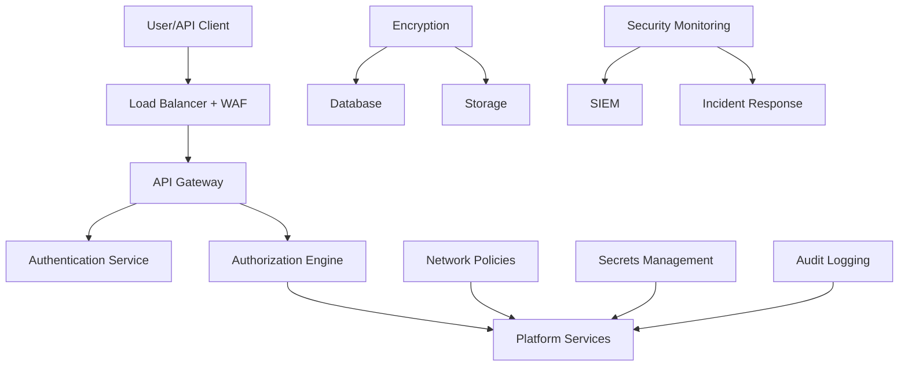

# Security Implementation - Railway.com Platform Security

## 🔐 Comprehensive Security Framework

This document outlines the security implementation strategy for building a Railway.com-like PaaS platform, covering authentication, authorization, network security, data protection, and compliance requirements.

## 🛡️ Security Architecture Overview



## 🔑 Authentication & Identity Management

### OAuth2/OpenID Connect Implementation

**Authentication Service Architecture:**
```go
// pkg/auth/service.go
package auth

import (
    "context"
    "crypto/rand"
    "encoding/base64"
    "time"
    
    "github.com/golang-jwt/jwt/v5"
    "github.com/google/uuid"
    "golang.org/x/crypto/bcrypt"
    "golang.org/x/oauth2"
    "golang.org/x/oauth2/github"
    "golang.org/x/oauth2/google"
)

type AuthService struct {
    jwtSecret       []byte
    tokenExpiry     time.Duration
    refreshExpiry   time.Duration
    githubOAuth     *oauth2.Config
    googleOAuth     *oauth2.Config
    userRepository  UserRepository
    sessionStore    SessionStore
}

type TokenPair struct {
    AccessToken  string `json:"access_token"`
    RefreshToken string `json:"refresh_token"`
    TokenType    string `json:"token_type"`
    ExpiresIn    int64  `json:"expires_in"`
}

type JWTClaims struct {
    UserID    string   `json:"sub"`
    Email     string   `json:"email"`
    Roles     []string `json:"roles"`
    TeamIDs   []string `json:"team_ids"`
    Audience  string   `json:"aud"`
    Issuer    string   `json:"iss"`
    IssuedAt  int64    `json:"iat"`
    ExpiresAt int64    `json:"exp"`
    jwt.RegisteredClaims
}

func NewAuthService(config *Config) *AuthService {
    return &AuthService{
        jwtSecret:     []byte(config.JWTSecret),
        tokenExpiry:   config.TokenExpiry,
        refreshExpiry: config.RefreshExpiry,
        githubOAuth: &oauth2.Config{
            ClientID:     config.GitHub.ClientID,
            ClientSecret: config.GitHub.ClientSecret,
            Scopes:       []string{"user:email", "read:user"},
            Endpoint:     github.Endpoint,
            RedirectURL:  config.GitHub.RedirectURL,
        },
        googleOAuth: &oauth2.Config{
            ClientID:     config.Google.ClientID,
            ClientSecret: config.Google.ClientSecret,
            Scopes:       []string{"openid", "email", "profile"},
            Endpoint:     google.Endpoint,
            RedirectURL:  config.Google.RedirectURL,
        },
        userRepository: config.UserRepository,
        sessionStore:   config.SessionStore,
    }
}

func (s *AuthService) GenerateTokenPair(ctx context.Context, userID string) (*TokenPair, error) {
    user, err := s.userRepository.GetByID(ctx, userID)
    if err != nil {
        return nil, err
    }
    
    // Generate access token
    accessClaims := &JWTClaims{
        UserID:    user.ID,
        Email:     user.Email,
        Roles:     user.Roles,
        TeamIDs:   user.TeamIDs,
        Audience:  "railway-api",
        Issuer:    "railway-auth",
        IssuedAt:  time.Now().Unix(),
        ExpiresAt: time.Now().Add(s.tokenExpiry).Unix(),
    }
    
    accessToken := jwt.NewWithClaims(jwt.SigningMethodHS256, accessClaims)
    accessTokenString, err := accessToken.SignedString(s.jwtSecret)
    if err != nil {
        return nil, err
    }
    
    // Generate secure refresh token
    refreshToken, err := s.generateSecureToken(32)
    if err != nil {
        return nil, err
    }
    
    // Store refresh token with expiry
    sessionID := uuid.New().String()
    session := &Session{
        ID:           sessionID,
        UserID:       userID,
        RefreshToken: refreshToken,
        ExpiresAt:    time.Now().Add(s.refreshExpiry),
        CreatedAt:    time.Now(),
    }
    
    if err := s.sessionStore.Store(ctx, session); err != nil {
        return nil, err
    }
    
    return &TokenPair{
        AccessToken:  accessTokenString,
        RefreshToken: refreshToken,
        TokenType:    "Bearer",
        ExpiresIn:    int64(s.tokenExpiry.Seconds()),
    }, nil
}

func (s *AuthService) ValidateToken(ctx context.Context, tokenString string) (*JWTClaims, error) {
    token, err := jwt.ParseWithClaims(tokenString, &JWTClaims{}, func(token *jwt.Token) (interface{}, error) {
        if _, ok := token.Method.(*jwt.SigningMethodHMAC); !ok {
            return nil, fmt.Errorf("unexpected signing method: %v", token.Header["alg"])
        }
        return s.jwtSecret, nil
    })
    
    if err != nil || !token.Valid {
        return nil, fmt.Errorf("invalid token: %w", err)
    }
    
    claims, ok := token.Claims.(*JWTClaims)
    if !ok {
        return nil, fmt.Errorf("invalid claims type")
    }
    
    // Verify token hasn't expired
    if time.Now().Unix() > claims.ExpiresAt {
        return nil, fmt.Errorf("token expired")
    }
    
    return claims, nil
}

func (s *AuthService) generateSecureToken(length int) (string, error) {
    bytes := make([]byte, length)
    if _, err := rand.Read(bytes); err != nil {
        return "", err
    }
    return base64.URLEncoding.EncodeToString(bytes), nil
}
```

### Multi-Factor Authentication (MFA)

**TOTP Implementation:**
```go
// pkg/auth/mfa.go
package auth

import (
    "crypto/rand"
    "encoding/base32"
    "fmt"
    "time"
    
    "github.com/pquerna/otp"
    "github.com/pquerna/otp/totp"
)

type MFAService struct {
    issuer string
}

type MFASetup struct {
    Secret    string `json:"secret"`
    QRCodeURL string `json:"qr_code_url"`
    BackupCodes []string `json:"backup_codes"`
}

func (m *MFAService) GenerateSecret(userEmail string) (*MFASetup, error) {
    key, err := totp.Generate(totp.GenerateOpts{
        Issuer:      m.issuer,
        AccountName: userEmail,
        SecretSize:  32,
    })
    if err != nil {
        return nil, err
    }
    
    // Generate backup codes
    backupCodes, err := m.generateBackupCodes(8)
    if err != nil {
        return nil, err
    }
    
    return &MFASetup{
        Secret:      key.Secret(),
        QRCodeURL:   key.URL(),
        BackupCodes: backupCodes,
    }, nil
}

func (m *MFAService) ValidateCode(secret, code string) bool {
    return totp.Validate(code, secret)
}

func (m *MFAService) generateBackupCodes(count int) ([]string, error) {
    codes := make([]string, count)
    for i := 0; i < count; i++ {
        bytes := make([]byte, 6)
        if _, err := rand.Read(bytes); err != nil {
            return nil, err
        }
        codes[i] = base32.StdEncoding.EncodeToString(bytes)[:8]
    }
    return codes, nil
}
```

## 🛡️ Authorization & Access Control

### Role-Based Access Control (RBAC)

**Permission Model:**
```go
// pkg/auth/rbac.go
package auth

type Permission string

const (
    // Project permissions
    ProjectCreate Permission = "project:create"
    ProjectRead   Permission = "project:read"
    ProjectUpdate Permission = "project:update"
    ProjectDelete Permission = "project:delete"
    
    // Service permissions
    ServiceCreate Permission = "service:create"
    ServiceRead   Permission = "service:read"
    ServiceUpdate Permission = "service:update"
    ServiceDelete Permission = "service:delete"
    ServiceDeploy Permission = "service:deploy"
    
    // Database permissions
    DatabaseCreate Permission = "database:create"
    DatabaseRead   Permission = "database:read"
    DatabaseUpdate Permission = "database:update"
    DatabaseDelete Permission = "database:delete"
    
    // Team permissions
    TeamManage    Permission = "team:manage"
    TeamInvite    Permission = "team:invite"
    TeamRemove    Permission = "team:remove"
    
    // Billing permissions
    BillingRead   Permission = "billing:read"
    BillingManage Permission = "billing:manage"
)

type Role struct {
    ID          string       `json:"id"`
    Name        string       `json:"name"`
    Description string       `json:"description"`
    Permissions []Permission `json:"permissions"`
    IsSystem    bool         `json:"is_system"`
}

var SystemRoles = map[string]Role{
    "owner": {
        ID:          "owner",
        Name:        "Owner",
        Description: "Full access to all resources",
        Permissions: []Permission{
            ProjectCreate, ProjectRead, ProjectUpdate, ProjectDelete,
            ServiceCreate, ServiceRead, ServiceUpdate, ServiceDelete, ServiceDeploy,
            DatabaseCreate, DatabaseRead, DatabaseUpdate, DatabaseDelete,
            TeamManage, TeamInvite, TeamRemove,
            BillingRead, BillingManage,
        },
        IsSystem: true,
    },
    "admin": {
        ID:          "admin",
        Name:        "Admin",
        Description: "Administrative access to resources",
        Permissions: []Permission{
            ProjectCreate, ProjectRead, ProjectUpdate, ProjectDelete,
            ServiceCreate, ServiceRead, ServiceUpdate, ServiceDelete, ServiceDeploy,
            DatabaseCreate, DatabaseRead, DatabaseUpdate, DatabaseDelete,
            TeamInvite, TeamRemove,
        },
        IsSystem: true,
    },
    "developer": {
        ID:          "developer",
        Name:        "Developer",
        Description: "Development access to resources",
        Permissions: []Permission{
            ProjectRead, ProjectUpdate,
            ServiceCreate, ServiceRead, ServiceUpdate, ServiceDeploy,
            DatabaseRead, DatabaseUpdate,
        },
        IsSystem: true,
    },
    "viewer": {
        ID:          "viewer",
        Name:        "Viewer",
        Description: "Read-only access to resources",
        Permissions: []Permission{
            ProjectRead,
            ServiceRead,
            DatabaseRead,
        },
        IsSystem: true,
    },
}

type AuthorizationService struct {
    userRepository UserRepository
    teamRepository TeamRepository
}

func (a *AuthorizationService) CheckPermission(ctx context.Context, userID, resourceType, resourceID string, permission Permission) (bool, error) {
    user, err := a.userRepository.GetByID(ctx, userID)
    if err != nil {
        return false, err
    }
    
    // Check if user is system admin
    if user.IsSystemAdmin {
        return true, nil
    }
    
    // Get user's roles for this resource
    roles, err := a.getUserRolesForResource(ctx, userID, resourceType, resourceID)
    if err != nil {
        return false, err
    }
    
    // Check if any role has the required permission
    for _, role := range roles {
        if a.roleHasPermission(role, permission) {
            return true, nil
        }
    }
    
    return false, nil
}

func (a *AuthorizationService) roleHasPermission(role Role, permission Permission) bool {
    for _, p := range role.Permissions {
        if p == permission {
            return true
        }
    }
    return false
}
```

### Open Policy Agent (OPA) Integration

**Policy Definitions:**
```rego
# policies/railway-authz.rego
package railway.authz

import future.keywords.in

# Default deny
default allow = false

# Allow if user is system admin
allow {
    input.user.is_system_admin == true
}

# Project-level permissions
allow {
    input.method == "GET"
    input.path[0] == "projects"
    project_id := input.path[1]
    
    user_role := data.user_roles[input.user.id][project_id]
    user_role in ["owner", "admin", "developer", "viewer"]
}

allow {
    input.method == "POST"
    input.path[0] == "projects"
    input.path[1] == "create"
    
    # Users can create projects if they have valid subscription
    data.subscriptions[input.user.id].status == "active"
}

allow {
    input.method == "DELETE"
    input.path[0] == "projects"
    project_id := input.path[1]
    
    user_role := data.user_roles[input.user.id][project_id]
    user_role in ["owner"]
}

# Service deployment permissions
allow {
    input.method == "POST"
    input.path[0] == "deployments"
    
    service_id := input.body.service_id
    service := data.services[service_id]
    project_id := service.project_id
    
    user_role := data.user_roles[input.user.id][project_id]
    user_role in ["owner", "admin", "developer"]
}

# Team management permissions
allow {
    input.method == "POST"
    input.path[0] == "teams"
    team_id := input.path[1]
    input.path[2] == "members"
    
    user_role := data.team_roles[input.user.id][team_id]
    user_role in ["owner", "admin"]
}

# Billing permissions
allow {
    input.method == "GET"
    input.path[0] == "billing"
    
    user_role := data.user_roles[input.user.id]
    "billing:read" in data.role_permissions[user_role]
}
```

## 🌐 Network Security

### Kubernetes Network Policies

**Zero-Trust Network Implementation:**
```yaml
# k8s-manifests/security/network-policies.yaml
apiVersion: networking.k8s.io/v1
kind: NetworkPolicy
metadata:
  name: default-deny-all
  namespace: railway-system
spec:
  podSelector: {}
  policyTypes:
  - Ingress
  - Egress

---
# Allow ingress controller to API
apiVersion: networking.k8s.io/v1
kind: NetworkPolicy
metadata:
  name: allow-ingress-to-api
  namespace: railway-system
spec:
  podSelector:
    matchLabels:
      app: railway-api
  policyTypes:
  - Ingress
  ingress:
  - from:
    - namespaceSelector:
        matchLabels:
          name: ingress-nginx
    ports:
    - protocol: TCP
      port: 8080

---
# Allow API to database
apiVersion: networking.k8s.io/v1
kind: NetworkPolicy
metadata:
  name: allow-api-to-database
  namespace: railway-system
spec:
  podSelector:
    matchLabels:
      app: railway-api
  policyTypes:
  - Egress
  egress:
  # Database access
  - to:
    - namespaceSelector:
        matchLabels:
          name: database
    ports:
    - protocol: TCP
      port: 5432
  # Redis access
  - to:
    - namespaceSelector:
        matchLabels:
          name: database
    ports:
    - protocol: TCP
      port: 6379
  # DNS resolution
  - to: []
    ports:
    - protocol: UDP
      port: 53
    - protocol: TCP
      port: 53
  # HTTPS outbound
  - to: []
    ports:
    - protocol: TCP
      port: 443

---
# User workload isolation
apiVersion: networking.k8s.io/v1
kind: NetworkPolicy
metadata:
  name: isolate-user-workloads
  namespace: user-workloads
spec:
  podSelector: {}
  policyTypes:
  - Ingress
  - Egress
  ingress:
  # Only allow ingress controller
  - from:
    - namespaceSelector:
        matchLabels:
          name: ingress-nginx
  egress:
  # Allow DNS
  - to: []
    ports:
    - protocol: UDP
      port: 53
    - protocol: TCP
      port: 53
  # Allow HTTPS outbound
  - to: []
    ports:
    - protocol: TCP
      port: 443
  # Block inter-pod communication within namespace
  - to:
    - podSelector: {}
    ports: []
```

### WAF and DDoS Protection

**CloudFlare Integration:**
```yaml
# k8s-manifests/security/cloudflare-tunnel.yaml
apiVersion: apps/v1
kind: Deployment
metadata:
  name: cloudflared
  namespace: railway-system
spec:
  replicas: 2
  selector:
    matchLabels:
      app: cloudflared
  template:
    metadata:
      labels:
        app: cloudflared
    spec:
      containers:
      - name: cloudflared
        image: cloudflare/cloudflared:latest
        args:
        - tunnel
        - --config
        - /etc/cloudflared/config/config.yaml
        - run
        livenessProbe:
          httpGet:
            path: /ready
            port: 2000
          failureThreshold: 1
          initialDelaySeconds: 10
          periodSeconds: 10
        volumeMounts:
        - name: config
          mountPath: /etc/cloudflared/config
          readOnly: true
        - name: creds
          mountPath: /etc/cloudflared/creds
          readOnly: true
      volumes:
      - name: config
        configMap:
          name: cloudflared-config
      - name: creds
        secret:
          secretName: cloudflared-creds

---
apiVersion: v1
kind: ConfigMap
metadata:
  name: cloudflared-config
  namespace: railway-system
data:
  config.yaml: |
    tunnel: railway-production
    credentials-file: /etc/cloudflared/creds/credentials.json
    metrics: 0.0.0.0:2000
    
    ingress:
    - hostname: api.railway.app
      service: http://railway-api:8080
    - hostname: dashboard.railway.app
      service: http://railway-frontend:3000
    - service: http_status:404
```

## 🔒 Data Protection & Encryption

### Encryption at Rest

**Database Encryption:**
```sql
-- PostgreSQL encryption configuration
-- Enable transparent data encryption
ALTER SYSTEM SET ssl = on;
ALTER SYSTEM SET ssl_cert_file = '/etc/ssl/certs/server.crt';
ALTER SYSTEM SET ssl_key_file = '/etc/ssl/private/server.key';
ALTER SYSTEM SET ssl_ca_file = '/etc/ssl/certs/ca.crt';

-- Enable row-level security
ALTER TABLE users ENABLE ROW LEVEL SECURITY;
ALTER TABLE projects ENABLE ROW LEVEL SECURITY;
ALTER TABLE services ENABLE ROW LEVEL SECURITY;

-- Create RLS policies
CREATE POLICY user_isolation ON users
    FOR ALL TO application_role
    USING (id = current_setting('app.current_user_id')::uuid);

CREATE POLICY project_access ON projects
    FOR ALL TO application_role
    USING (
        owner_id = current_setting('app.current_user_id')::uuid
        OR id IN (
            SELECT project_id FROM team_members tm
            JOIN teams t ON tm.team_id = t.id
            WHERE tm.user_id = current_setting('app.current_user_id')::uuid
        )
    );
```

### Secrets Management with HashiCorp Vault

**Vault Integration:**
```go
// pkg/secrets/vault.go
package secrets

import (
    "context"
    "fmt"
    "path"
    
    "github.com/hashicorp/vault/api"
)

type VaultClient struct {
    client    *api.Client
    namespace string
}

func NewVaultClient(address, token, namespace string) (*VaultClient, error) {
    config := api.DefaultConfig()
    config.Address = address
    
    client, err := api.NewClient(config)
    if err != nil {
        return nil, err
    }
    
    client.SetToken(token)
    if namespace != "" {
        client.SetNamespace(namespace)
    }
    
    return &VaultClient{
        client:    client,
        namespace: namespace,
    }, nil
}

func (v *VaultClient) GetSecret(ctx context.Context, path string) (map[string]interface{}, error) {
    secret, err := v.client.Logical().ReadWithContext(ctx, path)
    if err != nil {
        return nil, err
    }
    
    if secret == nil || secret.Data == nil {
        return nil, fmt.Errorf("secret not found at path: %s", path)
    }
    
    return secret.Data, nil
}

func (v *VaultClient) SetSecret(ctx context.Context, path string, data map[string]interface{}) error {
    _, err := v.client.Logical().WriteWithContext(ctx, path, data)
    return err
}

func (v *VaultClient) GetDatabaseCredentials(ctx context.Context, projectID string) (*DatabaseCredentials, error) {
    secretPath := path.Join("secret", "projects", projectID, "database")
    data, err := v.GetSecret(ctx, secretPath)
    if err != nil {
        return nil, err
    }
    
    return &DatabaseCredentials{
        Host:     data["host"].(string),
        Port:     int(data["port"].(float64)),
        Database: data["database"].(string),
        Username: data["username"].(string),
        Password: data["password"].(string),
    }, nil
}

type DatabaseCredentials struct {
    Host     string `json:"host"`
    Port     int    `json:"port"`
    Database string `json:"database"`
    Username string `json:"username"`
    Password string `json:"password"`
}
```

## 📊 Security Monitoring & Audit Logging

### Comprehensive Audit System

**Audit Event Logger:**
```go
// pkg/audit/logger.go
package audit

import (
    "context"
    "encoding/json"
    "time"
    
    "github.com/google/uuid"
)

type AuditLogger struct {
    storage EventStorage
    stream  EventStream
}

type AuditEvent struct {
    ID          string                 `json:"id"`
    Timestamp   time.Time              `json:"timestamp"`
    UserID      string                 `json:"user_id"`
    UserEmail   string                 `json:"user_email"`
    IPAddress   string                 `json:"ip_address"`
    UserAgent   string                 `json:"user_agent"`
    Action      string                 `json:"action"`
    Resource    string                 `json:"resource"`
    ResourceID  string                 `json:"resource_id"`
    Result      string                 `json:"result"` // success, failure, unauthorized
    ErrorCode   string                 `json:"error_code,omitempty"`
    ErrorMessage string                 `json:"error_message,omitempty"`
    Metadata    map[string]interface{} `json:"metadata,omitempty"`
    Risk        string                 `json:"risk"` // low, medium, high, critical
}

func (a *AuditLogger) LogEvent(ctx context.Context, event *AuditEvent) error {
    // Set event ID and timestamp
    event.ID = uuid.New().String()
    event.Timestamp = time.Now()
    
    // Determine risk level
    event.Risk = a.calculateRiskLevel(event)
    
    // Store event for compliance
    if err := a.storage.Store(ctx, event); err != nil {
        return fmt.Errorf("failed to store audit event: %w", err)
    }
    
    // Stream to monitoring systems
    eventJSON, _ := json.Marshal(event)
    if err := a.stream.Publish("audit-events", eventJSON); err != nil {
        // Log error but don't fail the main operation
        log.Printf("failed to stream audit event: %v", err)
    }
    
    // Trigger alerts for high-risk events
    if event.Risk == "high" || event.Risk == "critical" {
        a.triggerSecurityAlert(ctx, event)
    }
    
    return nil
}

func (a *AuditLogger) calculateRiskLevel(event *AuditEvent) string {
    // High-risk actions
    highRiskActions := map[string]bool{
        "user.delete":           true,
        "project.delete":        true,
        "database.delete":       true,
        "team.member.remove":    true,
        "billing.update":        true,
        "security.mfa.disable":  true,
    }
    
    // Critical actions
    criticalActions := map[string]bool{
        "system.admin.grant":    true,
        "security.key.rotate":   true,
        "audit.disable":         true,
    }
    
    if criticalActions[event.Action] {
        return "critical"
    }
    
    if highRiskActions[event.Action] || event.Result == "unauthorized" {
        return "high"
    }
    
    if event.Result == "failure" {
        return "medium"
    }
    
    return "low"
}

// Middleware for automatic audit logging
func AuditMiddleware(logger *AuditLogger) gin.HandlerFunc {
    return func(c *gin.Context) {
        start := time.Now()
        
        // Process request
        c.Next()
        
        // Extract user info
        user, _ := GetUserFromContext(c)
        
        // Create audit event
        event := &AuditEvent{
            UserID:     user.ID,
            UserEmail:  user.Email,
            IPAddress:  c.ClientIP(),
            UserAgent:  c.GetHeader("User-Agent"),
            Action:     fmt.Sprintf("%s %s", c.Request.Method, c.Request.URL.Path),
            Resource:   extractResourceType(c.Request.URL.Path),
            ResourceID: extractResourceID(c.Request.URL.Path),
        }
        
        // Determine result
        if c.Writer.Status() >= 200 && c.Writer.Status() < 300 {
            event.Result = "success"
        } else if c.Writer.Status() == 401 || c.Writer.Status() == 403 {
            event.Result = "unauthorized"
        } else {
            event.Result = "failure"
        }
        
        // Add metadata
        event.Metadata = map[string]interface{}{
            "status_code":    c.Writer.Status(),
            "response_time":  time.Since(start).Milliseconds(),
            "content_length": c.Writer.Size(),
        }
        
        // Log the event
        logger.LogEvent(c.Request.Context(), event)
    }
}
```

### Security Incident Response

**Automated Response System:**
```go
// pkg/security/incident.go
package security

import (
    "context"
    "fmt"
    "time"
)

type IncidentResponse struct {
    alertManager    AlertManager
    userRepository  UserRepository
    auditLogger     AuditLogger
    notificationSvc NotificationService
}

type SecurityIncident struct {
    ID          string    `json:"id"`
    Type        string    `json:"type"`
    Severity    string    `json:"severity"`
    UserID      string    `json:"user_id"`
    IPAddress   string    `json:"ip_address"`
    Description string    `json:"description"`
    Timestamp   time.Time `json:"timestamp"`
    Status      string    `json:"status"`
    Actions     []string  `json:"actions_taken"`
}

func (ir *IncidentResponse) HandleSuspiciousActivity(ctx context.Context, userID, ipAddress, activityType string) error {
    incident := &SecurityIncident{
        ID:          uuid.New().String(),
        Type:        "suspicious_activity",
        Severity:    "high",
        UserID:      userID,
        IPAddress:   ipAddress,
        Description: fmt.Sprintf("Suspicious %s activity detected", activityType),
        Timestamp:   time.Now(),
        Status:      "active",
    }
    
    switch activityType {
    case "multiple_failed_logins":
        return ir.handleFailedLogins(ctx, incident)
    case "unusual_api_patterns":
        return ir.handleUnusualAPIPatterns(ctx, incident)
    case "privilege_escalation":
        return ir.handlePrivilegeEscalation(ctx, incident)
    default:
        return ir.handleGenericIncident(ctx, incident)
    }
}

func (ir *IncidentResponse) handleFailedLogins(ctx context.Context, incident *SecurityIncident) error {
    // Temporarily lock account
    if err := ir.userRepository.LockAccount(ctx, incident.UserID, time.Hour); err != nil {
        return err
    }
    incident.Actions = append(incident.Actions, "account_temporary_lock")
    
    // Notify user of suspicious activity
    user, _ := ir.userRepository.GetByID(ctx, incident.UserID)
    if err := ir.notificationSvc.SendSecurityAlert(user.Email, "suspicious_login", incident.IPAddress); err != nil {
        return err
    }
    incident.Actions = append(incident.Actions, "user_notification_sent")
    
    // Alert security team
    if err := ir.alertManager.TriggerAlert("failed_login_threshold", incident); err != nil {
        return err
    }
    incident.Actions = append(incident.Actions, "security_team_alerted")
    
    return ir.storeIncident(ctx, incident)
}

func (ir *IncidentResponse) handlePrivilegeEscalation(ctx context.Context, incident *SecurityIncident) error {
    incident.Severity = "critical"
    
    // Immediately revoke all active sessions
    if err := ir.userRepository.RevokeAllSessions(ctx, incident.UserID); err != nil {
        return err
    }
    incident.Actions = append(incident.Actions, "all_sessions_revoked")
    
    // Lock account indefinitely pending investigation
    if err := ir.userRepository.LockAccount(ctx, incident.UserID, 0); err != nil {
        return err
    }
    incident.Actions = append(incident.Actions, "account_locked_indefinitely")
    
    // Immediate alert to security team
    if err := ir.alertManager.TriggerCriticalAlert("privilege_escalation", incident); err != nil {
        return err
    }
    incident.Actions = append(incident.Actions, "critical_alert_triggered")
    
    return ir.storeIncident(ctx, incident)
}
```

## 🛡️ Compliance & Governance

### SOC2 Type II Implementation

**Control Mapping:**
```yaml
# SOC2 Control Implementation
controls:
  CC6.1: # Logical Access Controls
    description: "System implements logical access security measures"
    implementation:
      - multi_factor_authentication
      - role_based_access_control
      - session_management
      - privileged_access_management
    
  CC6.2: # System Access Monitoring
    description: "System monitors logical access"
    implementation:
      - comprehensive_audit_logging
      - real_time_monitoring
      - automated_anomaly_detection
      - security_incident_response
    
  CC6.3: # Access Removal
    description: "System removes access when appropriate"
    implementation:
      - automated_deprovisioning
      - access_reviews
      - session_timeout
      - account_lifecycle_management

  CC7.1: # System Boundaries
    description: "System detects and addresses security threats"
    implementation:
      - network_segmentation
      - intrusion_detection
      - vulnerability_scanning
      - penetration_testing

  CC7.2: # Risk Assessment
    description: "System performs risk assessments"
    implementation:
      - automated_risk_scoring
      - threat_modeling
      - security_assessments
      - compliance_monitoring
```

### GDPR Compliance

**Data Privacy Implementation:**
```go
// pkg/privacy/gdpr.go
package privacy

import (
    "context"
    "time"
)

type GDPRService struct {
    userRepository UserRepository
    auditLogger    AuditLogger
    encryption     EncryptionService
}

type DataSubjectRequest struct {
    ID         string    `json:"id"`
    UserID     string    `json:"user_id"`
    Type       string    `json:"type"` // access, rectification, erasure, portability
    Status     string    `json:"status"`
    RequestedAt time.Time `json:"requested_at"`
    CompletedAt *time.Time `json:"completed_at,omitempty"`
}

func (g *GDPRService) ProcessDataAccessRequest(ctx context.Context, userID string) (*UserDataExport, error) {
    // Log the request
    g.auditLogger.LogEvent(ctx, &AuditEvent{
        UserID:   userID,
        Action:   "gdpr.data_access_request",
        Resource: "user_data",
        Result:   "success",
    })
    
    // Collect all user data
    userData, err := g.collectUserData(ctx, userID)
    if err != nil {
        return nil, err
    }
    
    // Create exportable format
    export := &UserDataExport{
        UserID:      userID,
        GeneratedAt: time.Now(),
        Data:        userData,
    }
    
    return export, nil
}

func (g *GDPRService) ProcessDataErasureRequest(ctx context.Context, userID string) error {
    // Verify user can be deleted (no active subscriptions, etc.)
    canDelete, err := g.canDeleteUser(ctx, userID)
    if err != nil {
        return err
    }
    if !canDelete {
        return fmt.Errorf("user cannot be deleted due to active obligations")
    }
    
    // Anonymize user data instead of hard delete for audit compliance
    if err := g.anonymizeUserData(ctx, userID); err != nil {
        return err
    }
    
    // Log the erasure
    g.auditLogger.LogEvent(ctx, &AuditEvent{
        UserID:   userID,
        Action:   "gdpr.data_erasure",
        Resource: "user_data",
        Result:   "success",
    })
    
    return nil
}

func (g *GDPRService) anonymizeUserData(ctx context.Context, userID string) error {
    anonymizedEmail := fmt.Sprintf("deleted-%s@example.com", uuid.New().String()[:8])
    
    updates := map[string]interface{}{
        "email":        anonymizedEmail,
        "display_name": "Deleted User",
        "avatar_url":   "",
        "github_id":    nil,
        "google_id":    nil,
        "deleted_at":   time.Now(),
    }
    
    return g.userRepository.Update(ctx, userID, updates)
}
```

---

## 🔗 Navigation

← [Back to Infrastructure Setup](./infrastructure-setup-guide.md) | [Next: Business Model Analysis →](./business-model-analysis.md)

## 📚 Security References

1. [OWASP Security Guidelines](https://owasp.org/www-project-top-ten/)
2. [NIST Cybersecurity Framework](https://www.nist.gov/cyberframework)
3. [Kubernetes Security Best Practices](https://kubernetes.io/docs/concepts/security/)
4. [OAuth2 Security Best Practices](https://datatracker.ietf.org/doc/html/draft-ietf-oauth-security-topics)
5. [HashiCorp Vault Documentation](https://www.vaultproject.io/docs)
6. [SOC2 Compliance Guide](https://www.aicpa.org/interestareas/frc/assuranceadvisoryservices/aicpasoc2report)
7. [GDPR Implementation Guide](https://gdpr.eu/implementation/)
8. [Zero Trust Architecture](https://www.nist.gov/publications/zero-trust-architecture)