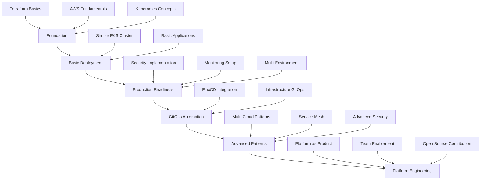

# Learning Path: Mastering Terraform with AWS and Kubernetes

A structured learning progression from beginner to expert, based on analysis of 60+ production-ready open source projects.

## 🎯 Learning Objectives

By following this path, you will:
- Master Infrastructure as Code with Terraform
- Deploy and manage production-ready Kubernetes clusters
- Implement GitOps workflows and best practices
- Build scalable, secure, and cost-effective infrastructure
- Contribute to open source DevOps projects

---

## 📊 Skill Assessment

### Prerequisites Check ✅

**Required Knowledge (Beginner Level)**:
- [ ] Basic Linux command line operations
- [ ] Git version control fundamentals
- [ ] Understanding of containerization (Docker)
- [ ] Basic cloud computing concepts

**Recommended Background**:
- [ ] AWS account with billing awareness
- [ ] Kubernetes concepts (pods, services, deployments)
- [ ] YAML configuration files
- [ ] Basic networking (IP, DNS, ports)

### Current Skill Level Assessment

| Level | Description | Estimated Learning Time |
|-------|-------------|------------------------|
| **🌱 Beginner** | New to DevOps/Cloud | 3-6 months |
| **🌿 Intermediate** | Some cloud experience | 2-4 months |
| **🌳 Advanced** | DevOps practitioner | 1-2 months |
| **🚀 Expert** | Platform engineer | Continuous learning |

---

## 🛤️ Learning Path Overview



---

## 🌱 Phase 1: Foundation (Weeks 1-4)

### Week 1: Terraform Fundamentals

#### 📚 **Study Materials**
- [Terraform Official Documentation](https://developer.hashicorp.com/terraform/docs)
- **Reference Project**: [infrastructure-as-code-talk](https://github.com/brikis98/infrastructure-as-code-talk)

#### 🎯 **Learning Objectives**
- [ ] Understand Infrastructure as Code principles
- [ ] Write basic Terraform configurations
- [ ] Manage Terraform state
- [ ] Use variables and outputs

#### 🛠️ **Hands-on Exercises**
```hcl
# Exercise 1: First Terraform configuration
# Create main.tf, variables.tf, outputs.tf
# Deploy simple AWS resources (VPC, EC2)

provider "aws" {
  region = var.aws_region
}

variable "aws_region" {
  description = "AWS region"
  type        = string
  default     = "us-west-2"
}

resource "aws_vpc" "main" {
  cidr_block           = "10.0.0.0/16"
  enable_dns_hostnames = true
  enable_dns_support   = true

  tags = {
    Name = "terraform-learning-vpc"
  }
}

output "vpc_id" {
  value = aws_vpc.main.id
}
```

#### ✅ **Week 1 Deliverables**
- [ ] Basic Terraform project with VPC and subnets
- [ ] Understanding of Terraform state management
- [ ] Familiarity with Terraform CLI commands

### Week 2: AWS Fundamentals

#### 📚 **Study Materials**
- [AWS EKS Documentation](https://docs.aws.amazon.com/eks/)
- **Reference Project**: [terraform-aws-eks](https://github.com/terraform-aws-modules/terraform-aws-eks)

#### 🎯 **Learning Objectives**
- [ ] Understand AWS networking (VPC, subnets, security groups)
- [ ] Learn IAM roles and policies
- [ ] Explore AWS EKS architecture
- [ ] Practice AWS CLI usage

#### 🛠️ **Hands-on Exercises**
```bash
# Exercise 2: AWS CLI practice
# Configure AWS CLI and explore services

# List available zones
aws ec2 describe-availability-zones --region us-west-2

# Create and manage IAM roles
aws iam create-role --role-name EKSClusterRole --assume-role-policy-document file://trust-policy.json

# Explore EKS clusters
aws eks list-clusters --region us-west-2
```

#### ✅ **Week 2 Deliverables**
- [ ] AWS account setup with proper IAM user
- [ ] Understanding of EKS prerequisites
- [ ] VPC design for Kubernetes clusters

### Week 3: Kubernetes Essentials

#### 📚 **Study Materials**
- [Kubernetes Documentation](https://kubernetes.io/docs/)
- **Reference Project**: [kubernetes-ansible-deployment](https://github.com/cesar-freire-rumos/kubernetes-ansible-deployment)

#### 🎯 **Learning Objectives**
- [ ] Understand Kubernetes architecture
- [ ] Learn about pods, services, deployments
- [ ] Practice kubectl commands
- [ ] Understand networking and storage concepts

#### 🛠️ **Hands-on Exercises**
```yaml
# Exercise 3: Kubernetes basics
# Deploy applications to existing cluster

apiVersion: apps/v1
kind: Deployment
metadata:
  name: nginx-deployment
spec:
  replicas: 3
  selector:
    matchLabels:
      app: nginx
  template:
    metadata:
      labels:
        app: nginx
    spec:
      containers:
      - name: nginx
        image: nginx:1.21
        ports:
        - containerPort: 80
---
apiVersion: v1
kind: Service
metadata:
  name: nginx-service
spec:
  selector:
    app: nginx
  ports:
  - port: 80
    targetPort: 80
  type: LoadBalancer
```

#### ✅ **Week 3 Deliverables**
- [ ] Deploy applications using kubectl
- [ ] Understand Kubernetes resource types
- [ ] Practice debugging pods and services

### Week 4: Integration Practice

#### 🎯 **Integration Objectives**
- [ ] Combine Terraform with Kubernetes
- [ ] Practice with Terraform providers
- [ ] Understand state dependencies

#### 🛠️ **Integration Exercise**
```hcl
# Exercise 4: Terraform + Kubernetes
# Use terraform kubernetes provider

terraform {
  required_providers {
    kubernetes = {
      source  = "hashicorp/kubernetes"
      version = "~> 2.20"
    }
  }
}

provider "kubernetes" {
  config_path = "~/.kube/config"
}

resource "kubernetes_deployment" "nginx" {
  metadata {
    name = "terraform-nginx"
  }
  
  spec {
    replicas = 2
    selector {
      match_labels = {
        app = "nginx"
      }
    }
    template {
      metadata {
        labels = {
          app = "nginx"
        }
      }
      spec {
        container {
          image = "nginx:1.21"
          name  = "nginx"
          port {
            container_port = 80
          }
        }
      }
    }
  }
}
```

---

## 🌿 Phase 2: Basic Deployment (Weeks 5-8)

### Week 5-6: First EKS Cluster

#### 📚 **Study Materials**
- **Primary Reference**: [terraform-aws-eks](https://github.com/terraform-aws-modules/terraform-aws-eks)
- **Supporting**: [Implementation Guide](./implementation-guide.md)

#### 🎯 **Learning Objectives**
- [ ] Deploy production-ready EKS cluster
- [ ] Configure node groups and add-ons
- [ ] Implement basic security practices
- [ ] Set up kubectl access

#### 🛠️ **Project: Deploy EKS Cluster**
```hcl
# Project 1: Basic EKS cluster following best practices
# Use the implementation guide as reference

module "vpc" {
  source = "terraform-aws-modules/vpc/aws"
  # ... VPC configuration
}

module "eks" {
  source = "terraform-aws-modules/eks/aws"
  # ... EKS configuration
}
```

#### ✅ **Week 5-6 Deliverables**
- [ ] Functioning EKS cluster with managed node groups
- [ ] kubectl configured and working
- [ ] Basic applications deployed and accessible

### Week 7-8: Application Deployment

#### 📚 **Study Materials**
- **Reference Project**: [ecs-farget-microservices-deployment-terraform](https://github.com/iamtejasmane/ecs-farget-microservices-deployment-terraform)
- **Alternative**: [e-commerce-microservices-sample](https://github.com/venkataravuri/e-commerce-microservices-sample)

#### 🎯 **Learning Objectives**
- [ ] Deploy multi-tier applications
- [ ] Configure ingress and load balancing
- [ ] Implement persistent storage
- [ ] Practice application scaling

#### 🛠️ **Project: Microservices Application**
```yaml
# Project 2: Deploy a microservices application
# Include frontend, backend, database

apiVersion: apps/v1
kind: Deployment
metadata:
  name: web-frontend
spec:
  replicas: 3
  selector:
    matchLabels:
      app: frontend
  template:
    metadata:
      labels:
        app: frontend
    spec:
      containers:
      - name: frontend
        image: nginx:1.21
        ports:
        - containerPort: 80
        env:
        - name: BACKEND_URL
          value: "http://backend-service:8080"
```

#### ✅ **Week 7-8 Deliverables**
- [ ] Complete microservices application deployed
- [ ] Load balancer configured with SSL
- [ ] Database with persistent storage
- [ ] Application scaling demonstrated

---

## 🌳 Phase 3: Production Readiness (Weeks 9-16)

### Week 9-10: Security Implementation

#### 📚 **Study Materials**
- **Reference Project**: [squareops/terraform-aws-eks](https://github.com/squareops/terraform-aws-eks)
- **Supporting**: [Best Practices Guide](./best-practices.md)

#### 🎯 **Learning Objectives**
- [ ] Implement network security (private clusters, security groups)
- [ ] Configure RBAC and IAM integration
- [ ] Set up secrets management
- [ ] Implement Pod Security Standards

#### 🛠️ **Project: Secure Cluster**
```hcl
# Project 3: Security-hardened EKS cluster
module "eks" {
  source = "terraform-aws-modules/eks/aws"
  
  # Private cluster configuration
  cluster_endpoint_public_access  = false
  cluster_endpoint_private_access = true
  
  # Enable logging
  cluster_enabled_log_types = ["api", "audit", "authenticator"]
  
  # Encryption
  cluster_encryption_config = [
    {
      provider_key_arn = aws_kms_key.eks.arn
      resources        = ["secrets"]
    }
  ]
}
```

#### ✅ **Week 9-10 Deliverables**
- [ ] Private EKS cluster with bastion access
- [ ] Network policies implemented
- [ ] Secrets encrypted and managed properly
- [ ] Security scanning integrated

### Week 11-12: Monitoring and Observability

#### 📚 **Study Materials**
- **Reference Project**: [terraform-kubernetes-monitoring-prometheus](https://github.com/mateothegreat/terraform-kubernetes-monitoring-prometheus)
- **Alternative**: [RahBia-Live-Coding](https://github.com/AhmadRafiee/RahBia-Live-Coding)

#### 🎯 **Learning Objectives**
- [ ] Deploy Prometheus and Grafana
- [ ] Configure alerting with AlertManager
- [ ] Set up log aggregation
- [ ] Implement distributed tracing

#### 🛠️ **Project: Complete Monitoring Stack**
```hcl
# Project 4: Comprehensive monitoring setup
resource "helm_release" "kube_prometheus_stack" {
  name             = "kube-prometheus-stack"
  repository       = "https://prometheus-community.github.io/helm-charts"
  chart            = "kube-prometheus-stack"
  namespace        = "monitoring"
  create_namespace = true

  values = [
    yamlencode({
      grafana = {
        enabled = true
        persistence = {
          enabled = true
          size    = "10Gi"
        }
      }
      prometheus = {
        prometheusSpec = {
          retention = "30d"
          storageSpec = {
            volumeClaimTemplate = {
              spec = {
                accessModes = ["ReadWriteOnce"]
                resources = {
                  requests = {
                    storage = "50Gi"
                  }
                }
              }
            }
          }
        }
      }
    })
  ]
}
```

#### ✅ **Week 11-12 Deliverables**
- [ ] Prometheus monitoring all cluster components
- [ ] Grafana dashboards for applications
- [ ] AlertManager configured with notifications
- [ ] Log aggregation working

### Week 13-14: Multi-Environment Strategy

#### 📚 **Study Materials**
- **Reference Project**: [terraform-kubestack](https://github.com/kbst/terraform-kubestack)
- **Alternative**: [terraform-azurerm-aks-reference](https://github.com/squareops/terraform-azurerm-aks-reference)

#### 🎯 **Learning Objectives**
- [ ] Design environment promotion strategy
- [ ] Implement infrastructure modules
- [ ] Configure environment-specific values
- [ ] Practice disaster recovery procedures

#### 🛠️ **Project: Multi-Environment Infrastructure**
```
# Project 5: Multi-environment setup
environments/
├── dev/
│   ├── main.tf
│   ├── terraform.tfvars
│   └── backend.tf
├── staging/
│   ├── main.tf
│   ├── terraform.tfvars
│   └── backend.tf
└── prod/
    ├── main.tf
    ├── terraform.tfvars
    └── backend.tf
```

#### ✅ **Week 13-14 Deliverables**
- [ ] Three environments (dev, staging, prod) deployed
- [ ] Environment-specific configurations
- [ ] Disaster recovery plan documented
- [ ] Infrastructure modules created

### Week 15-16: Cost Optimization

#### 📚 **Study Materials**
- **Reference Project**: [aws-k8s-platform-blueprint](https://github.com/mu-majid/aws-k8s-platform-blueprint)
- **Focus**: Cost optimization patterns

#### 🎯 **Learning Objectives**
- [ ] Implement spot instances and mixed instance types
- [ ] Configure cluster and pod autoscaling
- [ ] Set up cost monitoring and alerts
- [ ] Practice rightsizing workloads

#### 🛠️ **Project: Cost-Optimized Cluster**
```hcl
# Project 6: Cost optimization implementation
eks_managed_node_groups = {
  spot = {
    instance_types = ["m5.large", "m5.xlarge", "m4.large"]
    capacity_type  = "SPOT"
    
    min_size     = 0
    max_size     = 20
    desired_size = 3
    
    taints = [
      {
        key    = "spot"
        value  = "true"
        effect = "NO_SCHEDULE"
      }
    ]
  }
}
```

#### ✅ **Week 15-16 Deliverables**
- [ ] Spot instances implemented with graceful handling
- [ ] Autoscaling policies optimized
- [ ] Cost monitoring dashboard created
- [ ] 30%+ cost reduction achieved

---

## 🔄 Phase 4: GitOps Automation (Weeks 17-20)

### Week 17-18: FluxCD Implementation

#### 📚 **Study Materials**
- **Primary Reference**: [tofu-controller](https://github.com/flux-iac/tofu-controller)
- **Supporting**: [k8s-gitops](https://github.com/xunholy/k8s-gitops)

#### 🎯 **Learning Objectives**
- [ ] Set up FluxCD for GitOps workflows
- [ ] Configure Terraform automation with GitOps
- [ ] Implement secret management in GitOps
- [ ] Practice GitOps troubleshooting

#### 🛠️ **Project: GitOps Infrastructure**
```yaml
# Project 7: Complete GitOps setup
apiVersion: source.toolkit.fluxcd.io/v1beta2
kind: GitRepository
metadata:
  name: infrastructure-source
  namespace: flux-system
spec:
  interval: 5m
  url: https://github.com/your-org/infrastructure
  ref:
    branch: main
---
apiVersion: infra.contrib.fluxcd.io/v1alpha1
kind: Terraform
metadata:
  name: eks-cluster
  namespace: flux-system
spec:
  interval: 10m
  path: "./terraform/eks"
  sourceRef:
    kind: GitRepository
    name: infrastructure-source
```

#### ✅ **Week 17-18 Deliverables**
- [ ] FluxCD managing all Kubernetes resources
- [ ] Terraform infrastructure automated via GitOps
- [ ] Secrets managed securely in GitOps
- [ ] Complete CI/CD pipeline working

### Week 19-20: Advanced GitOps

#### 📚 **Study Materials**
- **Reference Project**: [home-ops](https://github.com/toboshii/home-ops)
- **Alternative**: [cluster](https://github.com/dfroberg/cluster)

#### 🎯 **Learning Objectives**
- [ ] Implement advanced GitOps patterns
- [ ] Configure progressive delivery
- [ ] Set up multi-cluster GitOps
- [ ] Practice GitOps disaster recovery

#### ✅ **Week 19-20 Deliverables**
- [ ] Progressive delivery implemented
- [ ] Multi-cluster GitOps configuration
- [ ] GitOps disaster recovery tested
- [ ] Team workflow documented

---

## 🚀 Phase 5: Advanced Patterns (Weeks 21-28)

### Week 21-24: Multi-Cloud Patterns

#### 📚 **Study Materials**
- **Reference Project**: [terraform-kubestack](https://github.com/kbst/terraform-kubestack)
- **Alternative**: [nitric](https://github.com/nitrictech/nitric)

#### 🎯 **Learning Objectives**
- [ ] Design cloud-agnostic infrastructure
- [ ] Implement multi-cloud Kubernetes
- [ ] Practice cloud migration strategies
- [ ] Understand cross-cloud networking

#### 🛠️ **Project: Multi-Cloud Platform**
```hcl
# Project 8: Multi-cloud deployment
module "kubernetes_cluster" {
  source = "./modules/kubernetes"
  
  providers = {
    aws   = aws.primary
    gcp   = google.primary
    azure = azurerm.primary
  }
  
  cloud_provider = var.target_cloud
  cluster_name   = var.cluster_name
}
```

#### ✅ **Week 21-24 Deliverables**
- [ ] Clusters deployed on multiple clouds
- [ ] Cloud-agnostic application deployments
- [ ] Cross-cloud networking established
- [ ] Migration procedures documented

### Week 25-28: Service Mesh and Advanced Security

#### 📚 **Study Materials**
- **Focus**: Service mesh integration with Terraform
- **Security**: Advanced security patterns

#### 🎯 **Learning Objectives**
- [ ] Deploy and configure service mesh (Istio/Linkerd)
- [ ] Implement advanced security policies
- [ ] Configure cross-cluster service discovery
- [ ] Practice security incident response

#### ✅ **Week 25-28 Deliverables**
- [ ] Service mesh deployed and configured
- [ ] Zero-trust networking implemented
- [ ] Advanced security policies active
- [ ] Security monitoring comprehensive

---

## 🏗️ Phase 6: Platform Engineering (Weeks 29-36)

### Week 29-32: Platform as a Product

#### 📚 **Study Materials**
- **Reference Project**: [bedrock](https://github.com/microsoft/bedrock)
- **Focus**: Platform engineering principles

#### 🎯 **Learning Objectives**
- [ ] Design internal developer platform
- [ ] Implement self-service capabilities
- [ ] Build platform documentation
- [ ] Establish platform SLAs

#### 🛠️ **Project: Developer Platform**
```yaml
# Project 9: Internal Developer Platform
apiVersion: v1
kind: Namespace
metadata:
  name: platform
---
apiVersion: argoproj.io/v1alpha1
kind: ApplicationSet
metadata:
  name: developer-environments
  namespace: argocd
spec:
  generators:
  - git:
      repoURL: https://github.com/platform-team/environments
      revision: HEAD
      directories:
      - path: environments/*
  template:
    metadata:
      name: '{{path.basename}}'
    spec:
      project: platform
      source:
        repoURL: https://github.com/platform-team/environments
        targetRevision: HEAD
        path: '{{path}}'
      destination:
        server: https://kubernetes.default.svc
        namespace: '{{path.basename}}'
```

#### ✅ **Week 29-32 Deliverables**
- [ ] Self-service platform deployed
- [ ] Developer documentation complete
- [ ] Platform metrics and SLAs defined
- [ ] Team onboarding process established

### Week 33-36: Team Enablement and Open Source

#### 🎯 **Learning Objectives**
- [ ] Train team members on platform
- [ ] Contribute to open source projects
- [ ] Share knowledge through documentation
- [ ] Build community around platform

#### ✅ **Week 33-36 Deliverables**
- [ ] Team training completed
- [ ] Open source contributions made
- [ ] Knowledge sharing sessions conducted
- [ ] Platform community established

---

## 📚 Recommended Study Resources

### Books
- **"Terraform: Up & Running"** by Yevgeniy Brikman
- **"Kubernetes in Action"** by Marko Lukša
- **"The DevOps Handbook"** by Gene Kim, et al.
- **"Accelerate"** by Nicole Forsgren, et al.

### Online Courses
- **Terraform Associate Certification** (HashiCorp)
- **Certified Kubernetes Administrator (CKA)** (CNCF)
- **AWS Solutions Architect** (Amazon)
- **GitOps Fundamentals** (Codefresh/Weaveworks)

### Hands-on Platforms
- **Katacoda** - Interactive scenarios
- **Play with Kubernetes** - Browser-based labs
- **Terraform Cloud** - Free tier for learning
- **AWS Free Tier** - Hands-on AWS experience

---

## 🎯 Certification Path

### Recommended Certifications by Phase

| Phase | Certification | Timeline | Difficulty |
|-------|---------------|----------|------------|
| **Foundation** | Terraform Associate | Month 2 | Beginner |
| **Basic Deployment** | AWS Solutions Architect Associate | Month 4 | Intermediate |
| **Production Ready** | Certified Kubernetes Administrator (CKA) | Month 6 | Intermediate |
| **GitOps** | GitOps Fundamentals | Month 8 | Intermediate |
| **Advanced** | Certified Kubernetes Security Specialist (CKS) | Month 10 | Advanced |
| **Platform Engineering** | AWS DevOps Engineer Professional | Month 12 | Expert |

---

## 🤝 Community Engagement

### Open Source Contribution Path

#### Beginner Contributions
- [ ] Documentation improvements
- [ ] Bug reports with detailed reproduction steps
- [ ] Testing and validation of examples

#### Intermediate Contributions  
- [ ] Feature enhancements
- [ ] New examples and use cases
- [ ] Performance optimizations

#### Advanced Contributions
- [ ] New modules and providers
- [ ] Security improvements
- [ ] Architecture enhancements

### Community Resources
- **Kubernetes Slack** - Real-time discussions
- **Terraform Community** - Provider development
- **CNCF Groups** - Local meetups
- **AWS User Groups** - Regional communities

---

## 📈 Progress Tracking

### Skill Assessment Checklist

#### Foundation Skills ✅
- [ ] Terraform basics and state management
- [ ] AWS networking and IAM
- [ ] Kubernetes fundamentals
- [ ] Git and version control

#### Intermediate Skills ✅
- [ ] EKS cluster deployment and management
- [ ] Application deployment patterns
- [ ] Basic security implementation
- [ ] Monitoring and troubleshooting

#### Advanced Skills ✅
- [ ] Production-ready infrastructure
- [ ] GitOps workflows
- [ ] Multi-environment strategies
- [ ] Cost optimization

#### Expert Skills ✅
- [ ] Platform engineering
- [ ] Multi-cloud patterns
- [ ] Advanced security
- [ ] Team enablement

### Project Portfolio

Build a portfolio showcasing:
1. **Basic Infrastructure** - Simple EKS cluster
2. **Production Application** - Microservices deployment
3. **Secure Platform** - Hardened, monitored infrastructure  
4. **GitOps Pipeline** - Automated deployment workflow
5. **Multi-Cloud Solution** - Portable infrastructure
6. **Developer Platform** - Self-service capabilities

---

## 🔄 Continuous Learning

### Staying Current
- [ ] Follow project updates and releases
- [ ] Subscribe to DevOps newsletters and blogs
- [ ] Attend conferences and webinars
- [ ] Participate in community discussions

### Advanced Topics to Explore
- [ ] FinOps and cost optimization
- [ ] Chaos engineering
- [ ] Policy as Code (OPA)
- [ ] Machine learning on Kubernetes
- [ ] Edge computing patterns

---

## Navigation
← [Comparison Analysis](./comparison-analysis.md) | → [Template Examples](./template-examples.md) | ↑ [README](./README.md)