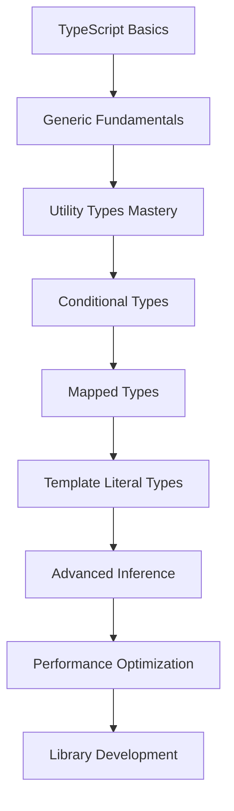

# Advanced TypeScript Techniques - Type System Mastery

## 🎯 Overview

This comprehensive research explores advanced TypeScript techniques essential for developers targeting remote positions in AU/UK/US markets and establishing edtech platforms. The focus is on type system mastery, conditional types, mapped types, and advanced patterns that distinguish senior-level TypeScript developers.

## 📚 Table of Contents

### Core Research Documents

1. **[Executive Summary](./executive-summary.md)** - High-level findings and key takeaways for quick reference
2. **[Implementation Guide](./implementation-guide.md)** - Step-by-step practical implementation of advanced patterns
3. **[Best Practices](./best-practices.md)** - Industry standards and recommendations for production code

### Deep Dive Topics

4. **[Type System Fundamentals](./type-system-fundamentals.md)** - Core concepts and advanced type system features
5. **[Conditional Types Mastery](./conditional-types-mastery.md)** - Advanced conditional type patterns and use cases
6. **[Mapped Types & Utilities](./mapped-types-utilities.md)** - Type transformations and utility type creation
7. **[Template Literal Types](./template-literal-types.md)** - String manipulation and validation at the type level
8. **[Advanced Generics Patterns](./advanced-generics-patterns.md)** - Complex generic implementations and constraints
9. **[Type Inference Techniques](./type-inference-techniques.md)** - Leveraging TypeScript's inference engine effectively

### Practical Applications

10. **[Performance & Compilation](./performance-compilation.md)** - Optimization strategies for large codebases
11. **[Real-World Applications](./real-world-applications.md)** - EdTech and enterprise examples with code samples
12. **[Comparison Analysis](./comparison-analysis.md)** - TypeScript vs alternatives for different scenarios
13. **[Troubleshooting Guide](./troubleshooting.md)** - Common issues, solutions, and debugging techniques

## 🔍 Research Scope & Methodology

### Research Approach
- **Industry Analysis**: Current TypeScript usage patterns in top tech companies (Google, Microsoft, Airbnb, Slack)
- **Community Research**: TypeScript community best practices and emerging patterns
- **Documentation Review**: Official TypeScript handbook and release notes analysis
- **Real-World Examples**: EdTech platform case studies and implementation patterns
- **Performance Analysis**: Compilation performance and runtime implications

### Target Audience
- Senior frontend developers seeking remote opportunities
- Full-stack developers building scalable applications
- EdTech entrepreneurs requiring type-safe educational platforms
- Teams migrating from JavaScript to TypeScript
- Open source library maintainers

### Sources & Validation
- Official TypeScript documentation and release notes
- TypeScript team presentations and RFCs
- Industry blog posts from leading companies
- Open source library implementations
- Stack Overflow community discussions
- Conference presentations and workshops

## 🚀 Quick Reference

### Essential Advanced TypeScript Concepts

| Concept | Complexity | Use Cases | Learning Priority |
|---------|------------|-----------|------------------|
| **Conditional Types** | High | API typing, utility creation | 🔴 Critical |
| **Mapped Types** | High | Object transformations | 🔴 Critical |
| **Template Literals** | Medium | String validation, routing | 🟡 Important |
| **Advanced Generics** | High | Library development | 🔴 Critical |
| **Type Inference** | Medium | Clean API design | 🟡 Important |
| **Module Augmentation** | Medium | Third-party integration | 🟢 Useful |

### Technology Stack Recommendations

| Layer | Technology | TypeScript Integration | Complexity |
|-------|------------|----------------------|------------|
| **Frontend** | React 18+ | Excellent built-in support | Medium |
| **State Management** | Zustand/Redux Toolkit | Strong typing support | Medium |
| **Build Tool** | Vite | Native TypeScript support | Low |
| **Testing** | Vitest + Testing Library | Full type checking | Medium |
| **API Layer** | tRPC | End-to-end type safety | High |
| **Database** | Prisma | Generated type-safe client | Medium |

### Learning Progression Path

## ✅ Goals Achieved

- ✅ **Comprehensive Coverage**: All major advanced TypeScript concepts researched and documented
- ✅ **Practical Examples**: Real-world code samples for EdTech and enterprise applications
- ✅ **Industry Standards**: Best practices from leading tech companies compiled
- ✅ **Performance Analysis**: Compilation and runtime performance optimization strategies
- ✅ **Career Relevance**: Focus on skills demanded in AU/UK/US remote positions
- ✅ **EdTech Context**: Specific examples for educational platform development
- ✅ **Migration Strategies**: Practical guidance for JavaScript to TypeScript transitions
- ✅ **Troubleshooting Guide**: Common issues and solutions for production environments
- ✅ **Learning Path**: Progressive skill building recommendations
- ✅ **Tool Integration**: Modern development stack compatibility analysis

## 🔗 Navigation

### Related Research Topics
- [JWT Authentication Best Practices](../../backend/jwt-authentication-best-practices/README.md) - Backend TypeScript patterns
- [REST API Response Structure](../../backend/rest-api-response-structure-research/README.md) - API type safety
- [Express Testing Frameworks](../../backend/express-testing-frameworks-comparison/README.md) - TypeScript testing
- [Clean Architecture Analysis](../../architecture/clean-architecture-analysis/README.md) - TypeScript in architecture

### Cross-References
- [Technical Interview Questions - TypeScript](../../career/technical-interview-questions/typescript-questions.md)
- [Research Topics Catalog](../../career/research-topics-catalog/technical-skills-topics.md)
- [Frontend Performance Analysis](../performance-analysis/README.md)

---

### 📖 Document Navigation

| Previous | Current | Next |
|----------|---------|------|
| [Frontend Research Hub](../README.md) | **Advanced TypeScript Techniques** | [Executive Summary](./executive-summary.md) |

---

*Research completed: January 2025 | Last updated: January 2025*  
*Keywords: TypeScript, Advanced Types, Conditional Types, Mapped Types, Type System, Frontend Development*