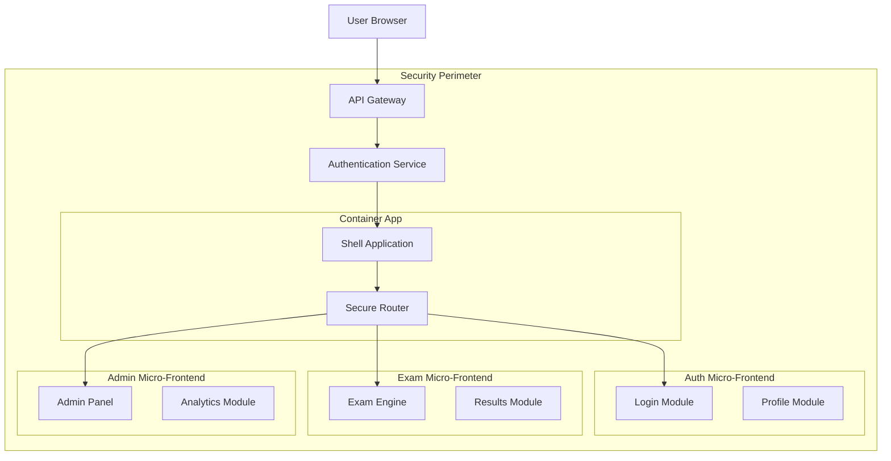

# Security Considerations: Micro-Frontend Architecture

Comprehensive security guide for micro-frontend architectures, covering authentication boundaries, secure communication patterns, and protection strategies for educational technology platforms.


**Security Priority**: Educational platforms handle sensitive student data and payment information
**Compliance Requirements**: GDPR, COPPA, PCI DSS compliance for global markets
**Threat Model**: Cross-application attacks, data leakage, authentication bypass


## Security Architecture Overview

### Security Boundaries in Micro-Frontends



### Core Security Principles

1. **Zero Trust Architecture**: Every micro-frontend request is authenticated and authorized
2. **Defense in Depth**: Multiple security layers across application boundaries
3. **Principle of Least Privilege**: Micro-frontends access only required resources
4. **Secure by Default**: Security controls are enabled by default

## Authentication and Authorization

### 1. Centralized Authentication Strategy

```typescript
// Centralized authentication service
interface AuthenticationService {
  authenticate(credentials: LoginCredentials): Promise<AuthResult>;
  validateToken(token: string): Promise<TokenValidation>;
  refreshToken(refreshToken: string): Promise<AuthResult>;
  logout(token: string): Promise<void>;
}

class SecureAuthService implements AuthenticationService {
  private readonly apiClient: SecureApiClient;
  private readonly tokenStorage: SecureTokenStorage;
  
  async authenticate(credentials: LoginCredentials): Promise<AuthResult> {
    try {
      // Input validation
      this.validateCredentials(credentials);
      
      // Rate limiting check
      await this.checkRateLimit(credentials.email);
      
      // API call with CSRF protection
      const response = await this.apiClient.post('/auth/login', {
        email: credentials.email,
        password: credentials.password,
        csrfToken: this.getCSRFToken(),
      });
      
      if (response.success) {
        // Store tokens securely
        await this.tokenStorage.storeTokens({
          accessToken: response.accessToken,
          refreshToken: response.refreshToken,
          expiresAt: response.expiresAt,
        });
        
        // Broadcast authentication success to micro-frontends
        this.notifyAuthenticationSuccess(response.user);
        
        return response;
      }
      
      throw new Error('Authentication failed');
    } catch (error) {
      // Log security event
      this.logSecurityEvent('authentication_failed', {
        email: credentials.email,
        ip: this.getClientIP(),
        userAgent: navigator.userAgent,
        error: error.message,
      });
      
      throw error;
    }
  }
  
  async validateToken(token: string): Promise<TokenValidation> {
    try {
      // Local validation first (JWT signature, expiry)
      const localValidation = this.validateTokenLocally(token);
      if (!localValidation.valid) {
        return localValidation;
      }
      
      // Remote validation for revocation check
      const response = await this.apiClient.post('/auth/validate', {
        token,
      });
      
      return {
        valid: response.valid,
        user: response.user,
        permissions: response.permissions,
        expiresAt: response.expiresAt,
      };
    } catch (error) {
      this.logSecurityEvent('token_validation_failed', { error: error.message });
      return { valid: false, reason: 'Validation failed' };
    }
  }
  
  private validateCredentials(credentials: LoginCredentials): void {
    if (!credentials.email || !this.isValidEmail(credentials.email)) {
      throw new Error('Invalid email format');
    }
    
    if (!credentials.password || credentials.password.length < 8) {
      throw new Error('Password does not meet requirements');
    }
  }
  
  private async checkRateLimit(email: string): Promise<void> {
    const key = `auth_attempts:${email}`;
    const attempts = parseInt(localStorage.getItem(key) || '0');
    
    if (attempts >= 5) {
      const lockoutTime = localStorage.getItem(`${key}:lockout`);
      if (lockoutTime && Date.now() < parseInt(lockoutTime)) {
        throw new Error('Account temporarily locked due to multiple failed attempts');
      }
    }
  }
  
  private notifyAuthenticationSuccess(user: User): void {
    // Secure cross-micro-frontend communication
    window.dispatchEvent(new CustomEvent('auth:success', {
      detail: {
        userId: user.id,
        permissions: user.permissions,
        timestamp: Date.now(),
      }
    }));
  }
}
```

### 2. Token Management and Storage

```typescript
// Secure token storage implementation
class SecureTokenStorage {
  private static readonly ACCESS_TOKEN_KEY = '__edtech_access_token';
  private static readonly REFRESH_TOKEN_KEY = '__edtech_refresh_token';
  
  async storeTokens(tokens: AuthTokens): Promise<void> {
    try {
      // Store access token in memory (most secure, but lost on refresh)
      this.setInMemoryToken(tokens.accessToken);
      
      // Store refresh token in httpOnly cookie (more secure than localStorage)
      await this.setSecureCookie(this.REFRESH_TOKEN_KEY, tokens.refreshToken, {
        httpOnly: true,
        secure: true,
        sameSite: 'strict',
        maxAge: 7 * 24 * 60 * 60, // 7 days
      });
      
      // Store session info in localStorage (non-sensitive data only)
      localStorage.setItem('user_session', JSON.stringify({
        userId: tokens.userId,
        expiresAt: tokens.expiresAt,
        permissions: tokens.permissions,
      }));
      
    } catch (error) {
      console.error('Failed to store tokens securely:', error);
      throw new Error('Token storage failed');
    }
  }
  
  async getAccessToken(): Promise<string | null> {
    // Try memory first
    const memoryToken = this.getInMemoryToken();
    if (memoryToken && !this.isTokenExpired(memoryToken)) {
      return memoryToken;
    }
    
    // Try to refresh token
    const refreshToken = await this.getRefreshToken();
    if (refreshToken) {
      return this.refreshAccessToken(refreshToken);
    }
    
    return null;
  }
  
  async clearTokens(): Promise<void> {
    // Clear memory
    this.clearInMemoryToken();
    
    // Clear cookies
    await this.clearSecureCookie(this.REFRESH_TOKEN_KEY);
    
    // Clear localStorage
    localStorage.removeItem('user_session');
    
    // Notify micro-frontends
    window.dispatchEvent(new CustomEvent('auth:logout'));
  }
  
  private setInMemoryToken(token: string): void {
    // Store in a closure or WeakMap to prevent access from global scope
    (window as any).__secureTokenStore = (window as any).__secureTokenStore || {};
    (window as any).__secureTokenStore[this.ACCESS_TOKEN_KEY] = token;
  }
  
  private getInMemoryToken(): string | null {
    const store = (window as any).__secureTokenStore;
    return store ? store[this.ACCESS_TOKEN_KEY] : null;
  }
  
  private isTokenExpired(token: string): boolean {
    try {
      const payload = JSON.parse(atob(token.split('.')[1]));
      return Date.now() >= payload.exp * 1000;
    } catch {
      return true;
    }
  }
}
```

### 3. Permission-Based Micro-Frontend Loading

```typescript
// Secure micro-frontend loader with permission checks
class SecureMicroFrontendLoader {
  private static authorizedModules = new Map<string, string[]>();
  
  static async loadMicroFrontend(
    moduleName: string,
    requiredPermissions: string[]
  ): Promise<any> {
    try {
      // Validate user permissions
      const hasPermission = await this.validatePermissions(requiredPermissions);
      if (!hasPermission) {
        throw new Error(`Insufficient permissions for ${moduleName}`);
      }
      
      // Check if module is authorized for current user
      if (!this.isModuleAuthorized(moduleName, requiredPermissions)) {
        throw new Error(`Module ${moduleName} not authorized for current user`);
      }
      
      // Load module with integrity check
      const module = await this.loadWithIntegrityCheck(moduleName);
      
      // Register loaded module for cleanup
      this.registerLoadedModule(moduleName, requiredPermissions);
      
      return module;
    } catch (error) {
      this.logSecurityEvent('unauthorized_module_access', {
        moduleName,
        requiredPermissions,
        error: error.message,
      });
      throw error;
    }
  }
  
  private static async validatePermissions(requiredPermissions: string[]): Promise<boolean> {
    const authService = new SecureAuthService();
    const token = await authService.getAccessToken();
    
    if (!token) {
      return false;
    }
    
    const validation = await authService.validateToken(token);
    if (!validation.valid) {
      return false;
    }
    
    // Check if user has all required permissions
    return requiredPermissions.every(permission =>
      validation.permissions.includes(permission)
    );
  }
  
  private static isModuleAuthorized(moduleName: string, permissions: string[]): boolean {
    const authorizedPerms = this.authorizedModules.get(moduleName);
    return authorizedPerms ? 
      permissions.every(perm => authorizedPerms.includes(perm)) : 
      false;
  }
  
  private static async loadWithIntegrityCheck(moduleName: string): Promise<any> {
    const moduleUrl = this.getModuleUrl(moduleName);
    
    // Verify module integrity using Subresource Integrity
    const expectedHash = await this.getExpectedHash(moduleName);
    
    const script = document.createElement('script');
    script.src = moduleUrl;
    script.integrity = expectedHash;
    script.crossOrigin = 'anonymous';
    
    return new Promise((resolve, reject) => {
      script.onload = () => {
        const module = (window as any)[moduleName];
        if (module) {
          resolve(module);
        } else {
          reject(new Error(`Module ${moduleName} not found after loading`));
        }
      };
      
      script.onerror = () => {
        reject(new Error(`Failed to load module ${moduleName} - integrity check failed`));
      };
      
      document.head.appendChild(script);
    });
  }
}
```

## Cross-Application Communication Security

### 1. Secure Message Passing

```typescript
// Secure inter-micro-frontend communication
class SecureMessageBus {
  private static trustedOrigins = new Set([
    'https://auth.edtech-platform.com',
    'https://exams.edtech-platform.com',
    'https://admin.edtech-platform.com',
  ]);
  
  private static messageHandlers = new Map<string, (data: any) => void>();
  private static encryptionKey: CryptoKey | null = null;
  
  static async initialize(): Promise<void> {
    // Generate encryption key for message encryption
    this.encryptionKey = await crypto.subtle.generateKey(
      { name: 'AES-GCM', length: 256 },
      false,
      ['encrypt', 'decrypt']
    );
    
    // Set up secure message listener
    window.addEventListener('message', this.handleSecureMessage.bind(this));
  }
  
  static async sendSecureMessage(
    targetOrigin: string,
    messageType: string,
    data: any
  ): Promise<void> {
    if (!this.trustedOrigins.has(targetOrigin)) {
      throw new Error(`Untrusted target origin: ${targetOrigin}`);
    }
    
    if (!this.encryptionKey) {
      throw new Error('Message bus not initialized');
    }
    
    try {
      // Create secure message
      const message: SecureMessage = {
        id: crypto.randomUUID(),
        type: messageType,
        timestamp: Date.now(),
        origin: window.location.origin,
        data: await this.encryptData(data),
        signature: await this.signMessage(messageType, data),
      };
      
      // Send message
      window.postMessage(message, targetOrigin);
      
    } catch (error) {
      this.logSecurityEvent('secure_message_send_failed', {
        targetOrigin,
        messageType,
        error: error.message,
      });
      throw error;
    }
  }
  
  static onSecureMessage(
    messageType: string,
    handler: (data: any) => void
  ): void {
    this.messageHandlers.set(messageType, handler);
  }
  
  private static async handleSecureMessage(event: MessageEvent): Promise<void> {
    try {
      // Verify origin
      if (!this.trustedOrigins.has(event.origin)) {
        this.logSecurityEvent('untrusted_message_origin', {
          origin: event.origin,
        });
        return;
      }
      
      const message = event.data as SecureMessage;
      
      // Validate message structure
      if (!this.isValidSecureMessage(message)) {
        this.logSecurityEvent('invalid_message_structure', { message });
        return;
      }
      
      // Verify message signature
      const isValidSignature = await this.verifyMessageSignature(message);
      if (!isValidSignature) {
        this.logSecurityEvent('invalid_message_signature', {
          messageId: message.id,
          type: message.type,
        });
        return;
      }
      
      // Decrypt and handle message
      const decryptedData = await this.decryptData(message.data);
      const handler = this.messageHandlers.get(message.type);
      
      if (handler) {
        handler(decryptedData);
      }
      
    } catch (error) {
      this.logSecurityEvent('secure_message_handling_failed', {
        error: error.message,
      });
    }
  }
  
  private static async encryptData(data: any): Promise<string> {
    if (!this.encryptionKey) {
      throw new Error('Encryption key not available');
    }
    
    const dataString = JSON.stringify(data);
    const dataBuffer = new TextEncoder().encode(dataString);
    const iv = crypto.getRandomValues(new Uint8Array(12));
    
    const encryptedData = await crypto.subtle.encrypt(
      { name: 'AES-GCM', iv },
      this.encryptionKey,
      dataBuffer
    );
    
    // Combine IV and encrypted data
    const combined = new Uint8Array(iv.length + encryptedData.byteLength);
    combined.set(iv);
    combined.set(new Uint8Array(encryptedData), iv.length);
    
    return btoa(String.fromCharCode(...combined));
  }
  
  private static async decryptData(encryptedData: string): Promise<any> {
    if (!this.encryptionKey) {
      throw new Error('Decryption key not available');
    }
    
    const combined = new Uint8Array(
      atob(encryptedData).split('').map(char => char.charCodeAt(0))
    );
    
    const iv = combined.slice(0, 12);
    const data = combined.slice(12);
    
    const decryptedData = await crypto.subtle.decrypt(
      { name: 'AES-GCM', iv },
      this.encryptionKey,
      data
    );
    
    const dataString = new TextDecoder().decode(decryptedData);
    return JSON.parse(dataString);
  }
  
  private static async signMessage(type: string, data: any): Promise<string> {
    const message = JSON.stringify({ type, data, timestamp: Date.now() });
    const messageBuffer = new TextEncoder().encode(message);
    
    // Use HMAC for message signing
    const key = await crypto.subtle.importKey(
      'raw',
      new TextEncoder().encode('secure-signing-key'), // In production, use proper key management
      { name: 'HMAC', hash: 'SHA-256' },
      false,
      ['sign']
    );
    
    const signature = await crypto.subtle.sign('HMAC', key, messageBuffer);
    return btoa(String.fromCharCode(...new Uint8Array(signature)));
  }
  
  private static async verifyMessageSignature(message: SecureMessage): Promise<boolean> {
    try {
      const expectedSignature = await this.signMessage(message.type, message.data);
      return message.signature === expectedSignature;
    } catch {
      return false;
    }
  }
}

interface SecureMessage {
  id: string;
  type: string;
  timestamp: number;
  origin: string;
  data: string; // Encrypted data
  signature: string;
}
```

## Content Security Policy (CSP)

### 1. Strict CSP Configuration

```typescript
// CSP configuration for micro-frontend security
class CSPManager {
  static generateCSPHeader(environment: 'development' | 'production'): string {
    const basePolicy = {
      'default-src': ["'self'"],
      'script-src': this.getScriptSources(environment),
      'style-src': this.getStyleSources(environment),
      'connect-src': this.getConnectSources(environment),
      'img-src': this.getImageSources(environment),
      'font-src': this.getFontSources(environment),
      'frame-src': ["'none'"],
      'object-src': ["'none'"],
      'base-uri': ["'self'"],
      'form-action': ["'self'"],
      'frame-ancestors': ["'none'"],
      'upgrade-insecure-requests': [],
    };
    
    return Object.entries(basePolicy)
      .map(([directive, sources]) => `${directive} ${sources.join(' ')}`)
      .join('; ');
  }
  
  private static getScriptSources(environment: string): string[] {
    const sources = ["'self'"];
    
    if (environment === 'development') {
      sources.push(
        "'unsafe-eval'", // Required for webpack dev server
        "http://localhost:*", // Local development servers
        "ws://localhost:*" // WebSocket connections
      );
    }
    
    sources.push(
      "'unsafe-inline'", // Required for Module Federation runtime
      "https://cdn.edtech-platform.com", // Production CDN
      "https://asia.cdn.edtech-platform.com", // Regional CDN
      "'nonce-{NONCE}'" // Dynamic nonce for inline scripts
    );
    
    return sources;
  }
  
  private static getStyleSources(environment: string): string[] {
    const sources = ["'self'", "'unsafe-inline'"]; // CSS-in-JS requires unsafe-inline
    
    sources.push(
      "https://cdn.edtech-platform.com",
      "https://fonts.googleapis.com" // Google Fonts
    );
    
    return sources;
  }
  
  private static getConnectSources(environment: string): string[] {
    const sources = ["'self'"];
    
    if (environment === 'development') {
      sources.push(
        "http://localhost:*",
        "ws://localhost:*"
      );
    }
    
    sources.push(
      "https://api.edtech-platform.com", // Main API
      "https://auth.edtech-platform.com", // Auth service
      "https://analytics.edtech-platform.com", // Analytics
      "wss://realtime.edtech-platform.com" // WebSocket connections
    );
    
    return sources;
  }
}
```

### 2. CSP Violation Reporting

```typescript
// CSP violation reporting and monitoring
class CSPViolationReporter {
  static setupViolationReporting(): void {
    // Set up CSP violation event listener
    document.addEventListener('securitypolicyviolation', this.handleViolation);
    
    // Also handle report-to directive violations
    if ('ReportingObserver' in window) {
      const observer = new ReportingObserver((reports) => {
        reports.forEach(report => {
          if (report.type === 'csp-violation') {
            this.reportViolation(report.body);
          }
        });
      });
      
      observer.observe();
    }
  }
  
  private static handleViolation(event: SecurityPolicyViolationEvent): void {
    const violation = {
      blockedURI: event.blockedURI,
      directive: event.violatedDirective,
      effectiveDirective: event.effectiveDirective,
      originalPolicy: event.originalPolicy,
      referrer: event.referrer,
      statusCode: event.statusCode,
      timestamp: Date.now(),
      userAgent: navigator.userAgent,
    };
    
    this.reportViolation(violation);
  }
  
  private static async reportViolation(violation: any): Promise<void> {
    try {
      // Send violation report to security monitoring service
      await fetch('/api/security/csp-violations', {
        method: 'POST',
        headers: { 'Content-Type': 'application/json' },
        body: JSON.stringify(violation),
      });
      
      // Log locally for development
      if (process.env.NODE_ENV === 'development') {
        console.warn('CSP Violation:', violation);
      }
      
    } catch (error) {
      console.error('Failed to report CSP violation:', error);
    }
  }
}
```

## Data Protection and Privacy

### 1. Data Classification and Handling

```typescript
// Data classification for educational platform
enum DataClassification {
  PUBLIC = 'public',
  INTERNAL = 'internal', 
  CONFIDENTIAL = 'confidential',
  RESTRICTED = 'restricted'
}

interface DataHandler {
  classification: DataClassification;
  encrypt: boolean;
  auditLog: boolean;
  retention: number; // days
  allowedMicroFrontends: string[];
}

class DataProtectionManager {
  private static dataHandlers = new Map<string, DataHandler>([
    ['user-profile', {
      classification: DataClassification.CONFIDENTIAL,
      encrypt: true,
      auditLog: true,
      retention: 2555, // 7 years
      allowedMicroFrontends: ['auth', 'profile', 'admin'],
    }],
    
    ['exam-results', {
      classification: DataClassification.RESTRICTED,
      encrypt: true,
      auditLog: true,
      retention: 2555, // 7 years
      allowedMicroFrontends: ['exams', 'analytics', 'admin'],
    }],
    
    ['payment-info', {
      classification: DataClassification.RESTRICTED,
      encrypt: true,
      auditLog: true,
      retention: 2555, // 7 years (compliance requirement)
      allowedMicroFrontends: ['payment', 'admin'],
    }],
    
    ['learning-progress', {
      classification: DataClassification.CONFIDENTIAL,
      encrypt: true,
      auditLog: true,
      retention: 1095, // 3 years
      allowedMicroFrontends: ['exams', 'analytics', 'dashboard'],
    }],
  ]);
  
  static async handleData(
    dataType: string,
    data: any,
    microFrontendName: string,
    operation: 'read' | 'write' | 'delete'
  ): Promise<any> {
    const handler = this.dataHandlers.get(dataType);
    
    if (!handler) {
      throw new Error(`Unknown data type: ${dataType}`);
    }
    
    // Check if micro-frontend is authorized to handle this data
    if (!handler.allowedMicroFrontends.includes(microFrontendName)) {
      this.auditLog('unauthorized_data_access', {
        dataType,
        microFrontend: microFrontendName,
        operation,
      });
      throw new Error(`Unauthorized access to ${dataType} from ${microFrontendName}`);
    }
    
    // Audit log all data operations
    if (handler.auditLog) {
      this.auditLog('data_access', {
        dataType,
        microFrontend: microFrontendName,
        operation,
        classification: handler.classification,
      });
    }
    
    // Handle encryption/decryption
    if (handler.encrypt) {
      if (operation === 'write') {
        data = await this.encryptSensitiveData(data);
      } else if (operation === 'read') {
        data = await this.decryptSensitiveData(data);
      }
    }
    
    return data;
  }
  
  private static async encryptSensitiveData(data: any): Promise<string> {
    const dataString = JSON.stringify(data);
    const dataBuffer = new TextEncoder().encode(dataString);
    
    const key = await this.getEncryptionKey();
    const iv = crypto.getRandomValues(new Uint8Array(12));
    
    const encryptedData = await crypto.subtle.encrypt(
      { name: 'AES-GCM', iv },
      key,
      dataBuffer
    );
    
    const combined = new Uint8Array(iv.length + encryptedData.byteLength);
    combined.set(iv);
    combined.set(new Uint8Array(encryptedData), iv.length);
    
    return btoa(String.fromCharCode(...combined));
  }
  
  private static async decryptSensitiveData(encryptedData: string): Promise<any> {
    const combined = new Uint8Array(
      atob(encryptedData).split('').map(char => char.charCodeAt(0))
    );
    
    const iv = combined.slice(0, 12);
    const data = combined.slice(12);
    
    const key = await this.getEncryptionKey();
    
    const decryptedData = await crypto.subtle.decrypt(
      { name: 'AES-GCM', iv },
      key,
      data
    );
    
    const dataString = new TextDecoder().decode(decryptedData);
    return JSON.parse(dataString);
  }
  
  private static auditLog(event: string, details: any): void {
    const auditEntry = {
      timestamp: new Date().toISOString(),
      event,
      details,
      userAgent: navigator.userAgent,
      ip: this.getClientIP(),
    };
    
    // Send to audit logging service
    fetch('/api/audit/log', {
      method: 'POST',
      headers: { 'Content-Type': 'application/json' },
      body: JSON.stringify(auditEntry),
    }).catch(error => {
      console.error('Failed to send audit log:', error);
    });
  }
}
```

## Security Monitoring and Incident Response

### 1. Real-time Security Monitoring

```typescript
// Security monitoring for micro-frontends
class SecurityMonitor {
  private static securityEvents = new Map<string, number>();
  private static alertThresholds = new Map<string, number>([
    ['failed_login_attempts', 5],
    ['unauthorized_access', 3],
    ['csp_violations', 10],
    ['suspicious_requests', 20],
  ]);
  
  static trackSecurityEvent(eventType: string, details: any): void {
    // Increment event counter
    const currentCount = this.securityEvents.get(eventType) || 0;
    this.securityEvents.set(eventType, currentCount + 1);
    
    // Check if threshold exceeded
    const threshold = this.alertThresholds.get(eventType);
    if (threshold && currentCount >= threshold) {
      this.triggerSecurityAlert(eventType, currentCount, details);
    }
    
    // Log security event
    this.logSecurityEvent(eventType, details);
  }
  
  private static triggerSecurityAlert(
    eventType: string,
    count: number,
    details: any
  ): void {
    const alert: SecurityAlert = {
      id: crypto.randomUUID(),
      type: eventType,
      severity: this.getSeverity(eventType),
      count,
      timestamp: Date.now(),
      details,
      status: 'active',
    };
    
    // Send alert to security team
    this.sendSecurityAlert(alert);
    
    // Take automated response actions
    this.executeAutomatedResponse(alert);
  }
  
  private static async sendSecurityAlert(alert: SecurityAlert): Promise<void> {
    try {
      await fetch('/api/security/alerts', {
        method: 'POST',
        headers: { 'Content-Type': 'application/json' },
        body: JSON.stringify(alert),
      });
      
      // Also send to external monitoring service (e.g., PagerDuty, Slack)
      if (alert.severity === 'critical') {
        await this.notifySecurityTeam(alert);
      }
      
    } catch (error) {
      console.error('Failed to send security alert:', error);
    }
  }
  
  private static executeAutomatedResponse(alert: SecurityAlert): void {
    switch (alert.type) {
      case 'failed_login_attempts':
        // Temporarily block IP address
        this.blockSuspiciousIP(alert.details.ip);
        break;
        
      case 'unauthorized_access':
        // Force logout and token revocation
        this.revokeUserTokens(alert.details.userId);
        break;
        
      case 'csp_violations':
        // Block malicious scripts
        this.blockMaliciousContent(alert.details.blockedURI);
        break;
    }
  }
  
  private static getSeverity(eventType: string): 'low' | 'medium' | 'high' | 'critical' {
    const severityMap = {
      'failed_login_attempts': 'medium',
      'unauthorized_access': 'high',
      'csp_violations': 'medium',
      'suspicious_requests': 'low',
      'data_breach': 'critical',
    };
    
    return severityMap[eventType] || 'low';
  }
}

interface SecurityAlert {
  id: string;
  type: string;
  severity: 'low' | 'medium' | 'high' | 'critical';
  count: number;
  timestamp: number;
  details: any;
  status: 'active' | 'investigating' | 'resolved';
}
```

## Compliance and Regulatory Requirements

### 1. GDPR Compliance for Educational Data

```typescript
// GDPR compliance manager for educational platforms
class GDPRComplianceManager {
  // Data subject rights implementation
  static async handleDataSubjectRequest(
    requestType: 'access' | 'rectification' | 'erasure' | 'portability',
    userId: string,
    userConsent: boolean
  ): Promise<any> {
    if (!userConsent) {
      throw new Error('User consent required for data processing');
    }
    
    // Log compliance request
    this.logComplianceActivity('data_subject_request', {
      requestType,
      userId,
      timestamp: Date.now(),
    });
    
    switch (requestType) {
      case 'access':
        return this.provideDataAccess(userId);
      
      case 'rectification':
        return this.enableDataRectification(userId);
      
      case 'erasure':
        return this.processDataErasure(userId);
      
      case 'portability':
        return this.provideDataPortability(userId);
      
      default:
        throw new Error(`Unknown request type: ${requestType}`);
    }
  }
  
  // Consent management across micro-frontends
  static async updateConsentSettings(
    userId: string,
    consentSettings: ConsentSettings
  ): Promise<void> {
    // Validate consent settings
    this.validateConsentSettings(consentSettings);
    
    // Update consent in all relevant micro-frontends
    const microFrontends = ['auth', 'exams', 'analytics', 'marketing'];
    
    await Promise.all(
      microFrontends.map(mf => 
        this.notifyConsentUpdate(mf, userId, consentSettings)
      )
    );
    
    // Log consent update
    this.logComplianceActivity('consent_updated', {
      userId,
      consentSettings,
      timestamp: Date.now(),
    });
  }
  
  // Data retention policy enforcement
  static async enforceDataRetention(): Promise<void> {
    const retentionPolicies = await this.getRetentionPolicies();
    
    for (const policy of retentionPolicies) {
      const expiredData = await this.findExpiredData(policy);
      
      if (expiredData.length > 0) {
        await this.processDataRetention(policy, expiredData);
        
        this.logComplianceActivity('data_retention_enforced', {
          policy: policy.name,
          recordsProcessed: expiredData.length,
          timestamp: Date.now(),
        });
      }
    }
  }
  
  private static async provideDataAccess(userId: string): Promise<UserDataExport> {
    // Collect data from all micro-frontends
    const dataCollectors = [
      () => this.collectAuthData(userId),
      () => this.collectExamData(userId),
      () => this.collectAnalyticsData(userId),
      () => this.collectProfileData(userId),
    ];
    
    const userData = await Promise.all(
      dataCollectors.map(collector => collector().catch(() => null))
    );
    
    return {
      userId,
      exportDate: new Date().toISOString(),
      data: userData.filter(Boolean),
      format: 'JSON',
      rights: 'This export contains all personal data we have about you.',
    };
  }
}

interface ConsentSettings {
  necessary: boolean; // Always true for educational platform
  analytics: boolean;
  marketing: boolean;
  thirdParty: boolean;
  dataRetention: number; // days
}

interface UserDataExport {
  userId: string;
  exportDate: string;
  data: any[];
  format: string;
  rights: string;
}
```

## Security Testing and Validation

### 1. Automated Security Testing

```typescript
// Security testing suite for micro-frontends
class SecurityTestSuite {
  static async runSecurityTests(microFrontendUrl: string): Promise<SecurityTestResults> {
    const results: SecurityTestResults = {
      passed: 0,
      failed: 0,
      tests: [],
    };
    
    // Run all security tests
    const tests = [
      () => this.testCSPHeaders(microFrontendUrl),
      () => this.testSecureHeaders(microFrontendUrl),
      () => this.testAuthenticationBypass(microFrontendUrl),
      () => this.testXSSVulnerabilities(microFrontendUrl),
      () => this.testCSRFProtection(microFrontendUrl),
      () => this.testInputValidation(microFrontendUrl),
    ];
    
    for (const test of tests) {
      try {
        const testResult = await test();
        results.tests.push(testResult);
        
        if (testResult.passed) {
          results.passed++;
        } else {
          results.failed++;
        }
      } catch (error) {
        results.tests.push({
          name: 'Unknown Test',
          passed: false,
          message: error.message,
        });
        results.failed++;
      }
    }
    
    return results;
  }
  
  private static async testCSPHeaders(url: string): Promise<SecurityTestResult> {
    const response = await fetch(url, { method: 'HEAD' });
    const cspHeader = response.headers.get('content-security-policy');
    
    return {
      name: 'CSP Headers',
      passed: !!cspHeader && cspHeader.includes("default-src 'self'"),
      message: cspHeader ? 'CSP header present' : 'Missing CSP header',
      severity: 'high',
    };
  }
  
  private static async testSecureHeaders(url: string): Promise<SecurityTestResult> {
    const response = await fetch(url, { method: 'HEAD' });
    
    const requiredHeaders = [
      'x-frame-options',
      'x-content-type-options',
      'strict-transport-security',
      'referrer-policy',
    ];
    
    const missingHeaders = requiredHeaders.filter(
      header => !response.headers.has(header)
    );
    
    return {
      name: 'Security Headers',
      passed: missingHeaders.length === 0,
      message: missingHeaders.length > 0 
        ? `Missing headers: ${missingHeaders.join(', ')}`
        : 'All required security headers present',
      severity: 'medium',
    };
  }
}

interface SecurityTestResult {
  name: string;
  passed: boolean;
  message: string;
  severity: 'low' | 'medium' | 'high' | 'critical';
}

interface SecurityTestResults {
  passed: number;
  failed: number;
  tests: SecurityTestResult[];
}
```

## Conclusion

Security in micro-frontend architectures requires a comprehensive, multi-layered approach:

### Key Security Principles
1. **Zero Trust**: Authenticate and authorize every request
2. **Defense in Depth**: Multiple security layers across boundaries
3. **Least Privilege**: Minimal access rights for each micro-frontend
4. **Continuous Monitoring**: Real-time security event tracking

### Critical Implementation Areas
- **Authentication Boundaries**: Centralized auth with distributed authorization
- **Secure Communication**: Encrypted message passing between micro-frontends
- **Data Protection**: Classification-based handling and encryption
- **Compliance**: GDPR, COPPA, and PCI DSS compliance frameworks

### Success Metrics
- Zero security incidents in production
- 100% CSP violation monitoring and resolution
- <1% false positive rate in security alerts
- Full audit trail for all sensitive data operations

Security is not an add-on but a foundational aspect of micro-frontend architecture that must be designed in from the beginning and continuously monitored throughout the application lifecycle.

---

**Navigation**
- ← Back to: [Performance Considerations](performance-considerations.md)
- → Next: [Deployment Strategies](deployment-strategies.md)
- → Related: [Best Practices](best-practices.md)