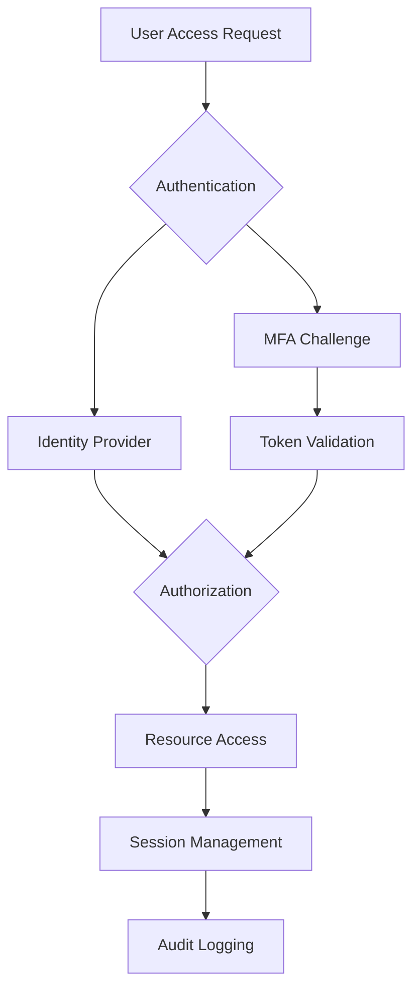

# Identity & Access Management - OAuth2, SAML, Multi-Factor Authentication

> **Comprehensive research on modern identity and access management solutions for EdTech platforms and remote work environments**

## 📋 Table of Contents

### Core Documentation
1. [Executive Summary](./executive-summary.md) - High-level findings and strategic recommendations
2. [Implementation Guide](./implementation-guide.md) - Step-by-step setup and configuration
3. [Best Practices](./best-practices.md) - Security patterns and recommendations
4. [Comparison Analysis](./comparison-analysis.md) - OAuth2 vs SAML vs other IAM solutions

### Deep Dive Analysis
5. [OAuth2 Deep Dive](./oauth2-deep-dive.md) - Comprehensive OAuth2 analysis and implementation
6. [SAML Implementation](./saml-implementation.md) - SAML configuration for enterprise SSO
7. [MFA Strategies](./mfa-strategies.md) - Multi-factor authentication approaches and tools
8. [EdTech Security Considerations](./edtech-security-considerations.md) - Educational platform specific guidance

### Specialized Topics
9. [Compliance Frameworks](./compliance-frameworks.md) - Regional compliance requirements (GDPR, CCPA, DPA)
10. [Testing Strategies](./testing-strategies.md) - Security testing and validation approaches
11. [Migration Strategy](./migration-strategy.md) - Legacy system modernization roadmap
12. [Template Examples](./template-examples.md) - Working configurations and code samples

## 🎯 Research Scope & Methodology

This research addresses comprehensive identity and access management requirements for:

### **Primary Use Cases**
- **EdTech Platform Development**: Student/teacher authentication, role-based access control
- **Remote Work Security**: Secure access to distributed systems and resources
- **International Compliance**: GDPR (EU), CCPA (US), Data Privacy Act (Philippines)

### **Research Methodology**
- Analysis of current IAM standards and protocols
- Comparison of enterprise-grade solutions
- Security best practices evaluation
- Cost-benefit analysis for different scales
- Real-world implementation case studies
- Compliance framework mapping

### **Information Sources**
- Official OAuth2 and SAML specifications
- Enterprise IAM vendor documentation
- Security research publications
- Open-source implementation analysis
- Industry compliance guidelines

## 🚀 Quick Reference

### Technology Stack Recommendations

| Component | Enterprise Solution | Open Source Alternative | SaaS Option |
|-----------|-------------------|------------------------|-------------|
| **OAuth2 Provider** | Microsoft Entra ID | Keycloak | Auth0 |
| **SAML IdP** | Microsoft ADFS | SimpleSAMLphp | Okta |
| **MFA Provider** | Microsoft Authenticator | FreeOTP | Authy |
| **Session Management** | Redis Enterprise | Redis OSS | AWS ElastiCache |
| **API Gateway** | Kong Enterprise | Kong Gateway | AWS API Gateway |

### Security Framework Overview

### Implementation Complexity Matrix

| Solution | Setup Complexity | Maintenance | Scalability | Cost |
|----------|-----------------|-------------|-------------|------|
| **Auth0** | Low | Low | High | $$$ |
| **Keycloak** | Medium | Medium | High | $ |
| **Custom OAuth2** | High | High | Medium | $$ |
| **SAML + LDAP** | High | High | High | $$$ |

## ✅ Goals Achieved

- ✅ **Comprehensive IAM Analysis**: Complete evaluation of OAuth2, SAML, and MFA solutions
- ✅ **EdTech Platform Guidance**: Specific recommendations for educational technology platforms
- ✅ **Multi-Regional Compliance**: Coverage of Philippines, Australia, UK, and US requirements
- ✅ **Implementation Roadmaps**: Step-by-step guides for different organizational scales
- ✅ **Security Best Practices**: Industry-standard security patterns and configurations
- ✅ **Cost-Benefit Analysis**: Financial considerations for different solution approaches
- ✅ **Migration Strategies**: Legacy system modernization pathways
- ✅ **Real-World Examples**: Working code samples and configuration templates

## 🌐 Navigation

### Previous: [Research Overview](../README.md)
### Next: [Executive Summary](./executive-summary.md)

---

### Related Research Topics
- [JWT Authentication Best Practices](../../backend/jwt-authentication-best-practices/README.md)
- [DevOps Security Considerations](../../devops/README.md)
- [API Security Patterns](../../architecture/README.md)

---

*Research completed: July 2025 | Focus: Identity & Access Management for EdTech and Remote Work*