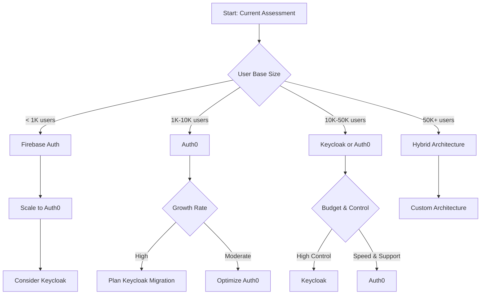

# Comparison Analysis: Identity & Access Management Solutions

> **Comprehensive evaluation of OAuth2, SAML, and MFA solutions for EdTech platforms**

## 🔍 Executive Summary

This analysis evaluates various Identity and Access Management solutions based on **security**, **scalability**, **cost**, **compliance**, and **implementation complexity** for EdTech platforms targeting international markets.

### **Key Recommendations by Use Case**

| Use Case | Primary Solution | Secondary Solution | Rationale |
|----------|-----------------|-------------------|-----------|
| **Startup MVP** | Auth0 + OAuth2 | Firebase Auth | Fast implementation, comprehensive features |
| **Growing Platform** | Keycloak + Custom | AWS Cognito | Cost optimization, flexibility |
| **Enterprise Ready** | Microsoft Entra ID | Okta | Enterprise integrations, compliance |
| **Global Scale** | Multi-provider | Hybrid approach | Regional optimization, redundancy |

## 🔐 Authentication Protocol Comparison

### **OAuth2 vs SAML vs OpenID Connect**

| Criteria | OAuth2 | SAML | OpenID Connect | Score |
|----------|--------|------|----------------|-------|
| **Implementation Complexity** | Medium | High | Low | OIDC ✅ |
| **Mobile Support** | Excellent | Poor | Excellent | OAuth2/OIDC ✅ |
| **Enterprise Integration** | Good | Excellent | Good | SAML ✅ |
| **API Security** | Excellent | Poor | Excellent | OAuth2/OIDC ✅ |
| **Token Management** | Good | N/A | Excellent | OIDC ✅ |
| **Scalability** | Excellent | Good | Excellent | OAuth2/OIDC ✅ |

### **Detailed Protocol Analysis**

#### **OAuth2 Analysis**

```yaml
OAuth2 Assessment:
  Strengths:
    - Modern, API-first design
    - Excellent mobile and SPA support
    - Granular scope management
    - Wide industry adoption
    - Strong ecosystem support
  
  Weaknesses:
    - No built-in user authentication
    - Complex security considerations
    - Multiple flow types can be confusing
    - Bearer token security concerns
  
  Best For:
    - API authorization
    - Mobile applications
    - Microservices architecture
    - Modern web applications
  
  Implementation Effort: 6-8 weeks
  Maintenance Complexity: Medium
  Security Rating: 8.5/10
```

#### **SAML Analysis**

```yaml
SAML Assessment:
  Strengths:
    - Mature, enterprise-proven
    - Strong security features
    - Excellent for SSO scenarios
    - Comprehensive attribute exchange
    - Non-repudiation support
  
  Weaknesses:
    - Complex XML-based protocol
    - Poor mobile support
    - Heavy implementation overhead
    - Limited API integration
    - Requires certificate management
  
  Best For:
    - Enterprise SSO
    - B2B integrations
    - Regulated industries
    - Desktop applications
  
  Implementation Effort: 10-12 weeks
  Maintenance Complexity: High
  Security Rating: 9/10
```

#### **OpenID Connect Analysis**

```yaml
OpenID Connect Assessment:
  Strengths:
    - Built on OAuth2 foundation
    - Standardized identity layer
    - JWT-based tokens
    - Excellent developer experience
    - Strong mobile support
  
  Weaknesses:
    - Relatively newer standard
    - Dependency on OAuth2 complexity
    - Token size limitations
    - Clock synchronization requirements
  
  Best For:
    - Modern web applications
    - Single-page applications
    - Mobile applications
    - Microservices
  
  Implementation Effort: 4-6 weeks
  Maintenance Complexity: Low-Medium
  Security Rating: 8.7/10
```

## 🏢 Identity Provider Comparison

### **Enterprise Solutions**

#### **Microsoft Entra ID (Azure AD)**

```yaml
Microsoft Entra ID:
  Pricing:
    - Free: Basic features, 50,000 objects
    - P1: $6/user/month - Advanced features
    - P2: $9/user/month - Premium security
  
  Pros:
    - Comprehensive identity platform
    - Strong enterprise integration
    - Advanced security features
    - Extensive compliance certifications
    - Global infrastructure
  
  Cons:
    - Microsoft ecosystem lock-in
    - Complex pricing structure
    - Steep learning curve
    - Limited customization
  
  Best For:
    - Large organizations
    - Microsoft-centric environments
    - High compliance requirements
    - Enterprise B2B scenarios
  
  EdTech Suitability: 8/10
  Philippines Market Fit: 7/10
  Remote Work Support: 9/10
```

#### **Okta**

```yaml
Okta:
  Pricing:
    - Workforce Identity: $8/user/month
    - Customer Identity: $3.50/user/month
    - Privileged Access: $15/user/month
  
  Pros:
    - Pure-play identity specialist
    - Extensive integration catalog
    - Strong API-first approach
    - Excellent user experience
    - Advanced analytics
  
  Cons:
    - Premium pricing
    - Vendor lock-in concerns
    - Limited customization
    - Complex enterprise features
  
  Best For:
    - Mid to large enterprises
    - SaaS-heavy environments
    - Complex integration needs
    - Compliance-focused organizations
  
  EdTech Suitability: 7.5/10
  Philippines Market Fit: 6/10
  Remote Work Support: 9/10
```

### **Developer-Friendly Solutions**

#### **Auth0**

```yaml
Auth0:
  Pricing:
    - Free: 7,000 active users
    - Essentials: $35/month (1,000 users)
    - Professional: $240/month (1,000 users)
    - Enterprise: Custom pricing
  
  Pros:
    - Excellent developer experience
    - Comprehensive documentation
    - Wide protocol support
    - Flexible customization
    - Strong community
  
  Cons:
    - Pricing can escalate quickly
    - Some advanced features require custom code
    - Vendor dependency
    - Limited offline support
  
  Best For:
    - Startups and scale-ups
    - Developer-centric organizations
    - Rapid prototyping
    - Modern application architectures
  
  EdTech Suitability: 9/10
  Philippines Market Fit: 8/10
  Remote Work Support: 8.5/10
```

#### **Firebase Authentication**

```yaml
Firebase Authentication:
  Pricing:
    - Free: 50,000 monthly active users
    - Pay-as-you-go: $0.0055 per verification
  
  Pros:
    - Very cost-effective
    - Google ecosystem integration
    - Excellent mobile SDKs
    - Real-time features
    - Simple implementation
  
  Cons:
    - Limited enterprise features
    - Google platform dependency
    - Basic customization options
    - Limited compliance features
  
  Best For:
    - Consumer applications
    - Mobile-first platforms
    - Rapid MVP development
    - Google Cloud environments
  
  EdTech Suitability: 7/10
  Philippines Market Fit: 9/10
  Remote Work Support: 6/10
```

### **Self-Hosted Solutions**

#### **Keycloak**

```yaml
Keycloak:
  Pricing:
    - Open Source: Free
    - Red Hat SSO: $50/user/year
    - Infrastructure costs: $500-2000/month
  
  Pros:
    - Open source with commercial support
    - Comprehensive feature set
    - High customization capability
    - No vendor lock-in
    - Strong security features
  
  Cons:
    - Requires infrastructure management
    - Complex initial setup
    - Ongoing maintenance overhead
    - Limited managed service options
  
  Best For:
    - Organizations with DevOps capabilities
    - High customization requirements
    - Cost-sensitive deployments
    - Hybrid cloud environments
  
  EdTech Suitability: 8.5/10
  Philippines Market Fit: 9/10
  Remote Work Support: 8/10
```

#### **Gluu Server**

```yaml
Gluu Server:
  Pricing:
    - Community Edition: Free
    - VIP Support: $10,000/year
    - Managed Service: Custom pricing
  
  Pros:
    - Open source foundation
    - Comprehensive protocol support
    - High security standards
    - Container-ready deployment
    - Strong SAML implementation
  
  Cons:
    - Steep learning curve
    - Limited community compared to Keycloak
    - Complex deployment
    - Java-based (resource intensive)
  
  Best For:
    - High-security environments
    - Compliance-heavy industries
    - SAML-centric requirements
    - On-premises deployments
  
  EdTech Suitability: 6.5/10
  Philippines Market Fit: 7/10
  Remote Work Support: 7/10
```

## 🔐 Multi-Factor Authentication Comparison

### **TOTP (Time-based One-Time Passwords)**

| Provider | Free Tier | Premium Features | Mobile Apps | Security Rating |
|----------|-----------|------------------|-------------|----------------|
| **Google Authenticator** | ✅ Unlimited | ❌ None | iOS, Android | 8.5/10 |
| **Microsoft Authenticator** | ✅ Unlimited | Push notifications | iOS, Android, Windows | 9/10 |
| **Authy** | ✅ Unlimited | Multi-device sync | iOS, Android, Desktop | 8.7/10 |
| **1Password** | ❌ Paid only | Password integration | iOS, Android, Desktop | 9.2/10 |

### **SMS-Based MFA**

| Provider | Cost per SMS | Global Coverage | Reliability | Philippines Support |
|----------|-------------|----------------|-------------|-------------------|
| **Twilio** | $0.0075 | 195+ countries | 99.9% | ✅ Excellent |
| **AWS SNS** | $0.0075 | 200+ countries | 99.95% | ✅ Good |
| **MessageBird** | $0.06 | 200+ countries | 99.5% | ✅ Excellent |
| **Nexmo (Vonage)** | $0.0075 | 190+ countries | 99.8% | ✅ Good |

### **Hardware Security Keys**

```yaml
Hardware Token Comparison:
  YubiKey 5 Series:
    Cost: $45-70 per key
    Protocols: FIDO2, WebAuthn, U2F, PIV, OATH
    Durability: Waterproof, crushproof
    EdTech Suitability: 6/10 (cost prohibitive for students)
  
  Google Titan Security Key:
    Cost: $30-50 per key
    Protocols: FIDO U2F, FIDO2
    Durability: Good
    EdTech Suitability: 7/10 (better price point)
  
  Microsoft Authenticator App:
    Cost: Free
    Protocols: FIDO2, Push notifications
    Device Requirements: Smartphone
    EdTech Suitability: 9/10 (accessible to all users)
```

### **Biometric Authentication**

| Method | Implementation Complexity | User Acceptance | Security Level | Cost |
|--------|---------------------------|-----------------|----------------|------|
| **Fingerprint** | Medium | High | High | Low |
| **Face Recognition** | High | Medium | Medium | Medium |
| **Voice Recognition** | High | Low | Medium | High |
| **Behavioral Biometrics** | Very High | High | High | Very High |

## 💰 Total Cost of Ownership Analysis

### **3-Year TCO Comparison (10K → 100K Users)**

#### **Startup Phase (0-10K Users)**

| Solution | Year 1 | Year 2 | Year 3 | Total | Notes |
|----------|--------|--------|--------|-------|-------|
| **Auth0** | $12,000 | $24,000 | $36,000 | $72,000 | Includes professional tier |
| **Firebase** | $0 | $3,600 | $7,200 | $10,800 | Pay-as-you-go model |
| **Keycloak** | $18,000 | $12,000 | $12,000 | $42,000 | Infrastructure + 1 FTE |
| **AWS Cognito** | $6,000 | $12,000 | $18,000 | $36,000 | Pay-per-use pricing |

#### **Growth Phase (10K-50K Users)**

| Solution | Year 1 | Year 2 | Year 3 | Total | Notes |
|----------|--------|--------|--------|-------|-------|
| **Auth0** | $60,000 | $120,000 | $180,000 | $360,000 | Enterprise tier required |
| **Keycloak** | $48,000 | $48,000 | $48,000 | $144,000 | 1.5 FTE + infrastructure |
| **Okta** | $72,000 | $144,000 | $216,000 | $432,000 | Customer identity pricing |
| **Azure AD** | $36,000 | $72,000 | $108,000 | $216,000 | P1 license tier |

#### **Scale Phase (50K-100K Users)**

| Solution | Year 1 | Year 2 | Year 3 | Total | Notes |
|----------|--------|--------|--------|-------|-------|
| **Keycloak** | $96,000 | $96,000 | $96,000 | $288,000 | 2 FTE + high-availability setup |
| **Azure AD** | $150,000 | $300,000 | $450,000 | $900,000 | P2 license for advanced features |
| **Auth0** | $240,000 | $480,000 | $720,000 | $1,440,000 | Enterprise with custom pricing |
| **Custom Build** | $200,000 | $120,000 | $120,000 | $440,000 | 3 FTE development team |

### **Hidden Costs Analysis**

```yaml
Often Overlooked Costs:
  Integration Development:
    Auth0: $10,000-20,000
    Keycloak: $30,000-50,000
    SAML Integration: $20,000-40,000
  
  Compliance & Auditing:
    SOC2 Preparation: $15,000-30,000/year
    GDPR Compliance: $20,000-50,000 initial
    Penetration Testing: $10,000-25,000/year
  
  Operational Overhead:
    Monitoring & Alerting: $5,000-15,000/year
    Incident Response: $10,000-30,000/year
    Documentation & Training: $5,000-15,000/year
  
  Migration Costs:
    Data Migration: $15,000-40,000
    User Re-enrollment: $5,000-15,000
    Integration Updates: $10,000-30,000
```

## 🌏 Regional Considerations

### **Philippines Market Analysis**

```yaml
Philippines EdTech IAM Requirements:
  Internet Infrastructure:
    - Average Speed: 25.7 Mbps (2024)
    - Mobile Penetration: 76.7%
    - Desktop Usage: 23.3%
    - Recommended: Mobile-first approach
  
  Payment Methods:
    - GCash: 57% market share
    - PayMaya: 23% market share
    - Credit Cards: 15% market share
    - Crypto: 5% market share
  
  Language Requirements:
    - Filipino (Tagalog): Primary
    - English: Business standard
    - Regional Languages: 100+ dialects
    - Recommendation: Multi-language support
  
  Regulatory Compliance:
    - Data Privacy Act 2012
    - BSP Digital Banking Guidelines
    - DepEd ICT Guidelines
    - SEC Corporate Governance Code
```

### **International Market Considerations**

#### **Australia**

```yaml
Australia Requirements:
  Regulatory:
    - Privacy Act 1988
    - Notifiable Data Breaches scheme
    - Consumer Data Right (CDR)
  
  Technical:
    - Strong internet infrastructure
    - High mobile adoption
    - Government digital identity (myGov)
  
  Business:
    - Premium pricing acceptable
    - High security expectations
    - Enterprise integration needs
```

#### **United Kingdom**

```yaml
UK Requirements:
  Regulatory:
    - UK GDPR
    - Data Protection Act 2018
    - Investigatory Powers Act 2016
  
  Technical:
    - Excellent infrastructure
    - High digital literacy
    - Strong cybersecurity focus
  
  Business:
    - Education sector funding constraints
    - Strong compliance requirements
    - Brexit-related data residency needs
```

#### **United States**

```yaml
US Requirements:
  Regulatory:
    - FERPA (Education)
    - CCPA (California)
    - COPPA (Children's privacy)
    - State-specific regulations
  
  Technical:
    - Varied infrastructure quality
    - High mobile usage
    - Cloud-first approach
  
  Business:
    - Competitive market
    - Enterprise sales cycles
    - Strong IP protection needs
```

## 📊 Decision Matrix & Scoring

### **Weighted Scoring Model**

| Criteria | Weight | Auth0 | Keycloak | Azure AD | Firebase | Custom |
|----------|--------|--------|----------|----------|----------|--------|
| **Implementation Speed** | 15% | 9 | 6 | 7 | 10 | 3 |
| **Security Features** | 20% | 8 | 9 | 9 | 6 | 8 |
| **Scalability** | 15% | 8 | 9 | 9 | 7 | 9 |
| **Cost Effectiveness** | 20% | 6 | 9 | 7 | 9 | 7 |
| **Compliance Support** | 10% | 8 | 7 | 9 | 5 | 6 |
| **Integration Ease** | 10% | 9 | 7 | 8 | 8 | 5 |
| **Vendor Independence** | 5% | 4 | 9 | 4 | 4 | 10 |
| **Support Quality** | 5% | 8 | 6 | 8 | 6 | 2 |

### **Calculated Scores**

| Solution | Weighted Score | Ranking | Best For |
|----------|----------------|---------|----------|
| **Auth0** | 7.6/10 | 🥈 2nd | Rapid development, startups |
| **Keycloak** | 8.1/10 | 🥇 1st | Long-term, cost-conscious |
| **Azure AD** | 8.0/10 | 🥉 3rd | Enterprise integration |
| **Firebase** | 7.4/10 | 4th | Consumer apps, MVP |
| **Custom** | 6.3/10 | 5th | Unique requirements |

## 🎯 Recommendation Matrix

### **By Organization Type**

| Organization | Primary Choice | Secondary Choice | Rationale |
|-------------|----------------|------------------|-----------|
| **EdTech Startup** | Auth0 | Firebase Auth | Speed to market, comprehensive features |
| **Growing EdTech** | Keycloak | Auth0 | Cost optimization, flexibility |
| **Enterprise EdTech** | Azure AD | Okta | Enterprise integration, compliance |
| **Government EdTech** | Keycloak | Gluu Server | Data sovereignty, security |

### **By Geographic Focus**

| Region | Recommended Solution | Key Considerations |
|--------|---------------------|-------------------|
| **Philippines Only** | Keycloak + Local hosting | Data residency, cost optimization |
| **ASEAN Markets** | Auth0 with regional CDN | Multi-language, mobile-first |
| **Global Platform** | Azure AD + Auth0 hybrid | Regional compliance, scalability |
| **US/EU Focus** | Okta or Azure AD | Strict compliance, enterprise sales |

### **By Budget Range**

| Annual Budget | Recommended Approach | Expected Capabilities |
|---------------|---------------------|----------------------|
| **$0-50K** | Firebase → Auth0 → Keycloak | Basic → Professional → Enterprise |
| **$50K-200K** | Auth0 → Keycloak → Azure AD | Professional → Enterprise → Global |
| **$200K+** | Azure AD / Okta / Custom | Full enterprise capabilities |

## 🔍 Risk Assessment Matrix

### **Implementation Risks**

| Risk Category | Auth0 | Keycloak | Azure AD | Mitigation Strategy |
|---------------|--------|----------|----------|-------------------|
| **Vendor Lock-in** | High | Low | High | Multi-provider strategy |
| **Cost Escalation** | Medium | Low | Medium | Usage monitoring, planning |
| **Security Breach** | Low | Medium | Low | Defense in depth, monitoring |
| **Compliance Failure** | Low | Medium | Low | Regular audits, legal review |
| **Performance Issues** | Low | Medium | Low | Load testing, monitoring |

### **Business Continuity Planning**

```yaml
Disaster Recovery Considerations:
  Auth0:
    - Global infrastructure with automatic failover
    - 99.9% SLA with financial penalties
    - Built-in backup and recovery
    - Risk: Single point of failure
  
  Keycloak:
    - Self-managed clustering required
    - Database backup responsibility
    - Infrastructure redundancy needed
    - Risk: Operational complexity
  
  Azure AD:
    - Microsoft's global infrastructure
    - 99.9% SLA with compensation
    - Built-in geo-redundancy
    - Risk: Microsoft dependency
```

## 📈 Migration Strategies

### **Platform Migration Complexity**

| From → To | Complexity | Duration | Risk Level |
|-----------|------------|----------|------------|
| **Custom → Auth0** | Medium | 2-3 months | Low |
| **Custom → Keycloak** | High | 4-6 months | Medium |
| **Auth0 → Keycloak** | High | 3-4 months | Medium |
| **SAML → OAuth2** | High | 4-5 months | High |
| **Firebase → Auth0** | Medium | 2-3 months | Low |

### **Migration Best Practices**

```yaml
Migration Strategy Framework:
  Phase 1 - Assessment (4-6 weeks):
    - Current system audit
    - User data mapping
    - Integration inventory
    - Risk assessment
  
  Phase 2 - Preparation (6-8 weeks):
    - New system setup
    - Development environment
    - Testing framework
    - Migration tooling
  
  Phase 3 - Gradual Migration (8-12 weeks):
    - Feature flags implementation
    - User cohort migration
    - A/B testing
    - Performance monitoring
  
  Phase 4 - Validation (4-6 weeks):
    - End-to-end testing
    - Security assessment
    - Performance validation
    - User acceptance testing
```

## 🏆 Final Recommendations

### **Top 3 Recommended Architectures**

#### **🥇 Recommended: Hybrid Keycloak + Auth0**

```yaml
Architecture Overview:
  Core Identity: Keycloak (self-hosted)
  Consumer Auth: Auth0 (managed service)
  Enterprise SSO: SAML via Keycloak
  MFA: Microsoft Authenticator + SMS fallback
  
Benefits:
  - Cost optimization for large user bases
  - Maximum flexibility and customization
  - Strong enterprise integration capabilities
  - Reduced vendor lock-in risk
  
Implementation Timeline: 6-8 months
Total 3-year TCO: $180,000-250,000
Recommended for: Growing EdTech platforms (10K+ users)
```

#### **🥈 Alternative: Auth0 Pure Play**

```yaml
Architecture Overview:
  Core Identity: Auth0 (managed service)
  Consumer Auth: Auth0 social connections
  Enterprise SSO: Auth0 SAML connections
  MFA: Auth0 Guardian + SMS
  
Benefits:
  - Fastest time to market
  - Comprehensive feature set
  - Excellent developer experience
  - Strong community support
  
Implementation Timeline: 2-3 months
Total 3-year TCO: $150,000-400,000
Recommended for: Startups and rapid growth scenarios
```

#### **🥉 Enterprise: Microsoft Entra ID**

```yaml
Architecture Overview:
  Core Identity: Microsoft Entra ID
  Consumer Auth: Azure AD B2C
  Enterprise SSO: Native SAML/OIDC
  MFA: Microsoft Authenticator
  
Benefits:
  - Deep Microsoft ecosystem integration
  - Strong compliance and security features
  - Global enterprise support
  - Comprehensive audit capabilities
  
Implementation Timeline: 4-6 months
Total 3-year TCO: $200,000-600,000
Recommended for: Enterprise-focused EdTech platforms
```

### **Strategic Implementation Roadmap**



---

### Navigation
**Previous**: [Best Practices](./best-practices.md) | **Next**: [OAuth2 Deep Dive](./oauth2-deep-dive.md)

---

*Comparison Analysis for EdTech IAM Solutions | July 2025*