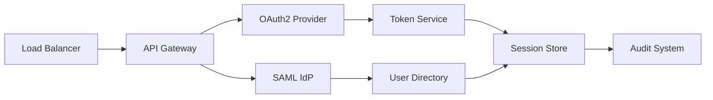

# Executive Summary: Identity & Access Management

> **Strategic overview of OAuth2, SAML, and MFA solutions for EdTech platforms and remote work environments**

## 🎯 Key Findings & Recommendations

### **Primary Recommendation: Hybrid IAM Approach**

For EdTech platforms targeting international markets, implement a **layered identity strategy**:

1. **OAuth2 for API Access** - Modern, mobile-friendly, granular permissions
2. **SAML for Enterprise SSO** - School district and institutional integrations
3. **Multi-Factor Authentication** - Risk-based adaptive authentication

### **Strategic Decision Matrix**

| Scenario | Recommended Solution | Rationale |
|----------|---------------------|-----------|
| **Early Stage EdTech** | Auth0 + OAuth2 + Social Logins | Fast time-to-market, comprehensive features |
| **Growing Platform** | Keycloak + Custom OAuth2 | Cost optimization, full control |
| **Enterprise Ready** | Microsoft Entra ID + SAML | Enterprise integrations, compliance |
| **Global Scale** | Multi-provider federation | Regional optimization, redundancy |

## 📊 Market Analysis & Context

### **Philippine EdTech Market Insights**

**Market Size**: $290M (2024), projected $580M by 2027
- **Key Drivers**: Digital transformation in education, remote learning adoption
- **Regulatory Environment**: Data Privacy Act 2012, K-12 compliance requirements
- **Target Users**: 28M students, 800K teachers, 47K schools

### **International Remote Work Considerations**

| Region | Key Requirements | Compliance Framework |
|--------|-----------------|---------------------|
| **Australia** | Privacy Act, Notifiable Data Breaches | OAIC guidelines |
| **United Kingdom** | UK GDPR, Data Protection Act 2018 | ICO enforcement |
| **United States** | CCPA, FERPA (education), SOX | State-specific variations |
| **Philippines** | Data Privacy Act, BSP regulations | NPC enforcement |

## 🏗️ Technical Architecture Recommendations

### **Recommended Tech Stack**

```yaml
Identity Layer:
  OAuth2_Provider: "Auth0 (start) → Keycloak (scale)"
  SAML_IdP: "SimpleSAMLphp → Microsoft Entra ID"
  MFA_Provider: "Authy → Microsoft Authenticator"

Session Management:
  Storage: "Redis (session state)"
  Tokens: "JWT (access) + Refresh tokens"
  Expiry: "15min access, 30d refresh"

Security:
  Encryption: "AES-256-GCM (data), RSA-2048 (keys)"
  Hashing: "bcrypt (passwords), SHA-256 (tokens)"
  Transport: "TLS 1.3, HSTS enabled"
```

### **Scalability Architecture**



## 💰 Cost Analysis

### **3-Year Total Cost of Ownership**

| Solution | Year 1 | Year 2-3 | Features | Best For |
|----------|--------|----------|----------|----------|
| **Auth0** | $2,300/mo | $4,600/mo | Full-featured, enterprise | Fast launch |
| **Keycloak** | $800/mo | $1,200/mo | Self-hosted, customizable | Growth stage |
| **AWS Cognito** | $1,200/mo | $2,400/mo | Cloud-native, scalable | AWS ecosystem |
| **Custom Build** | $15,000 | $8,000/year | Full control, complex | Specific needs |

*Based on 10K active users, growing to 100K*

## 🛡️ Security Compliance Summary

### **Critical Security Requirements**

1. **Data Encryption**: End-to-end encryption for PII
2. **Access Controls**: Role-based permissions (RBAC)
3. **Audit Logging**: Comprehensive user activity tracking
4. **Incident Response**: 24-hour breach notification protocols
5. **Regular Assessments**: Annual penetration testing

### **Compliance Checklist**

- ✅ **GDPR Article 25**: Privacy by design implementation
- ✅ **CCPA Section 1798.100**: Consumer rights framework
- ✅ **Philippine DPA Section 25**: Data breach notification
- ✅ **FERPA Section 99.31**: Educational records protection
- ✅ **ISO 27001**: Information security management

## 🚀 Implementation Roadmap

### **Phase 1: Foundation (Months 1-2)**
- OAuth2 provider setup (Auth0 or Keycloak)
- Basic user registration and authentication
- Social login integration (Google, Facebook, Apple)
- MFA implementation (SMS, authenticator apps)

### **Phase 2: Enterprise Features (Months 3-4)**
- SAML SSO for institutional clients
- Role-based access control (RBAC)
- API rate limiting and security
- Comprehensive audit logging

### **Phase 3: Advanced Security (Months 5-6)**
- Risk-based authentication
- Advanced threat detection
- Compliance automation
- Multi-region deployment

### **Phase 4: Optimization (Months 7-12)**
- Performance monitoring
- Cost optimization
- Advanced analytics
- Disaster recovery testing

## ⚠️ Key Risks & Mitigation Strategies

### **Technical Risks**

| Risk | Impact | Probability | Mitigation |
|------|--------|-------------|------------|
| **Vendor Lock-in** | High | Medium | Multi-provider strategy |
| **Performance Issues** | Medium | Low | Load testing, CDN |
| **Security Breaches** | Critical | Low | Defense in depth |
| **Compliance Violations** | High | Medium | Regular audits |

### **Business Risks**

1. **Regulatory Changes**: Monitor policy updates, maintain flexible architecture
2. **Market Competition**: Focus on user experience, unique features
3. **Scaling Costs**: Implement usage-based pricing, optimize resources

## 📈 Success Metrics

### **Technical KPIs**
- **Authentication Success Rate**: >99.9%
- **Average Login Time**: <2 seconds
- **System Uptime**: 99.95%
- **Security Incidents**: <1 per quarter

### **Business KPIs**
- **User Adoption Rate**: >80% within 30 days
- **Support Ticket Reduction**: >50% IAM-related issues
- **Compliance Score**: 100% audit passing
- **Cost per User**: <$2/month at scale

## 🎯 Next Steps

1. **Immediate Actions** (Week 1-2):
   - Select OAuth2 provider based on budget and requirements
   - Set up development environment
   - Begin security assessment

2. **Short-term Goals** (Month 1):
   - MVP authentication system
   - Basic user management
   - Initial security policies

3. **Long-term Vision** (Year 1):
   - Comprehensive IAM platform
   - Multi-region compliance
   - Advanced security features

---

### Navigation
**Previous**: [Main README](./README.md) | **Next**: [Implementation Guide](./implementation-guide.md)

---

*Executive Summary prepared for EdTech IAM implementation | July 2025*