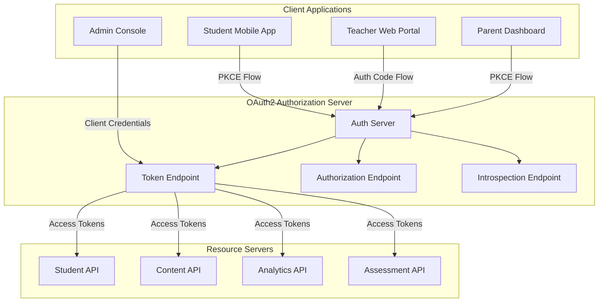

# OAuth2 Deep Dive: Comprehensive Implementation Guide

> **Advanced OAuth2 implementation strategies for EdTech platforms with security, scalability, and compliance considerations**

## 🎯 OAuth2 Fundamentals for EdTech

### **OAuth2 Flow Selection Matrix**

| Use Case | Recommended Flow | Security Level | Implementation Complexity |
|----------|------------------|----------------|--------------------------|
| **Student Mobile App** | Authorization Code + PKCE | High | Medium |
| **Teacher Web Dashboard** | Authorization Code | High | Low |
| **Parent Portal SPA** | Authorization Code + PKCE | High | Medium |
| **Admin Management** | Client Credentials | Medium | Low |
| **Third-party Integrations** | Authorization Code | High | Medium |
| **System-to-System** | Client Credentials | Medium | Low |

### **EdTech-Specific OAuth2 Architecture**



## 🔐 Advanced OAuth2 Security Implementation

### **PKCE (Proof Key for Code Exchange) Implementation**

```typescript
// Enhanced PKCE Implementation for EdTech
export class EdTechPKCEClient {
  private readonly config = {
    codeVerifierLength: 128, // Maximum security
    codeChallengeMethod: 'S256', // SHA256 hashing
    stateLength: 32,
    nonceLength: 32,
  };

  async initiateStudentAuth(studentId: string, deviceInfo: DeviceInfo): Promise<AuthRequest> {
    // Generate cryptographically secure values
    const codeVerifier = this.generateCodeVerifier();
    const state = this.generateSecureState();
    const nonce = this.generateNonce();
    
    // Create code challenge
    const codeChallenge = this.createCodeChallenge(codeVerifier);
    
    // Store session data with encryption
    const sessionData: AuthSession = {
      codeVerifier,
      state,
      nonce,
      studentId,
      deviceInfo,
      timestamp: Date.now(),
      attempts: 0,
    };
    
    await this.storeAuthSession(
      state, 
      this.encryptSessionData(sessionData),
      600 // 10 minutes TTL
    );

    // Build authorization URL with EdTech-specific parameters
    const authUrl = new URL(this.authorizationEndpoint);
    authUrl.searchParams.set('response_type', 'code');
    authUrl.searchParams.set('client_id', this.clientId);
    authUrl.searchParams.set('redirect_uri', this.getRedirectUri(deviceInfo.platform));
    authUrl.searchParams.set('code_challenge', codeChallenge);
    authUrl.searchParams.set('code_challenge_method', 'S256');
    authUrl.searchParams.set('state', state);
    authUrl.searchParams.set('nonce', nonce);
    
    // EdTech-specific scopes
    const scopes = this.buildScopesForStudent(studentId);
    authUrl.searchParams.set('scope', scopes.join(' '));
    
    // Additional security parameters
    authUrl.searchParams.set('prompt', 'consent'); // Always show consent
    authUrl.searchParams.set('max_age', '3600'); // Force re-auth after 1 hour
    
    return {
      authUrl: authUrl.toString(),
      state,
      expiresAt: Date.now() + (10 * 60 * 1000),
    };
  }

  private buildScopesForStudent(studentId: string): string[] {
    // Minimal scope principle for students
    return [
      'openid',
      'profile',
      'email',
      'read:own_profile',
      'read:enrolled_courses',
      'write:assignments',
      'read:grades',
      'read:schedule',
    ];
  }

  private buildScopesForTeacher(teacherId: string): string[] {
    return [
      'openid',
      'profile',
      'email',
      'read:own_profile',
      'read:teaching_courses',
      'write:grades',
      'read:student_profiles',
      'write:assignments',
      'read:analytics',
    ];
  }

  async handleAuthCallback(
    code: string, 
    state: string, 
    requestInfo: RequestInfo
  ): Promise<TokenResponse> {
    // Retrieve and decrypt session data
    const encryptedSession = await this.getAuthSession(state);
    if (!encryptedSession) {
      throw new AuthError('Invalid or expired state', 'invalid_state');
    }

    const sessionData = this.decryptSessionData(encryptedSession);
    
    // Validate session
    await this.validateAuthSession(sessionData, requestInfo);
    
    // Exchange code for tokens
    const tokenResponse = await this.exchangeCodeForTokens(
      code,
      sessionData.codeVerifier,
      sessionData.deviceInfo
    );
    
    // Validate tokens
    await this.validateTokenResponse(tokenResponse, sessionData);
    
    // Clean up session
    await this.deleteAuthSession(state);
    
    return tokenResponse;
  }

  private async validateAuthSession(
    sessionData: AuthSession, 
    requestInfo: RequestInfo
  ): Promise<void> {
    // Check timestamp
    if (Date.now() - sessionData.timestamp > 600000) { // 10 minutes
      throw new AuthError('Auth session expired', 'session_expired');
    }

    // Increment and check attempts
    sessionData.attempts++;
    if (sessionData.attempts > 3) {
      throw new AuthError('Too many auth attempts', 'too_many_attempts');
    }

    // Device fingerprint validation
    if (!this.validateDeviceFingerprint(sessionData.deviceInfo, requestInfo.deviceInfo)) {
      throw new AuthError('Device fingerprint mismatch', 'device_mismatch');
    }
  }
}
```

### **Dynamic Client Registration for EdTech Partners**

```typescript
// Dynamic Client Registration for School Districts
export class EdTechClientRegistration {
  private readonly allowedClientTypes = ['web', 'native', 'spa'];
  private readonly schoolDomainRegistry = new Map<string, SchoolConfig>();

  async registerSchoolDistrict(registration: SchoolRegistrationRequest): Promise<ClientRegistration> {
    // Validate school district
    await this.validateSchoolDistrict(registration);
    
    // Generate client credentials
    const clientId = this.generateClientId(registration.schoolDomain);
    const clientSecret = registration.clientType === 'web' ? 
      this.generateClientSecret() : null; // No secret for public clients
    
    // Configure redirect URIs based on school's setup
    const redirectUris = this.buildRedirectUris(registration);
    
    // Set up scopes based on school's license level
    const allowedScopes = this.buildAllowedScopes(registration.licenseLevel);
    
    const clientConfig: ClientConfiguration = {
      clientId,
      clientSecret,
      clientType: registration.clientType,
      schoolDomain: registration.schoolDomain,
      redirectUris,
      allowedScopes,
      tokenEndpointAuthMethod: registration.clientType === 'web' ? 
        'client_secret_post' : 'none',
      grantTypes: ['authorization_code', 'refresh_token'],
      responseTypes: ['code'],
      
      // EdTech-specific configurations
      studentDataPrivacy: true,
      ferpaCompliant: true,
      dataRetentionPolicy: registration.dataRetentionPolicy,
      allowedGradeLevels: registration.allowedGradeLevels,
      subjectAreas: registration.subjectAreas,
      
      // Security settings
      requirePkce: true,
      pkceCodeChallengeMethod: 'S256',
      requireNonce: true,
      idTokenSignedResponseAlg: 'RS256',
      accessTokenLifetime: 3600, // 1 hour
      refreshTokenLifetime: 86400 * 30, // 30 days
      
      createdAt: new Date(),
      expiresAt: new Date(Date.now() + (365 * 24 * 60 * 60 * 1000)), // 1 year
    };

    // Store client configuration
    await this.storeClientConfiguration(clientConfig);
    
    // Set up webhook endpoints for the school
    await this.setupSchoolWebhooks(clientConfig);
    
    return {
      clientId,
      clientSecret,
      registrationAccessToken: this.generateRegistrationToken(clientId),
      clientSecretExpiresAt: clientSecret ? 
        Date.now() + (365 * 24 * 60 * 60 * 1000) : 0,
    };
  }

  private buildAllowedScopes(licenseLevel: string): string[] {
    const baseScopesByLevel = {
      'basic': [
        'openid', 'profile', 'email',
        'read:own_profile', 'read:courses'
      ],
      'standard': [
        'openid', 'profile', 'email',
        'read:own_profile', 'read:courses', 'read:grades',
        'write:assignments', 'read:schedule'
      ],
      'premium': [
        'openid', 'profile', 'email',
        'read:own_profile', 'read:courses', 'read:grades',
        'write:assignments', 'read:schedule', 'read:analytics',
        'write:grades', 'read:student_profiles'
      ],
      'enterprise': [
        'openid', 'profile', 'email',
        'read:all', 'write:all', 'admin:users',
        'admin:courses', 'admin:analytics', 'admin:settings'
      ]
    };

    return baseScopesByLevel[licenseLevel] || baseScopesByLevel['basic'];
  }
}
```

## 🎓 EdTech-Specific OAuth2 Patterns

### **Student Privacy Protection**

```typescript
// FERPA-Compliant OAuth2 Implementation
export class FERPACompliantOAuth2Service {
  private readonly privacyConfig = {
    minorAgeThreshold: 13, // COPPA compliance
    parentalConsentRequired: true,
    dataMinimization: true,
    purposeLimitation: true,
    retentionLimits: {
      'student_grades': 86400 * 365 * 7, // 7 years
      'behavioral_data': 86400 * 365 * 3, // 3 years
      'auth_logs': 86400 * 365 * 2, // 2 years
    }
  };

  async authenticateStudent(studentId: string, context: AuthContext): Promise<TokenResponse> {
    // Check if student is a minor
    const student = await this.getStudentProfile(studentId);
    const isMinor = this.calculateAge(student.dateOfBirth) < this.privacyConfig.minorAgeThreshold;
    
    if (isMinor && !student.parentalConsentGiven) {
      throw new AuthError(
        'Parental consent required for minor student',
        'parental_consent_required',
        { 
          redirectUrl: this.buildParentalConsentUrl(studentId),
          parentEmail: student.parentEmail 
        }
      );
    }

    // Apply data minimization principles
    const scopes = this.applyDataMinimization(context.requestedScopes, student);
    
    // Generate privacy-enhanced tokens
    const tokens = await this.generatePrivacyTokens(studentId, scopes, {
      isMinor,
      parentalConsentGiven: student.parentalConsentGiven,
      dataRetentionPolicy: student.dataRetentionPolicy,
    });

    // Log access for FERPA audit trail
    await this.logFERPAAccess({
      studentId,
      accessType: 'authentication',
      dataAccessed: scopes,
      requestingParty: context.clientId,
      legalBasis: 'educational_legitimate_interest',
      timestamp: new Date(),
    });

    return tokens;
  }

  private applyDataMinimization(requestedScopes: string[], student: StudentProfile): string[] {
    // Filter scopes based on student's age, privacy settings, and educational necessity
    const allowedScopes = [];
    
    for (const scope of requestedScopes) {
      if (this.isScopeEducationallyNecessary(scope, student)) {
        if (this.isScopeAgeAppropriate(scope, student)) {
          if (this.hasConsentForScope(scope, student)) {
            allowedScopes.push(scope);
          }
        }
      }
    }

    return allowedScopes;
  }

  private async generatePrivacyTokens(
    studentId: string,
    scopes: string[],
    privacyContext: PrivacyContext
  ): Promise<TokenResponse> {
    // Create privacy-enhanced JWT claims
    const claims = {
      sub: studentId,
      scope: scopes.join(' '),
      
      // Privacy-specific claims
      privacy_level: privacyContext.isMinor ? 'high' : 'standard',
      data_retention: this.calculateRetentionExpiry(scopes),
      parental_consent: privacyContext.parentalConsentGiven,
      purpose_limitation: true,
      
      // FERPA-specific claims
      ferpa_protected: true,
      educational_purpose: true,
      directory_info_only: this.isDirectoryInfoOnly(scopes),
    };

    return this.tokenService.generateTokens(claims);
  }
}
```

### **Teacher Dashboard Authorization**

```typescript
// Role-Based Access Control for Teachers
export class TeacherAuthorizationService {
  private readonly teacherRoles = {
    'substitute_teacher': {
      scopes: ['read:assigned_classes', 'read:lesson_plans'],
      temporaryAccess: true,
      maxDuration: 86400, // 24 hours
    },
    'classroom_teacher': {
      scopes: [
        'read:own_classes', 'write:grades', 'read:student_profiles',
        'write:assignments', 'read:parent_contacts'
      ],
      temporaryAccess: false,
    },
    'department_head': {
      scopes: [
        'read:department_classes', 'write:department_grades',
        'read:department_analytics', 'admin:department_settings'
      ],
      temporaryAccess: false,
    },
    'principal': {
      scopes: [
        'read:all_school_data', 'admin:users', 'admin:settings',
        'read:compliance_reports', 'admin:emergency_procedures'
      ],
      temporaryAccess: false,
    }
  };

  async authorizeTeacher(
    teacherId: string,
    requestedScopes: string[],
    context: AuthContext
  ): Promise<AuthorizationResult> {
    const teacher = await this.getTeacherProfile(teacherId);
    
    // Get current assignments and roles
    const currentAssignments = await this.getCurrentAssignments(teacherId);
    const effectiveRoles = this.calculateEffectiveRoles(teacher, currentAssignments);
    
    // Check time-based access restrictions
    if (!this.isWithinAuthorizedHours(teacher, context.timestamp)) {
      throw new AuthError(
        'Access outside authorized hours',
        'time_restriction_violation'
      );
    }

    // Apply scope filtering based on current assignments
    const authorizedScopes = await this.filterScopesByAssignments(
      requestedScopes,
      currentAssignments,
      context
    );

    // Check for emergency access scenarios
    const emergencyOverride = await this.checkEmergencyOverride(teacherId, context);
    if (emergencyOverride.active) {
      authorizedScopes.push(...emergencyOverride.additionalScopes);
    }

    return {
      authorizedScopes,
      effectiveRoles,
      restrictions: {
        timeWindow: this.getAuthorizedTimeWindow(teacher),
        locationRestriction: teacher.locationRestricted,
        emergencyOverride: emergencyOverride.active,
      },
      auditInfo: {
        teacherId,
        requestedScopes,
        authorizedScopes,
        deniedScopes: requestedScopes.filter(s => !authorizedScopes.includes(s)),
        timestamp: context.timestamp,
      }
    };
  }

  private async filterScopesByAssignments(
    requestedScopes: string[],
    assignments: TeacherAssignment[],
    context: AuthContext
  ): Promise<string[]> {
    const authorizedScopes = [];

    for (const scope of requestedScopes) {
      // Check if scope is related to current assignments
      if (await this.isScopeAuthorizedForAssignments(scope, assignments)) {
        // Additional checks for sensitive scopes
        if (this.isSensitiveScope(scope)) {
          if (await this.validateSensitiveScopeAccess(scope, assignments, context)) {
            authorizedScopes.push(scope);
          }
        } else {
          authorizedScopes.push(scope);
        }
      }
    }

    return authorizedScopes;
  }
}
```

### **Parent Portal OAuth2 Flow**

```typescript
// Parent-Specific OAuth2 Implementation
export class ParentPortalOAuth2Service {
  async initiateParentAuth(parentRequest: ParentAuthRequest): Promise<AuthResponse> {
    // Verify parent relationship to students
    const verifiedRelationships = await this.verifyParentStudentRelationships(
      parentRequest.parentId,
      parentRequest.requestedStudentIds
    );

    if (verifiedRelationships.length === 0) {
      throw new AuthError(
        'No verified parent-student relationships found',
        'unauthorized_parent_access'
      );
    }

    // Build parent-specific scopes
    const parentScopes = this.buildParentScopes(verifiedRelationships);
    
    // Create consent-aware authorization request
    const authRequest = await this.createConsentAwareAuthRequest({
      parentId: parentRequest.parentId,
      studentIds: verifiedRelationships.map(r => r.studentId),
      scopes: parentScopes,
      consentType: 'ongoing', // vs 'one-time'
      dataAccessLevel: 'educational_progress', // vs 'full_educational_record'
    });

    return authRequest;
  }

  private buildParentScopes(relationships: ParentStudentRelationship[]): string[] {
    const baseScopes = ['openid', 'profile', 'email'];
    const parentScopes = [];

    for (const relationship of relationships) {
      const student = relationship.student;
      
      // Age-based scope determination
      if (student.age < 13) {
        // Full parental access for young children
        parentScopes.push(
          `read:student_${student.id}_grades`,
          `read:student_${student.id}_attendance`,
          `read:student_${student.id}_behavior`,
          `read:student_${student.id}_assignments`,
          `write:student_${student.id}_emergency_contacts`
        );
      } else if (student.age < 18) {
        // Limited access for older minors (based on student consent)
        if (student.hasGrantedParentalAccess) {
          parentScopes.push(
            `read:student_${student.id}_grades`,
            `read:student_${student.id}_attendance`
          );
        }
      }
      // No automatic access for adult students (18+)
    }

    return [...baseScopes, ...parentScopes];
  }

  async handleParentConsent(consentRequest: ParentConsentRequest): Promise<ConsentResponse> {
    // Record explicit consent for audit purposes
    const consentRecord: ConsentRecord = {
      parentId: consentRequest.parentId,
      studentIds: consentRequest.studentIds,
      dataTypes: consentRequest.dataTypes,
      purpose: 'educational_monitoring',
      consentType: 'explicit',
      timestamp: new Date(),
      ipAddress: consentRequest.ipAddress,
      userAgent: consentRequest.userAgent,
      expiresAt: new Date(Date.now() + (365 * 24 * 60 * 60 * 1000)), // 1 year
    };

    await this.storeConsentRecord(consentRecord);
    
    // Update student profiles with parent consent status
    await this.updateStudentParentalConsentStatus(
      consentRequest.studentIds,
      consentRequest.parentId,
      true
    );

    return {
      consentId: consentRecord.id,
      status: 'granted',
      expiresAt: consentRecord.expiresAt,
      dataTypes: consentRecord.dataTypes,
    };
  }
}
```

## 🔒 Token Management & Security

### **Advanced Token Lifecycle Management**

```typescript
// Comprehensive Token Lifecycle Service
export class EdTechTokenLifecycleService {
  private readonly tokenPolicies = {
    student: {
      accessTokenTTL: 900, // 15 minutes (shorter for minors)
      refreshTokenTTL: 86400 * 7, // 7 days
      maxConcurrentSessions: 2, // Phone + computer
      inactivityTimeout: 1800, // 30 minutes
    },
    teacher: {
      accessTokenTTL: 3600, // 1 hour
      refreshTokenTTL: 86400 * 30, // 30 days
      maxConcurrentSessions: 3, // Multiple devices
      inactivityTimeout: 3600, // 1 hour
    },
    admin: {
      accessTokenTTL: 1800, // 30 minutes (shorter for privileged access)
      refreshTokenTTL: 86400 * 1, // 1 day
      maxConcurrentSessions: 1, // Single session
      inactivityTimeout: 900, // 15 minutes
    }
  };

  async generateTokens(subject: string, scopes: string[], context: TokenContext): Promise<TokenPair> {
    const userRole = await this.getUserRole(subject);
    const policy = this.tokenPolicies[userRole];
    
    // Generate access token with role-specific TTL
    const accessTokenClaims = {
      sub: subject,
      scope: scopes.join(' '),
      aud: context.clientId,
      iss: this.issuer,
      iat: Math.floor(Date.now() / 1000),
      exp: Math.floor(Date.now() / 1000) + policy.accessTokenTTL,
      
      // EdTech-specific claims
      role: userRole,
      grade_level: context.gradeLevel,
      school_id: context.schoolId,
      
      // Security claims
      jti: this.generateJTI(),
      session_id: context.sessionId,
      device_id: context.deviceId,
    };

    const accessToken = await this.signJWT(accessTokenClaims);
    
    // Generate refresh token (opaque for security)
    const refreshToken = await this.generateOpaqueRefreshToken({
      subject,
      scopes,
      clientId: context.clientId,
      sessionId: context.sessionId,
      expiresAt: new Date(Date.now() + (policy.refreshTokenTTL * 1000)),
      tokenFamily: this.generateTokenFamily(),
    });

    // Store token metadata for lifecycle management
    await this.storeTokenMetadata({
      accessTokenJTI: accessTokenClaims.jti,
      refreshTokenId: refreshToken.id,
      subject,
      clientId: context.clientId,
      issuedAt: new Date(),
      accessTokenExpiresAt: new Date(accessTokenClaims.exp * 1000),
      refreshTokenExpiresAt: refreshToken.expiresAt,
      scopes,
      userRole,
      sessionId: context.sessionId,
    });

    return {
      accessToken,
      refreshToken: refreshToken.token,
      tokenType: 'Bearer',
      expiresIn: policy.accessTokenTTL,
      scope: scopes.join(' '),
    };
  }

  async refreshTokens(refreshToken: string, context: RefreshContext): Promise<TokenPair> {
    // Validate refresh token
    const tokenData = await this.validateRefreshToken(refreshToken);
    
    // Check for token family rotation (security measure)
    if (await this.detectTokenReuse(tokenData.tokenFamily, refreshToken)) {
      // Possible token theft - invalidate entire token family
      await this.invalidateTokenFamily(tokenData.tokenFamily);
      throw new AuthError('Token reuse detected', 'token_reuse_detected');
    }

    // Apply refresh token rotation
    const newTokens = await this.generateTokens(
      tokenData.subject,
      tokenData.scopes,
      {
        ...context,
        sessionId: tokenData.sessionId,
      }
    );

    // Invalidate old refresh token
    await this.invalidateRefreshToken(refreshToken);
    
    // Update token family
    await this.updateTokenFamily(tokenData.tokenFamily, newTokens);

    return newTokens;
  }

  // Automatic token cleanup based on policies
  async cleanupExpiredTokens(): Promise<CleanupResult> {
    const cutoffDate = new Date(Date.now() - (7 * 24 * 60 * 60 * 1000)); // 7 days ago
    
    // Remove expired access tokens
    const expiredAccessTokens = await this.findExpiredAccessTokens(cutoffDate);
    await this.removeTokenMetadata(expiredAccessTokens.map(t => t.jti));
    
    // Remove expired refresh tokens
    const expiredRefreshTokens = await this.findExpiredRefreshTokens(cutoffDate);
    await this.removeRefreshTokens(expiredRefreshTokens.map(t => t.id));
    
    // Clean up orphaned token families
    await this.cleanupOrphanedTokenFamilies();

    return {
      accessTokensRemoved: expiredAccessTokens.length,
      refreshTokensRemoved: expiredRefreshTokens.length,
      cleanupTimestamp: new Date(),
    };
  }
}
```

### **Scope-Based Access Control Engine**

```typescript
// Advanced Scope Management for EdTech
export class EdTechScopeEngine {
  private readonly scopeHierarchy = {
    // Student scopes
    'read:own_profile': {
      description: 'Read own student profile',
      requiredRole: ['student'],
      dataTypes: ['basic_profile'],
      sensitivityLevel: 'low',
    },
    'read:own_grades': {
      description: 'Read own grades',
      requiredRole: ['student'],
      dataTypes: ['grades', 'assessments'],
      sensitivityLevel: 'medium',
      parentalConsentRequired: true, // For minors
    },
    'write:assignments': {
      description: 'Submit assignments',
      requiredRole: ['student'],
      dataTypes: ['assignments', 'submissions'],
      sensitivityLevel: 'low',
      timeRestrictions: ['school_hours', 'assignment_deadlines'],
    },
    
    // Teacher scopes
    'read:student_profiles': {
      description: 'Read student profiles in assigned classes',
      requiredRole: ['teacher', 'substitute_teacher'],
      dataTypes: ['student_profiles', 'contact_info'],
      sensitivityLevel: 'high',
      contextRequired: ['current_assignment'],
      auditRequired: true,
    },
    'write:grades': {
      description: 'Assign grades to students',
      requiredRole: ['teacher'],
      dataTypes: ['grades', 'assessments'],
      sensitivityLevel: 'high',
      contextRequired: ['teaching_assignment'],
      approvalRequired: false,
      auditRequired: true,
    },
    
    // Admin scopes
    'admin:user_management': {
      description: 'Manage user accounts',
      requiredRole: ['admin', 'principal'],
      dataTypes: ['user_accounts', 'roles', 'permissions'],
      sensitivityLevel: 'critical',
      mfaRequired: true,
      approvalRequired: true,
      auditRequired: true,
    }
  };

  async evaluateScope(
    scope: string,
    subject: SubjectInfo,
    context: AccessContext
  ): Promise<ScopeEvaluation> {
    const scopeDefinition = this.scopeHierarchy[scope];
    if (!scopeDefinition) {
      return { granted: false, reason: 'unknown_scope' };
    }

    // Check role requirements
    if (!this.hasRequiredRole(subject.roles, scopeDefinition.requiredRole)) {
      return { granted: false, reason: 'insufficient_role' };
    }

    // Check MFA requirements for sensitive scopes
    if (scopeDefinition.mfaRequired && !context.mfaVerified) {
      return { granted: false, reason: 'mfa_required' };
    }

    // Check context requirements (e.g., current teaching assignment)
    if (scopeDefinition.contextRequired) {
      const contextValid = await this.validateContext(
        scopeDefinition.contextRequired,
        subject,
        context
      );
      if (!contextValid) {
        return { granted: false, reason: 'invalid_context' };
      }
    }

    // Check time restrictions
    if (scopeDefinition.timeRestrictions) {
      const timeValid = this.validateTimeRestrictions(
        scopeDefinition.timeRestrictions,
        context.timestamp
      );
      if (!timeValid) {
        return { granted: false, reason: 'time_restriction' };
      }
    }

    // Check parental consent for minors
    if (scopeDefinition.parentalConsentRequired && subject.isMinor) {
      const consentGiven = await this.checkParentalConsent(subject.id, scope);
      if (!consentGiven) {
        return { granted: false, reason: 'parental_consent_required' };
      }
    }

    // Log access for audit trail
    if (scopeDefinition.auditRequired) {
      await this.logScopeAccess({
        scope,
        subject: subject.id,
        context,
        timestamp: new Date(),
        sensitivityLevel: scopeDefinition.sensitivityLevel,
      });
    }

    return {
      granted: true,
      restrictions: this.buildAccessRestrictions(scopeDefinition, context),
      expiresAt: this.calculateScopeExpiry(scopeDefinition, context),
    };
  }

  private async validateContext(
    requiredContext: string[],
    subject: SubjectInfo,
    context: AccessContext
  ): Promise<boolean> {
    for (const contextType of requiredContext) {
      switch (contextType) {
        case 'current_assignment':
          const hasAssignment = await this.hasCurrentTeachingAssignment(
            subject.id,
            context.resourceId
          );
          if (!hasAssignment) return false;
          break;
          
        case 'teaching_assignment':
          const canTeachStudent = await this.canTeachStudent(
            subject.id,
            context.targetStudentId
          );
          if (!canTeachStudent) return false;
          break;
          
        case 'parent_relationship':
          const isParent = await this.isParentOfStudent(
            subject.id,
            context.targetStudentId
          );
          if (!isParent) return false;
          break;
      }
    }
    
    return true;
  }
}
```

## 📱 Mobile-Specific OAuth2 Implementation

### **Mobile App Security Patterns**

```typescript
// Mobile-Optimized OAuth2 Client
export class MobileOAuth2Client {
  private readonly mobileConfig = {
    // Use system browser for security
    useSystemBrowser: true,
    // Custom URL scheme for redirect
    customScheme: 'edtech-student',
    // Biometric authentication integration
    biometricEnabled: true,
    // Secure storage for tokens
    useKeychain: true,
  };

  async authenticateWithBiometrics(studentId: string): Promise<AuthResult> {
    // Check if biometric auth is available and enrolled
    const biometricAvailable = await this.checkBiometricAvailability();
    if (!biometricAvailable) {
      throw new AuthError('Biometric authentication not available');
    }

    // Retrieve stored refresh token using biometric authentication
    const storedToken = await this.secureStorage.getBiometric(`refresh_token_${studentId}`);
    if (!storedToken) {
      // Fallback to full OAuth2 flow
      return this.initiateFullAuthFlow(studentId);
    }

    try {
      // Attempt to refresh using stored token
      const newTokens = await this.refreshTokens(storedToken);
      return { success: true, tokens: newTokens };
    } catch (error) {
      // Token expired or invalid, initiate full flow
      await this.secureStorage.remove(`refresh_token_${studentId}`);
      return this.initiateFullAuthFlow(studentId);
    }
  }

  async initiateFullAuthFlow(studentId: string): Promise<AuthResult> {
    // Generate PKCE parameters
    const { codeVerifier, codeChallenge } = await this.generatePKCE();
    const state = await this.generateSecureState();
    
    // Store PKCE verifier securely
    await this.secureStorage.set(`pkce_verifier_${state}`, codeVerifier);

    // Build authorization URL
    const authUrl = this.buildAuthUrl({
      codeChallenge,
      state,
      studentId,
      redirectUri: `${this.mobileConfig.customScheme}://oauth/callback`,
    });

    // Open system browser for authentication
    await this.openSystemBrowser(authUrl);

    // Wait for callback (this would be handled by deep link)
    return { success: true, pendingCallback: true };
  }

  async handleDeepLinkCallback(url: string): Promise<TokenResponse> {
    const urlParams = new URLSearchParams(new URL(url).search);
    const code = urlParams.get('code');
    const state = urlParams.get('state');
    const error = urlParams.get('error');

    if (error) {
      throw new AuthError(`OAuth error: ${error}`);
    }

    if (!code || !state) {
      throw new AuthError('Missing required parameters in callback');
    }

    // Retrieve stored PKCE verifier
    const codeVerifier = await this.secureStorage.get(`pkce_verifier_${state}`);
    if (!codeVerifier) {
      throw new AuthError('Invalid state parameter');
    }

    // Exchange code for tokens
    const tokens = await this.exchangeCodeForTokens(code, codeVerifier);

    // Store refresh token securely with biometric protection
    if (this.mobileConfig.biometricEnabled) {
      await this.secureStorage.setBiometric(
        `refresh_token_${tokens.subject}`,
        tokens.refreshToken
      );
    }

    // Clean up temporary storage
    await this.secureStorage.remove(`pkce_verifier_${state}`);

    return tokens;
  }

  // Background token refresh for mobile apps
  async backgroundTokenRefresh(): Promise<void> {
    const activeUsers = await this.getActiveUsers();
    
    for (const userId of activeUsers) {
      try {
        const refreshToken = await this.secureStorage.getBiometric(`refresh_token_${userId}`);
        if (!refreshToken) continue;

        // Check if token needs refresh (expires within 5 minutes)
        const tokenMetadata = await this.getTokenMetadata(refreshToken);
        const needsRefresh = tokenMetadata.expiresAt.getTime() - Date.now() < 300000;

        if (needsRefresh) {
          const newTokens = await this.refreshTokens(refreshToken);
          await this.secureStorage.setBiometric(
            `refresh_token_${userId}`,
            newTokens.refreshToken
          );
        }
      } catch (error) {
        console.error(`Background refresh failed for user ${userId}:`, error);
        // Remove invalid token
        await this.secureStorage.remove(`refresh_token_${userId}`);
      }
    }
  }
}
```

### **Offline Access Patterns**

```typescript
// Offline-Capable OAuth2 Client
export class OfflineOAuth2Client {
  private readonly offlineConfig = {
    maxOfflineDuration: 86400 * 7, // 7 days maximum offline
    syncRequiredScopes: ['write:assignments', 'write:grades'],
    readOnlyScopes: ['read:courses', 'read:assignments'],
  };

  async requestOfflineAccess(scopes: string[]): Promise<OfflineAccessResult> {
    // Filter scopes that support offline access
    const offlineScopes = scopes.filter(scope => 
      this.supportsOfflineAccess(scope)
    );

    if (offlineScopes.length === 0) {
      throw new AuthError('No scopes support offline access');
    }

    // Request tokens with offline_access scope
    const tokenRequest = {
      scope: [...offlineScopes, 'offline_access'].join(' '),
      // Request longer-lived refresh token
      refreshTokenTTL: this.offlineConfig.maxOfflineDuration,
    };

    const tokens = await this.requestTokens(tokenRequest);

    // Store offline capabilities metadata
    await this.storeOfflineCapabilities({
      userId: tokens.subject,
      offlineScopes,
      offlineUntil: new Date(Date.now() + this.offlineConfig.maxOfflineDuration * 1000),
      lastSync: new Date(),
    });

    return {
      tokens,
      offlineScopes,
      offlineUntil: new Date(Date.now() + this.offlineConfig.maxOfflineDuration * 1000),
    };
  }

  async validateOfflineAccess(scope: string, userId: string): Promise<boolean> {
    const offlineCapabilities = await this.getOfflineCapabilities(userId);
    if (!offlineCapabilities) return false;

    // Check if offline period has expired
    if (Date.now() > offlineCapabilities.offlineUntil.getTime()) {
      return false;
    }

    // Check if scope is allowed for offline access
    return offlineCapabilities.offlineScopes.includes(scope);
  }

  async syncWhenOnline(): Promise<SyncResult> {
    const pendingActions = await this.getPendingOfflineActions();
    const syncResults = [];

    for (const action of pendingActions) {
      try {
        // Validate that we still have authorization for this action
        const hasAccess = await this.validateCurrentAccess(action.scope, action.userId);
        if (!hasAccess) {
          syncResults.push({
            action: action.id,
            status: 'failed',
            reason: 'authorization_expired',
          });
          continue;
        }

        // Execute the offline action
        await this.executeAction(action);
        await this.markActionSynced(action.id);
        
        syncResults.push({
          action: action.id,
          status: 'success',
        });
      } catch (error) {
        syncResults.push({
          action: action.id,
          status: 'failed',
          reason: error.message,
        });
      }
    }

    // Update last sync timestamp
    await this.updateLastSyncTimestamp();

    return {
      totalActions: pendingActions.length,
      successful: syncResults.filter(r => r.status === 'success').length,
      failed: syncResults.filter(r => r.status === 'failed').length,
      results: syncResults,
    };
  }
}
```

## 🔍 Monitoring & Analytics

### **OAuth2 Security Monitoring**

```typescript
// Comprehensive OAuth2 Security Monitoring
export class OAuth2SecurityMonitor {
  private readonly securityMetrics = {
    // Authentication patterns
    authenticationFailureRate: new Map<string, number>(),
    suspiciousLocationLogins: new Map<string, LocationData[]>(),
    deviceFingerprintChanges: new Map<string, number>(),
    
    // Token usage patterns
    tokenReuseDetections: new Map<string, number>(),
    unusualScopeRequests: new Map<string, string[]>(),
    highFrequencyRefreshes: new Map<string, number>(),
    
    // Client behavior
    clientAuthenticationFailures: new Map<string, number>(),
    redirectUriViolations: new Map<string, number>(),
    rateLimit exceedances: new Map<string, number>(),
  };

  async monitorAuthenticationEvent(event: AuthEvent): Promise<void> {
    // Update metrics
    await this.updateSecurityMetrics(event);
    
    // Analyze for suspicious patterns
    const riskScore = await this.calculateEventRiskScore(event);
    
    if (riskScore > 0.7) {
      await this.triggerSecurityAlert({
        type: 'HIGH_RISK_AUTHENTICATION',
        event,
        riskScore,
        timestamp: new Date(),
      });
    }

    // Store event for analysis
    await this.storeSecurityEvent(event, riskScore);
  }

  private async calculateEventRiskScore(event: AuthEvent): Promise<number> {
    let riskScore = 0;

    // Location-based risk
    const locationRisk = await this.assessLocationRisk(event.userId, event.location);
    riskScore += locationRisk * 0.3;

    // Time-based risk
    const timeRisk = this.assessTimeRisk(event.userId, event.timestamp);
    riskScore += timeRisk * 0.2;

    // Device-based risk
    const deviceRisk = await this.assessDeviceRisk(event.userId, event.deviceFingerprint);
    riskScore += deviceRisk * 0.25;

    // Behavioral risk
    const behaviorRisk = await this.assessBehaviorRisk(event.userId, event);
    riskScore += behaviorRisk * 0.25;

    return Math.min(riskScore, 1.0);
  }

  async generateSecurityReport(period: ReportPeriod): Promise<SecurityReport> {
    const startDate = new Date(Date.now() - period.days * 24 * 60 * 60 * 1000);
    const endDate = new Date();

    const events = await this.getSecurityEvents(startDate, endDate);
    
    return {
      period: { startDate, endDate },
      summary: {
        totalAuthEvents: events.length,
        highRiskEvents: events.filter(e => e.riskScore > 0.7).length,
        uniqueUsers: new Set(events.map(e => e.userId)).size,
        uniqueClients: new Set(events.map(e => e.clientId)).size,
      },
      patterns: {
        topRiskUsers: this.identifyTopRiskUsers(events),
        suspiciousClients: this.identifySuspiciousClients(events),
        geographicAnomalies: this.identifyGeographicAnomalies(events),
        timeBasedAnomalies: this.identifyTimeBasedAnomalies(events),
      },
      recommendations: await this.generateSecurityRecommendations(events),
    };
  }

  private identifyTopRiskUsers(events: SecurityEvent[]): RiskUser[] {
    const userRiskMap = new Map<string, number[]>();
    
    events.forEach(event => {
      if (!userRiskMap.has(event.userId)) {
        userRiskMap.set(event.userId, []);
      }
      userRiskMap.get(event.userId)!.push(event.riskScore);
    });

    return Array.from(userRiskMap.entries())
      .map(([userId, scores]) => ({
        userId,
        averageRiskScore: scores.reduce((a, b) => a + b, 0) / scores.length,
        highRiskEventCount: scores.filter(s => s > 0.7).length,
        totalEvents: scores.length,
      }))
      .sort((a, b) => b.averageRiskScore - a.averageRiskScore)
      .slice(0, 10);
  }
}
```

---

### Navigation
**Previous**: [Comparison Analysis](./comparison-analysis.md) | **Next**: [SAML Implementation](./saml-implementation.md)

---

*OAuth2 Deep Dive for EdTech Platforms | July 2025*