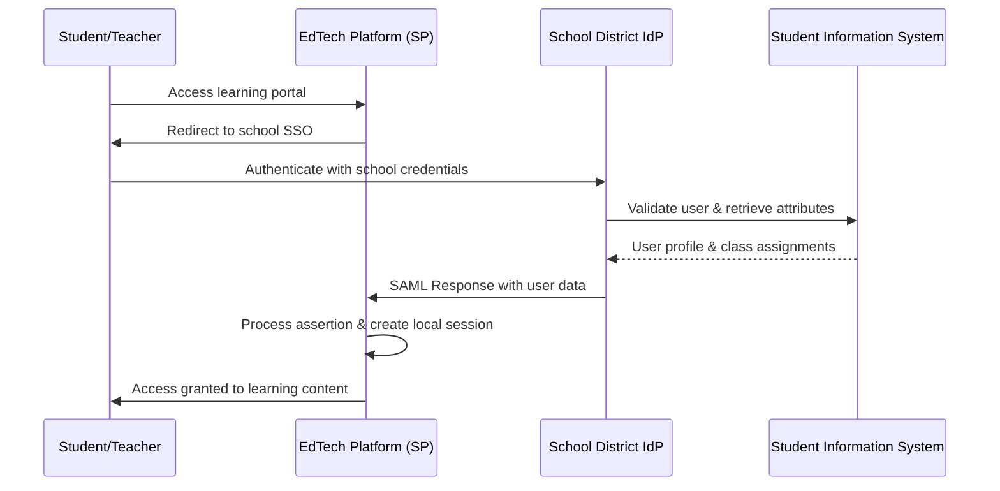

# SAML Implementation: Enterprise SSO for EdTech Platforms

> **Comprehensive SAML Security Assertion Markup Language implementation guide for educational institutions and enterprise clients**

## 🎯 SAML for EdTech: Strategic Overview

### **Why SAML for Educational Institutions**

SAML (Security Assertion Markup Language) is crucial for EdTech platforms targeting educational institutions because:

1. **Enterprise Integration**: School districts use SAML for centralized identity management
2. **Compliance Requirements**: FERPA, COPPA, and institutional policies often require SAML
3. **Single Sign-On**: Reduces password fatigue for teachers and administrators
4. **Identity Federation**: Enables seamless integration with existing school systems

### **SAML Implementation Scenarios in EdTech**

| Scenario | SAML Role | Use Case | Implementation Priority |
|----------|-----------|----------|------------------------|
| **School District Integration** | Service Provider (SP) | Teachers/students login via school IdP | ✅ High |
| **Multi-tenant Platform** | Identity Provider (IdP) | EdTech platform as central identity source | 🔸 Medium |
| **Partner Integrations** | Both SP & IdP | Federated access to multiple EdTech tools | 🔹 Low |
| **Government Compliance** | Service Provider (SP) | Integration with government education systems | ✅ High |

## 🏗️ SAML Architecture for EdTech

### **Typical EdTech SAML Flow**



### **Multi-Tenant SAML Architecture**

```typescript
// Multi-Tenant SAML Configuration
export class MultiTenantSAMLManager {
  private readonly tenantConfigs = new Map<string, SAMLTenantConfig>();

  async registerSchoolDistrict(config: SchoolDistrictConfig): Promise<SAMLRegistration> {
    const tenantId = this.generateTenantId(config.schoolDomain);
    
    const samlConfig: SAMLTenantConfig = {
      tenantId,
      schoolDomain: config.schoolDomain,
      schoolName: config.schoolName,
      
      // Identity Provider Configuration
      idpMetadata: config.idpMetadataXml,
      idpEntityId: config.idpEntityId,
      idpSSOURL: config.idpSSOURL,
      idpCertificate: config.idpCertificate,
      
      // Service Provider Configuration (Our EdTech Platform)
      spEntityId: `https://edtech-platform.com/saml/sp/${tenantId}`,
      spAcsUrl: `https://edtech-platform.com/saml/acs/${tenantId}`,
      spSLSUrl: `https://edtech-platform.com/saml/sls/${tenantId}`,
      
      // EdTech-Specific Configurations
      attributeMapping: this.createAttributeMapping(config),
      roleMapping: this.createRoleMapping(config),
      gradeLevelMapping: config.gradeLevelMapping,
      
      // Security Settings
      wantAssertionsSigned: true,
      wantResponseSigned: true,
      signatureAlgorithm: 'http://www.w3.org/2001/04/xmldsig-more#rsa-sha256',
      digestAlgorithm: 'http://www.w3.org/2001/04/xmlenc#sha256',
      
      // Compliance Settings
      ferpaCompliant: true,
      dataRetentionPolicy: config.dataRetentionPolicy,
      privacySettings: config.privacySettings,
    };

    // Store tenant configuration
    this.tenantConfigs.set(tenantId, samlConfig);
    await this.persistTenantConfig(samlConfig);

    // Generate SP metadata for the school district
    const spMetadata = await this.generateSPMetadata(samlConfig);

    return {
      tenantId,
      spEntityId: samlConfig.spEntityId,
      spMetadata,
      acsUrl: samlConfig.spAcsUrl,
      singleLogoutUrl: samlConfig.spSLSUrl,
    };
  }

  private createAttributeMapping(config: SchoolDistrictConfig): AttributeMapping {
    // Common educational attribute mappings
    return {
      // Standard attributes
      'userId': config.userIdAttribute || 'urn:oid:0.9.2342.19200300.100.1.1', // uid
      'email': 'urn:oid:0.9.2342.19200300.100.1.3', // mail
      'firstName': 'urn:oid:2.5.4.42', // givenName
      'lastName': 'urn:oid:2.5.4.4', // sn
      'displayName': 'urn:oid:2.16.840.1.113730.3.1.241', // displayName
      
      // Educational attributes
      'studentId': 'urn:mace:dir:attribute-def:eduPersonPrincipalName',
      'role': 'urn:mace:dir:attribute-def:eduPersonAffiliation',
      'gradeLevel': 'urn:school:attribute:gradeLevel',
      'schoolCode': 'urn:school:attribute:schoolCode',
      'classes': 'urn:school:attribute:enrolledClasses',
      'teachingAssignments': 'urn:school:attribute:teachingAssignments',
      
      // Custom mappings based on school's LDAP/AD schema
      ...config.customAttributeMapping,
    };
  }

  private createRoleMapping(config: SchoolDistrictConfig): RoleMapping {
    return {
      // Map school roles to EdTech platform roles
      'student': ['student'],
      'teacher': ['teacher'],
      'substitute': ['substitute_teacher'],
      'counselor': ['counselor', 'teacher'],
      'administrator': ['admin'],
      'principal': ['principal', 'admin'],
      'district_admin': ['district_admin', 'admin'],
      'parent': ['parent'],
      'guardian': ['parent'],
      
      // Handle multiple roles
      'teacher_admin': ['teacher', 'admin'],
      'student_aide': ['student', 'aide'],
      
      // Custom role mappings
      ...config.customRoleMapping,
    };
  }
}
```

## 🔐 SAML Security Implementation

### **Secure SAML Service Provider Setup**

```typescript
// Production-Ready SAML Service Provider
export class SecureSAMLServiceProvider {
  private readonly securityConfig = {
    // Certificate Management
    certificateValidation: true,
    certificateChainValidation: true,
    certificateRevocationCheck: false, // Can be enabled for high-security
    
    // Signature Validation
    requireSignedAssertions: true,
    requireSignedResponse: true,
    validateSignatureAlgorithm: true,
    allowedSignatureAlgorithms: [
      'http://www.w3.org/2001/04/xmldsig-more#rsa-sha256',
      'http://www.w3.org/2001/04/xmldsig-more#rsa-sha384',
      'http://www.w3.org/2001/04/xmldsig-more#rsa-sha512',
    ],
    
    // Timestamp Validation
    clockSkewTolerance: 300, // 5 minutes
    assertionValidityPeriod: 300, // 5 minutes maximum
    
    // Replay Protection
    enableReplayProtection: true,
    replayProtectionTTL: 3600, // 1 hour
    
    // Additional Security
    requireEncryptedAssertions: false, // Can be enabled per tenant
    requireAudienceRestriction: true,
    requireRecipientValidation: true,
  };

  async processSAMLResponse(
    samlResponse: string,
    tenantId: string,
    requestInfo: RequestInfo
  ): Promise<SAMLAssertion> {
    // Get tenant configuration
    const tenantConfig = await this.getTenantConfig(tenantId);
    if (!tenantConfig) {
      throw new SAMLError('Unknown tenant', 'invalid_tenant');
    }

    // Parse SAML response
    const parsedResponse = await this.parseSAMLResponse(samlResponse);
    
    // Security Validations
    await this.validateSAMLSecurity(parsedResponse, tenantConfig, requestInfo);
    
    // Extract assertion
    const assertion = this.extractAssertion(parsedResponse);
    
    // Validate assertion
    await this.validateAssertion(assertion, tenantConfig);
    
    // Process attributes
    const processedAssertion = await this.processAttributes(assertion, tenantConfig);
    
    // Log for audit
    await this.logSAMLAccess({
      tenantId,
      userId: processedAssertion.nameId,
      attributes: processedAssertion.attributes,
      timestamp: new Date(),
      ipAddress: requestInfo.ipAddress,
    });

    return processedAssertion;
  }

  private async validateSAMLSecurity(
    response: ParsedSAMLResponse,
    config: SAMLTenantConfig,
    requestInfo: RequestInfo
  ): Promise<void> {
    // 1. Signature Validation
    if (this.securityConfig.requireSignedResponse) {
      await this.validateResponseSignature(response, config);
    }

    if (this.securityConfig.requireSignedAssertions) {
      await this.validateAssertionSignatures(response, config);
    }

    // 2. Certificate Validation
    if (this.securityConfig.certificateValidation) {
      await this.validateCertificates(response, config);
    }

    // 3. Timestamp Validation
    await this.validateTimestamps(response);

    // 4. Audience Restriction
    if (this.securityConfig.requireAudienceRestriction) {
      this.validateAudienceRestriction(response, config.spEntityId);
    }

    // 5. Recipient Validation
    if (this.securityConfig.requireRecipientValidation) {
      this.validateRecipient(response, config.spAcsUrl);
    }

    // 6. Replay Protection
    if (this.securityConfig.enableReplayProtection) {
      await this.checkReplayAttack(response);
    }

    // 7. Subject Confirmation
    await this.validateSubjectConfirmation(response, requestInfo);
  }

  private async validateResponseSignature(
    response: ParsedSAMLResponse,
    config: SAMLTenantConfig
  ): Promise<void> {
    const signature = response.signature;
    if (!signature) {
      throw new SAMLError('SAML response is not signed', 'missing_signature');
    }

    // Validate signature algorithm
    if (!this.securityConfig.allowedSignatureAlgorithms.includes(signature.algorithm)) {
      throw new SAMLError(
        `Unsupported signature algorithm: ${signature.algorithm}`,
        'invalid_signature_algorithm'
      );
    }

    // Get IdP certificate
    const idpCertificate = await this.getIdPCertificate(config);
    
    // Verify signature
    const isValid = await this.crypto.verifyXMLSignature(
      response.xml,
      signature,
      idpCertificate
    );

    if (!isValid) {
      throw new SAMLError('Invalid SAML response signature', 'signature_verification_failed');
    }
  }

  private async checkReplayAttack(response: ParsedSAMLResponse): Promise<void> {
    const assertionId = response.assertion.id;
    const cacheKey = `saml_assertion_${assertionId}`;
    
    // Check if assertion has been used before
    const exists = await this.cache.exists(cacheKey);
    if (exists) {
      throw new SAMLError('SAML assertion replay detected', 'replay_attack');
    }

    // Store assertion ID to prevent replay
    await this.cache.set(
      cacheKey,
      '1',
      this.securityConfig.replayProtectionTTL
    );
  }

  private async validateSubjectConfirmation(
    response: ParsedSAMLResponse,
    requestInfo: RequestInfo
  ): Promise<void> {
    const subjectConfirmation = response.assertion.subjectConfirmation;
    
    if (!subjectConfirmation) {
      throw new SAMLError('Missing subject confirmation', 'missing_subject_confirmation');
    }

    // Validate confirmation method
    if (subjectConfirmation.method !== 'urn:oasis:names:tc:SAML:2.0:cm:bearer') {
      throw new SAMLError(
        `Unsupported confirmation method: ${subjectConfirmation.method}`,
        'invalid_confirmation_method'
      );
    }

    const confirmationData = subjectConfirmation.confirmationData;
    
    // Validate recipient
    if (confirmationData.recipient !== requestInfo.acsUrl) {
      throw new SAMLError('Invalid recipient in subject confirmation', 'invalid_recipient');
    }

    // Validate not on or after
    if (new Date() > confirmationData.notOnOrAfter) {
      throw new SAMLError('Subject confirmation expired', 'confirmation_expired');
    }

    // Validate in response to (if present)
    if (confirmationData.inResponseTo && requestInfo.requestId) {
      if (confirmationData.inResponseTo !== requestInfo.requestId) {
        throw new SAMLError('Invalid InResponseTo value', 'invalid_in_response_to');
      }
    }
  }
}
```

### **SAML Metadata Management**

```typescript
// Dynamic SAML Metadata Management
export class SAMLMetadataManager {
  async generateServiceProviderMetadata(tenantConfig: SAMLTenantConfig): Promise<string> {
    const metadata = `<?xml version="1.0" encoding="UTF-8"?>
<EntityDescriptor 
  entityID="${tenantConfig.spEntityId}"
  xmlns="urn:oasis:names:tc:SAML:2.0:metadata"
  xmlns:ds="http://www.w3.org/2000/09/xmldsig#">
  
  <SPSSODescriptor 
    protocolSupportEnumeration="urn:oasis:names:tc:SAML:2.0:protocol"
    AuthnRequestsSigned="${tenantConfig.signRequests}"
    WantAssertionsSigned="${tenantConfig.wantAssertionsSigned}">
    
    <!-- Signing Certificate -->
    <KeyDescriptor use="signing">
      <ds:KeyInfo>
        <ds:X509Data>
          <ds:X509Certificate>${this.formatCertificate(tenantConfig.spSigningCert)}</ds:X509Certificate>
        </ds:X509Data>
      </ds:KeyInfo>
    </KeyDescriptor>
    
    <!-- Encryption Certificate (if different) -->
    ${tenantConfig.spEncryptionCert ? this.generateEncryptionKeyDescriptor(tenantConfig.spEncryptionCert) : ''}
    
    <!-- Single Logout Service -->
    <SingleLogoutService 
      Binding="urn:oasis:names:tc:SAML:2.0:bindings:HTTP-Redirect"
      Location="${tenantConfig.spSLSUrl}"/>
    <SingleLogoutService 
      Binding="urn:oasis:names:tc:SAML:2.0:bindings:HTTP-POST"
      Location="${tenantConfig.spSLSUrl}"/>
    
    <!-- NameID Formats -->
    <NameIDFormat>urn:oasis:names:tc:SAML:2.0:nameid-format:persistent</NameIDFormat>
    <NameIDFormat>urn:oasis:names:tc:SAML:2.0:nameid-format:transient</NameIDFormat>
    <NameIDFormat>urn:oasis:names:tc:SAML:1.1:nameid-format:emailAddress</NameIDFormat>
    
    <!-- Assertion Consumer Services -->
    <AssertionConsumerService 
      Binding="urn:oasis:names:tc:SAML:2.0:bindings:HTTP-POST"
      Location="${tenantConfig.spAcsUrl}"
      index="1"
      isDefault="true"/>
    <AssertionConsumerService 
      Binding="urn:oasis:names:tc:SAML:2.0:bindings:HTTP-Redirect"
      Location="${tenantConfig.spAcsUrl}"
      index="2"/>
    
    <!-- Attribute Consuming Service -->
    <AttributeConsumingService index="1">
      <ServiceName xml:lang="en">EdTech Platform - ${tenantConfig.schoolName}</ServiceName>
      <ServiceDescription xml:lang="en">Educational platform requiring user attributes</ServiceDescription>
      
      <!-- Required Attributes -->
      <RequestedAttribute 
        Name="urn:oid:0.9.2342.19200300.100.1.1"
        FriendlyName="uid"
        isRequired="true"/>
      <RequestedAttribute 
        Name="urn:oid:0.9.2342.19200300.100.1.3"
        FriendlyName="mail"
        isRequired="true"/>
      <RequestedAttribute 
        Name="urn:oid:2.5.4.42"
        FriendlyName="givenName"
        isRequired="true"/>
      <RequestedAttribute 
        Name="urn:oid:2.5.4.4"
        FriendlyName="sn"
        isRequired="true"/>
      
      <!-- Educational Attributes -->
      <RequestedAttribute 
        Name="urn:mace:dir:attribute-def:eduPersonAffiliation"
        FriendlyName="affiliation"
        isRequired="true"/>
      <RequestedAttribute 
        Name="urn:school:attribute:gradeLevel"
        FriendlyName="gradeLevel"
        isRequired="false"/>
      <RequestedAttribute 
        Name="urn:school:attribute:enrolledClasses"
        FriendlyName="classes"
        isRequired="false"/>
      
    </AttributeConsumingService>
    
  </SPSSODescriptor>
  
  <!-- Organization Information -->
  <Organization>
    <OrganizationName xml:lang="en">EdTech Platform</OrganizationName>
    <OrganizationDisplayName xml:lang="en">EdTech Learning Platform</OrganizationDisplayName>
    <OrganizationURL xml:lang="en">https://edtech-platform.com</OrganizationURL>
  </Organization>
  
  <!-- Contact Information -->
  <ContactPerson contactType="technical">
    <GivenName>Technical Support</GivenName>
    <EmailAddress>tech-support@edtech-platform.com</EmailAddress>
  </ContactPerson>
  <ContactPerson contactType="support">
    <GivenName>Customer Support</GivenName>
    <EmailAddress>support@edtech-platform.com</EmailAddress>
  </ContactPerson>
  
</EntityDescriptor>`;

    // Sign the metadata
    const signedMetadata = await this.signMetadata(metadata, tenantConfig);
    return signedMetadata;
  }

  async validateIdPMetadata(metadataXml: string): Promise<IdPMetadataValidation> {
    try {
      const parsed = await this.parseMetadata(metadataXml);
      
      const validation: IdPMetadataValidation = {
        valid: true,
        entityId: parsed.entityId,
        ssoUrls: parsed.ssoUrls,
        certificates: parsed.certificates,
        nameIdFormats: parsed.nameIdFormats,
        warnings: [],
        errors: [],
      };

      // Validation checks
      if (!parsed.entityId) {
        validation.errors.push('Missing entityID');
        validation.valid = false;
      }

      if (parsed.ssoUrls.length === 0) {
        validation.errors.push('No SSO URLs found');
        validation.valid = false;
      }

      if (parsed.certificates.length === 0) {
        validation.warnings.push('No signing certificates found');
      }

      // Check certificate validity
      for (const cert of parsed.certificates) {
        const certValidation = await this.validateCertificate(cert);
        if (!certValidation.valid) {
          validation.errors.push(`Invalid certificate: ${certValidation.error}`);
          validation.valid = false;
        } else if (certValidation.expiresWithin30Days) {
          validation.warnings.push(`Certificate expires within 30 days: ${cert.subject}`);
        }
      }

      return validation;
    } catch (error) {
      return {
        valid: false,
        errors: [`Metadata parsing failed: ${error.message}`],
        warnings: [],
      };
    }
  }

  // Automatic metadata refresh for federated partners
  async refreshIdPMetadata(tenantId: string): Promise<void> {
    const tenantConfig = await this.getTenantConfig(tenantId);
    if (!tenantConfig.idpMetadataUrl) {
      return; // No automatic refresh URL configured
    }

    try {
      // Fetch latest metadata
      const response = await fetch(tenantConfig.idpMetadataUrl, {
        timeout: 10000,
        headers: {
          'User-Agent': 'EdTech-Platform-SAML/1.0',
        },
      });

      if (!response.ok) {
        throw new Error(`HTTP ${response.status}: ${response.statusText}`);
      }

      const metadataXml = await response.text();
      
      // Validate new metadata
      const validation = await this.validateIdPMetadata(metadataXml);
      if (!validation.valid) {
        throw new Error(`Invalid metadata: ${validation.errors.join(', ')}`);
      }

      // Update tenant configuration
      await this.updateTenantIdPMetadata(tenantId, {
        metadataXml,
        entityId: validation.entityId!,
        ssoUrls: validation.ssoUrls!,
        certificates: validation.certificates!,
        lastUpdated: new Date(),
      });

      console.log(`Successfully refreshed metadata for tenant ${tenantId}`);
    } catch (error) {
      console.error(`Failed to refresh metadata for tenant ${tenantId}:`, error);
      
      // Send alert if metadata refresh fails
      await this.sendMetadataRefreshAlert(tenantId, error.message);
    }
  }
}
```

## 🎓 EdTech-Specific SAML Implementations

### **Student Privacy-Compliant SAML**

```typescript
// FERPA-Compliant SAML Processing
export class FERPACompliantSAMLProcessor {
  private readonly privacyRules = {
    // Define what constitutes directory information
    directoryInformation: [
      'name', 'email', 'grade_level', 'enrollment_status'
    ],
    
    // Define sensitive educational records
    sensitiveRecords: [
      'grades', 'disciplinary_records', 'special_education_status',
      'health_records', 'psychological_evaluations'
    ],
    
    // Age-based consent requirements
    minorAge: 18, // Students under 18 need different handling
    coppaAge: 13,  // COPPA compliance for under 13
  };

  async processSAMLForStudent(
    assertion: SAMLAssertion,
    tenantConfig: SAMLTenantConfig
  ): Promise<StudentSAMLProfile> {
    // Extract basic student information
    const studentProfile = this.extractStudentProfile(assertion);
    
    // Determine if student is a minor
    const isMinor = await this.isStudentMinor(studentProfile.studentId);
    
    // Apply privacy filtering based on age and consent
    const filteredAttributes = await this.applyPrivacyFiltering(
      assertion.attributes,
      studentProfile,
      isMinor,
      tenantConfig
    );

    // Check parental consent requirements
    if (isMinor) {
      await this.verifyParentalConsent(studentProfile.studentId, filteredAttributes);
    }

    // Create privacy-compliant profile
    const profile: StudentSAMLProfile = {
      studentId: studentProfile.studentId,
      attributes: filteredAttributes,
      privacyLevel: isMinor ? 'high' : 'standard',
      parentalConsentStatus: isMinor ? await this.getParentalConsentStatus(studentProfile.studentId) : null,
      dataRetentionPolicy: tenantConfig.dataRetentionPolicy,
      ferpaProtected: true,
    };

    // Log access for FERPA audit trail
    await this.logFERPAAccess({
      studentId: studentProfile.studentId,
      dataAccessed: Object.keys(filteredAttributes),
      accessReason: 'saml_authentication',
      accessedBy: 'system',
      timestamp: new Date(),
      tenantId: tenantConfig.tenantId,
    });

    return profile;
  }

  private async applyPrivacyFiltering(
    attributes: Record<string, any>,
    studentProfile: StudentProfile,
    isMinor: boolean,
    tenantConfig: SAMLTenantConfig
  ): Promise<Record<string, any>> {
    const filteredAttributes: Record<string, any> = {};

    for (const [key, value] of Object.entries(attributes)) {
      // Always allow directory information
      if (this.privacyRules.directoryInformation.includes(key)) {
        filteredAttributes[key] = value;
        continue;
      }

      // Check if attribute is sensitive
      if (this.privacyRules.sensitiveRecords.includes(key)) {
        // Require explicit consent for sensitive data
        const hasConsent = await this.hasConsentForAttribute(
          studentProfile.studentId,
          key,
          isMinor
        );
        
        if (hasConsent) {
          filteredAttributes[key] = value;
        }
        continue;
      }

      // For other attributes, apply tenant-specific filtering
      if (await this.isTenantAllowed(key, tenantConfig)) {
        filteredAttributes[key] = value;
      }
    }

    return filteredAttributes;
  }

  private async hasConsentForAttribute(
    studentId: string,
    attribute: string,
    isMinor: boolean
  ): Promise<boolean> {
    if (!isMinor) {
      // Adult students can consent for themselves
      return await this.hasStudentConsent(studentId, attribute);
    } else {
      // Minor students need parental consent
      return await this.hasParentalConsent(studentId, attribute);
    }
  }
}
```

### **Teacher SSO Integration**

```typescript
// Teacher-Specific SAML Integration
export class TeacherSAMLIntegration {
  async processTeacherSSO(
    assertion: SAMLAssertion,
    tenantConfig: SAMLTenantConfig
  ): Promise<TeacherSAMLProfile> {
    // Extract teacher information
    const teacherInfo = this.extractTeacherInfo(assertion);
    
    // Get current teaching assignments from school system
    const assignments = await this.getTeachingAssignments(
      teacherInfo.teacherId,
      tenantConfig.schoolDomain
    );

    // Map school roles to platform roles
    const platformRoles = this.mapTeacherRoles(
      assertion.attributes.role,
      assignments
    );

    // Create teacher profile with context-aware permissions
    const profile: TeacherSAMLProfile = {
      teacherId: teacherInfo.teacherId,
      name: teacherInfo.name,
      email: teacherInfo.email,
      roles: platformRoles,
      assignments: assignments,
      
      // Time-based access restrictions
      accessSchedule: await this.getAccessSchedule(teacherInfo.teacherId),
      
      // Location-based restrictions (if configured)
      locationRestrictions: tenantConfig.enforceLocationRestrictions ? 
        await this.getLocationRestrictions(teacherInfo.teacherId) : null,
      
      // Emergency access capabilities
      emergencyAccess: await this.getEmergencyAccessRights(teacherInfo.teacherId),
      
      // Data access permissions based on current assignments
      dataAccessPermissions: this.calculateDataAccessPermissions(assignments),
    };

    return profile;
  }

  private mapTeacherRoles(
    schoolRoles: string[],
    assignments: TeachingAssignment[]
  ): string[] {
    const platformRoles = new Set<string>();

    // Base teacher role
    platformRoles.add('teacher');

    // Role-based mappings
    for (const role of schoolRoles) {
      switch (role.toLowerCase()) {
        case 'teacher':
        case 'classroom_teacher':
          platformRoles.add('teacher');
          break;
        case 'substitute':
        case 'substitute_teacher':
          platformRoles.add('substitute_teacher');
          break;
        case 'department_head':
          platformRoles.add('department_head');
          platformRoles.add('teacher');
          break;
        case 'counselor':
          platformRoles.add('counselor');
          platformRoles.add('teacher');
          break;
        case 'principal':
        case 'assistant_principal':
          platformRoles.add('principal');
          platformRoles.add('admin');
          break;
        case 'district_admin':
          platformRoles.add('district_admin');
          platformRoles.add('admin');
          break;
      }
    }

    // Assignment-based role additions
    if (assignments.some(a => a.isLead)) {
      platformRoles.add('lead_teacher');
    }

    if (assignments.some(a => a.hasSpecialNeeds)) {
      platformRoles.add('special_ed_teacher');
    }

    return Array.from(platformRoles);
  }

  private calculateDataAccessPermissions(
    assignments: TeachingAssignment[]
  ): DataAccessPermissions {
    const permissions: DataAccessPermissions = {
      canViewStudentProfiles: [],
      canViewGrades: [],
      canEditGrades: [],
      canViewAttendance: [],
      canEditAttendance: [],
      canViewBehavior: [],
      canEditBehavior: [],
      canViewParentContacts: [],
      canCommunicateWithParents: [],
    };

    for (const assignment of assignments) {
      // Students in assigned classes
      const studentIds = assignment.enrolledStudents.map(s => s.id);
      
      permissions.canViewStudentProfiles.push(...studentIds);
      permissions.canViewGrades.push(...studentIds);
      permissions.canViewAttendance.push(...studentIds);
      
      // Edit permissions based on assignment type
      if (assignment.canGrade) {
        permissions.canEditGrades.push(...studentIds);
      }
      
      if (assignment.canTakeAttendance) {
        permissions.canEditAttendance.push(...studentIds);
      }
      
      if (assignment.canManageBehavior) {
        permissions.canViewBehavior.push(...studentIds);
        permissions.canEditBehavior.push(...studentIds);
      }
      
      if (assignment.canContactParents) {
        permissions.canViewParentContacts.push(...studentIds);
        permissions.canCommunicateWithParents.push(...studentIds);
      }
    }

    // Remove duplicates
    Object.keys(permissions).forEach(key => {
      permissions[key] = [...new Set(permissions[key])];
    });

    return permissions;
  }
}
```

### **Parent Portal SAML Integration**

```typescript
// Parent-Specific SAML Processing
export class ParentSAMLIntegration {
  async processParentSSO(
    assertion: SAMLAssertion,
    tenantConfig: SAMLTenantConfig
  ): Promise<ParentSAMLProfile> {
    // Extract parent information
    const parentInfo = this.extractParentInfo(assertion);
    
    // Verify parent-student relationships
    const studentRelationships = await this.verifyParentStudentRelationships(
      parentInfo.parentId,
      assertion.attributes.studentIds || []
    );

    if (studentRelationships.length === 0) {
      throw new SAMLError(
        'No verified parent-student relationships found',
        'no_student_relationships'
      );
    }

    // Create parent profile with student-specific permissions
    const profile: ParentSAMLProfile = {
      parentId: parentInfo.parentId,
      name: parentInfo.name,
      email: parentInfo.email,
      studentRelationships,
      
      // Calculate permissions based on student ages and consent
      studentPermissions: await this.calculateParentPermissions(studentRelationships),
      
      // Communication preferences
      communicationPreferences: await this.getParentCommunicationPreferences(parentInfo.parentId),
      
      // Emergency contact information
      emergencyContact: await this.getEmergencyContactInfo(parentInfo.parentId),
    };

    return profile;
  }

  private async calculateParentPermissions(
    relationships: ParentStudentRelationship[]
  ): Promise<Record<string, StudentPermissions>> {
    const permissions: Record<string, StudentPermissions> = {};

    for (const relationship of relationships) {
      const student = relationship.student;
      const studentPermissions: StudentPermissions = {
        canViewGrades: false,
        canViewAttendance: false,
        canViewBehavior: false,
        canViewSchedule: false,
        canReceiveNotifications: false,
        canUpdateEmergencyInfo: false,
        canOptOutCommunications: false,
      };

      // Age-based permission calculation
      if (student.age < 13) {
        // Full parental control for young children
        studentPermissions.canViewGrades = true;
        studentPermissions.canViewAttendance = true;
        studentPermissions.canViewBehavior = true;
        studentPermissions.canViewSchedule = true;
        studentPermissions.canReceiveNotifications = true;
        studentPermissions.canUpdateEmergencyInfo = true;
        studentPermissions.canOptOutCommunications = true;
      } else if (student.age < 18) {
        // Limited access for older minors, based on student consent
        const studentConsent = await this.getStudentConsentStatus(student.id, relationship.parentId);
        
        studentPermissions.canViewGrades = studentConsent.gradesConsent;
        studentPermissions.canViewAttendance = studentConsent.attendanceConsent;
        studentPermissions.canViewBehavior = studentConsent.behaviorConsent;
        studentPermissions.canViewSchedule = true; // Usually always allowed
        studentPermissions.canReceiveNotifications = studentConsent.notificationsConsent;
        studentPermissions.canUpdateEmergencyInfo = true; // Safety-related, always allowed
        studentPermissions.canOptOutCommunications = studentConsent.communicationsConsent;
      } else {
        // Adult students (18+) - only with explicit consent
        const adultConsent = await this.getAdultStudentConsentStatus(student.id, relationship.parentId);
        
        studentPermissions.canViewGrades = adultConsent.gradesConsent;
        studentPermissions.canViewAttendance = adultConsent.attendanceConsent;
        studentPermissions.canViewBehavior = adultConsent.behaviorConsent;
        studentPermissions.canViewSchedule = adultConsent.scheduleConsent;
        studentPermissions.canReceiveNotifications = adultConsent.notificationsConsent;
        studentPermissions.canUpdateEmergencyInfo = adultConsent.emergencyInfoConsent;
        studentPermissions.canOptOutCommunications = false; // Adult student controls this
      }

      permissions[student.id] = studentPermissions;
    }

    return permissions;
  }
}
```

## 🔄 SAML Single Logout Implementation

### **Comprehensive Logout Strategy**

```typescript
// SAML Single Logout Service
export class SAMLSingleLogoutService {
  async initiateSingleLogout(
    sessionId: string,
    tenantId: string,
    initiatorType: 'sp' | 'idp'
  ): Promise<SingleLogoutResult> {
    // Get session information
    const session = await this.getSession(sessionId);
    if (!session) {
      throw new SAMLError('Session not found', 'invalid_session');
    }

    const tenantConfig = await this.getTenantConfig(tenantId);
    const logoutId = this.generateLogoutId();

    if (initiatorType === 'sp') {
      // SP-initiated logout - send LogoutRequest to IdP
      return this.initiateServiceProviderLogout(session, tenantConfig, logoutId);
    } else {
      // IdP-initiated logout - process LogoutRequest from IdP
      return this.processIdentityProviderLogout(session, tenantConfig, logoutId);
    }
  }

  private async initiateServiceProviderLogout(
    session: SAMLSession,
    config: SAMLTenantConfig,
    logoutId: string
  ): Promise<SingleLogoutResult> {
    // Create SAML LogoutRequest
    const logoutRequest = this.createLogoutRequest({
      id: logoutId,
      issuer: config.spEntityId,
      destination: config.idpSLSUrl,
      nameId: session.nameId,
      nameIdFormat: session.nameIdFormat,
      sessionIndex: session.sessionIndex,
    });

    // Sign the logout request if required
    const signedRequest = config.signLogoutRequests ? 
      await this.signLogoutRequest(logoutRequest, config) : logoutRequest;

    // Store logout state
    await this.storeLogoutState({
      logoutId,
      sessionId: session.id,
      tenantId: config.tenantId,
      userId: session.userId,
      timestamp: new Date(),
      status: 'pending',
    });

    // Build logout URL
    const logoutUrl = this.buildLogoutUrl(config.idpSLSUrl, signedRequest);

    return {
      success: true,
      logoutId,
      redirectUrl: logoutUrl,
      status: 'redirect_required',
    };
  }

  async processLogoutResponse(
    samlResponse: string,
    tenantId: string
  ): Promise<LogoutResponseResult> {
    const tenantConfig = await this.getTenantConfig(tenantId);
    
    // Parse logout response
    const response = await this.parseLogoutResponse(samlResponse);
    
    // Validate response
    await this.validateLogoutResponse(response, tenantConfig);
    
    // Get logout state
    const logoutState = await this.getLogoutState(response.inResponseTo);
    if (!logoutState) {
      throw new SAMLError('Invalid logout response', 'invalid_logout_state');
    }

    // Process the logout
    await this.completeLogout(logoutState);

    return {
      success: response.status === 'success',
      logoutId: response.inResponseTo,
      userId: logoutState.userId,
      message: response.statusMessage,
    };
  }

  private async completeLogout(logoutState: LogoutState): Promise<void> {
    // Invalidate local session
    await this.invalidateSession(logoutState.sessionId);
    
    // Invalidate all related tokens
    await this.invalidateUserTokens(logoutState.userId, logoutState.tenantId);
    
    // Clear user cache
    await this.clearUserCache(logoutState.userId);
    
    // Log logout event
    await this.logLogoutEvent({
      userId: logoutState.userId,
      tenantId: logoutState.tenantId,
      logoutId: logoutState.logoutId,
      timestamp: new Date(),
      successful: true,
    });

    // Update logout state
    await this.updateLogoutState(logoutState.logoutId, {
      status: 'completed',
      completedAt: new Date(),
    });

    // Notify other systems if needed
    await this.notifyLogoutEvent(logoutState);
  }

  // Handle IdP-initiated logout
  async processIdPLogoutRequest(
    logoutRequest: string,
    tenantId: string
  ): Promise<IdPLogoutResult> {
    const tenantConfig = await this.getTenantConfig(tenantId);
    
    // Parse logout request
    const request = await this.parseLogoutRequest(logoutRequest);
    
    // Validate request
    await this.validateLogoutRequest(request, tenantConfig);
    
    // Find session by NameID and SessionIndex
    const session = await this.findSessionByNameId(
      request.nameId,
      request.sessionIndex,
      tenantId
    );

    let logoutStatus = 'success';
    let statusMessage = 'Logout successful';

    if (session) {
      try {
        // Perform logout
        await this.invalidateSession(session.id);
        await this.invalidateUserTokens(session.userId, tenantId);
        await this.clearUserCache(session.userId);
        
        // Log the logout
        await this.logLogoutEvent({
          userId: session.userId,
          tenantId,
          logoutId: request.id,
          timestamp: new Date(),
          successful: true,
          initiatedBy: 'idp',
        });
      } catch (error) {
        logoutStatus = 'partial';
        statusMessage = 'Partial logout - some cleanup failed';
        console.error('Logout cleanup error:', error);
      }
    } else {
      logoutStatus = 'success'; // Already logged out
      statusMessage = 'Session not found - already logged out';
    }

    // Create logout response
    const logoutResponse = this.createLogoutResponse({
      id: this.generateLogoutId(),
      inResponseTo: request.id,
      issuer: tenantConfig.spEntityId,
      destination: request.issuer, // Send back to IdP
      status: logoutStatus,
      statusMessage,
    });

    // Sign response if required
    const signedResponse = tenantConfig.signLogoutResponses ?
      await this.signLogoutResponse(logoutResponse, tenantConfig) : logoutResponse;

    return {
      success: true,
      logoutResponse: signedResponse,
      redirectUrl: this.buildLogoutResponseUrl(request.issuer, signedResponse),
    };
  }
}
```

## 📊 SAML Monitoring & Analytics

### **SAML Performance Monitoring**

```typescript
// SAML Performance and Security Monitoring
export class SAMLMonitoringService {
  private readonly metrics = {
    authenticationLatency: new Map<string, number[]>(),
    errorRates: new Map<string, number>(),
    certificateExpiries: new Map<string, Date>(),
    metadataRefreshStatus: new Map<string, Date>(),
  };

  async recordSAMLMetrics(event: SAMLEvent): Promise<void> {
    const tenantId = event.tenantId;
    
    // Record latency
    if (event.type === 'authentication' && event.latency) {
      if (!this.metrics.authenticationLatency.has(tenantId)) {
        this.metrics.authenticationLatency.set(tenantId, []);
      }
      this.metrics.authenticationLatency.get(tenantId)!.push(event.latency);
    }

    // Record errors
    if (event.type === 'error') {
      const currentErrors = this.metrics.errorRates.get(tenantId) || 0;
      this.metrics.errorRates.set(tenantId, currentErrors + 1);
    }

    // Store in time-series database
    await this.storeMetric({
      timestamp: new Date(),
      tenantId,
      eventType: event.type,
      success: event.success,
      latency: event.latency,
      errorCode: event.errorCode,
      userId: event.userId,
    });
  }

  async generateSAMLHealthReport(tenantId?: string): Promise<SAMLHealthReport> {
    const tenants = tenantId ? [tenantId] : await this.getAllTenantIds();
    const reports: TenantHealthReport[] = [];

    for (const tid of tenants) {
      const tenantConfig = await this.getTenantConfig(tid);
      const metrics = await this.getTenantMetrics(tid, 24); // Last 24 hours

      const report: TenantHealthReport = {
        tenantId: tid,
        schoolName: tenantConfig.schoolName,
        
        // Performance metrics
        averageLatency: this.calculateAverageLatency(metrics),
        p95Latency: this.calculateP95Latency(metrics),
        successRate: this.calculateSuccessRate(metrics),
        
        // Security metrics
        failedAuthAttempts: metrics.filter(m => m.eventType === 'auth_failure').length,
        suspiciousActivities: await this.detectSuspiciousActivities(tid, metrics),
        
        // Configuration health
        certificateStatus: await this.checkCertificateStatus(tenantConfig),
        metadataStatus: await this.checkMetadataStatus(tenantConfig),
        configurationIssues: await this.validateConfiguration(tenantConfig),
        
        // Usage statistics
        totalAuthentications: metrics.filter(m => m.eventType === 'authentication').length,
        uniqueUsers: new Set(metrics.map(m => m.userId).filter(Boolean)).size,
        peakUsageHour: this.calculatePeakUsageHour(metrics),
      };

      reports.push(report);
    }

    return {
      generatedAt: new Date(),
      tenantReports: reports,
      overallHealth: this.calculateOverallHealth(reports),
      recommendations: this.generateRecommendations(reports),
    };
  }

  private async detectSuspiciousActivities(
    tenantId: string,
    metrics: SAMLMetric[]
  ): Promise<SuspiciousActivity[]> {
    const activities: SuspiciousActivity[] = [];

    // Multiple failed authentication attempts
    const failedAuths = metrics.filter(m => 
      m.eventType === 'auth_failure' && 
      m.timestamp > new Date(Date.now() - 3600000) // Last hour
    );

    const failuresByUser = new Map<string, number>();
    failedAuths.forEach(auth => {
      const count = failuresByUser.get(auth.userId) || 0;
      failuresByUser.set(auth.userId, count + 1);
    });

    failuresByUser.forEach((count, userId) => {
      if (count >= 5) {
        activities.push({
          type: 'multiple_auth_failures',
          userId,
          count,
          severity: 'high',
          description: `${count} failed authentication attempts in the last hour`,
        });
      }
    });

    // Unusual login times
    const authMetrics = metrics.filter(m => m.eventType === 'authentication' && m.success);
    const unusualTimes = authMetrics.filter(auth => {
      const hour = new Date(auth.timestamp).getHours();
      return hour < 6 || hour > 22; // Outside normal school hours
    });

    if (unusualTimes.length > 10) {
      activities.push({
        type: 'unusual_login_times',
        count: unusualTimes.length,
        severity: 'medium',
        description: `${unusualTimes.length} logins outside normal school hours`,
      });
    }

    // Geographic anomalies (would require IP geolocation)
    // Implementation would depend on available IP data

    return activities;
  }

  async checkCertificateStatus(config: SAMLTenantConfig): Promise<CertificateStatus> {
    const certificates = await this.extractCertificatesFromConfig(config);
    const statuses: CertificateInfo[] = [];

    for (const cert of certificates) {
      const info = await this.getCertificateInfo(cert);
      const daysUntilExpiry = Math.floor(
        (info.expiryDate.getTime() - Date.now()) / (1000 * 60 * 60 * 24)
      );

      statuses.push({
        subject: info.subject,
        issuer: info.issuer,
        expiryDate: info.expiryDate,
        daysUntilExpiry,
        status: daysUntilExpiry < 30 ? 'expiring_soon' : 
               daysUntilExpiry < 0 ? 'expired' : 'valid',
      });
    }

    return {
      certificates: statuses,
      hasExpiringCerts: statuses.some(s => s.status === 'expiring_soon'),
      hasExpiredCerts: statuses.some(s => s.status === 'expired'),
    };
  }

  private generateRecommendations(reports: TenantHealthReport[]): Recommendation[] {
    const recommendations: Recommendation[] = [];

    reports.forEach(report => {
      // Performance recommendations
      if (report.averageLatency > 3000) {
        recommendations.push({
          type: 'performance',
          severity: 'medium',
          tenantId: report.tenantId,
          title: 'High Authentication Latency',
          description: `Average latency (${report.averageLatency}ms) exceeds recommended threshold`,
          action: 'Consider optimizing SAML processing or checking network connectivity',
        });
      }

      // Security recommendations
      if (report.successRate < 0.95) {
        recommendations.push({
          type: 'security',
          severity: 'high',
          tenantId: report.tenantId,
          title: 'Low Authentication Success Rate',
          description: `Success rate (${(report.successRate * 100).toFixed(1)}%) indicates potential issues`,
          action: 'Review authentication failures and configuration',
        });
      }

      // Certificate recommendations
      if (report.certificateStatus.hasExpiringCerts) {
        recommendations.push({
          type: 'configuration',
          severity: 'high',
          tenantId: report.tenantId,
          title: 'Certificates Expiring Soon',
          description: 'One or more certificates will expire within 30 days',
          action: 'Renew certificates and update metadata',
        });
      }
    });

    return recommendations;
  }
}
```

---

### Navigation
**Previous**: [OAuth2 Deep Dive](./oauth2-deep-dive.md) | **Next**: [MFA Strategies](./mfa-strategies.md)

---

*SAML Implementation Guide for EdTech Platforms | July 2025*