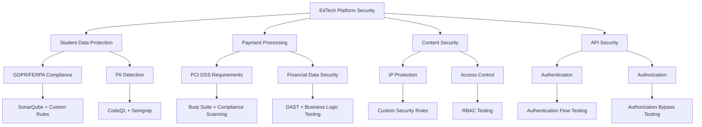

# Tool Selection Guide: Choosing the Right Security Scanning Tools

## 🎯 Overview

Selecting the right security scanning tools is crucial for building an effective security program. This guide provides a comprehensive framework for evaluating and choosing SAST, DAST, and dependency scanning tools based on your organization's specific needs, constraints, and goals.

## 🔍 Decision Framework

### 1. Assessment Criteria Matrix

**Technical Requirements (40%)**
- Language and framework support
- Integration capabilities (CI/CD, IDEs)
- Scanning accuracy and coverage
- Performance and scalability
- Customization and extensibility

**Business Requirements (25%)**
- Cost and licensing model
- Team size and scalability
- Compliance requirements
- Support and documentation quality

**Operational Requirements (20%)**
- Deployment complexity
- Maintenance overhead
- Training requirements
- Workflow integration

**Strategic Requirements (15%)**
- Vendor stability and roadmap
- Community and ecosystem
- Future-proofing considerations
- Exit strategy complexity

### 2. Scoring Methodology

**Weighted Scoring System:**
- **Excellent (5)**: Exceeds all requirements, industry leading
- **Good (4)**: Meets all requirements with some advantages
- **Satisfactory (3)**: Meets minimum requirements
- **Poor (2)**: Meets some requirements with significant gaps
- **Inadequate (1)**: Does not meet basic requirements

**Final Score Calculation:**
```
Final Score = (Technical × 0.4) + (Business × 0.25) + (Operational × 0.2) + (Strategic × 0.15)
```

## 📊 Tool Selection Matrices

### SAST Tool Selection Matrix

| Criteria | Weight | GitHub CodeQL | SonarQube Developer | Semgrep | ESLint Security |
|----------|--------|---------------|-------------------|----------|-----------------|
| **Technical Requirements** | 40% | | | | |
| Language Support | 8% | 4.5 | 4.8 | 4.3 | 3.5 |
| Accuracy | 8% | 4.8 | 4.2 | 4.3 | 3.5 |
| Performance | 6% | 4.0 | 3.5 | 4.8 | 5.0 |
| Integration | 10% | 5.0 | 4.0 | 4.5 | 4.8 |
| Customization | 8% | 4.5 | 4.5 | 4.8 | 4.2 |
| **Business Requirements** | 25% | | | | |
| Cost Effectiveness | 10% | 4.5 | 2.5 | 4.0 | 5.0 |
| Scalability | 8% | 4.8 | 4.5 | 4.2 | 3.0 |
| Compliance Support | 7% | 4.5 | 4.8 | 3.5 | 2.5 |
| **Operational Requirements** | 20% | | | | |
| Setup Complexity | 8% | 4.5 | 2.5 | 4.2 | 4.8 |
| Maintenance | 6% | 4.2 | 3.0 | 4.5 | 4.5 |
| Training Required | 6% | 3.5 | 3.5 | 4.0 | 4.8 |
| **Strategic Requirements** | 15% | | | | |
| Vendor Stability | 8% | 5.0 | 4.5 | 3.8 | 4.0 |
| Roadmap Alignment | 7% | 4.5 | 4.0 | 4.2 | 3.5 |
| **TOTAL SCORE** | 100% | **4.4** | **3.8** | **4.3** | **4.1** |

### DAST Tool Selection Matrix

| Criteria | Weight | OWASP ZAP | Burp Suite Pro | Nuclei | Acunetix |
|----------|--------|-----------|-----------------|--------|----------|
| **Technical Requirements** | 40% | | | | |
| Vulnerability Detection | 12% | 4.0 | 4.8 | 3.8 | 4.5 |
| False Positive Rate | 8% | 4.2 | 4.5 | 4.5 | 4.0 |
| API Testing | 10% | 3.8 | 4.5 | 4.2 | 4.2 |
| Automation | 10% | 4.5 | 3.5 | 5.0 | 4.0 |
| **Business Requirements** | 25% | | | | |
| Cost | 12% | 5.0 | 2.5 | 5.0 | 2.5 |
| Support Quality | 8% | 3.0 | 4.5 | 3.5 | 4.0 |
| Licensing Model | 5% | 5.0 | 3.0 | 5.0 | 3.0 |
| **Operational Requirements** | 20% | | | | |
| Ease of Use | 10% | 3.5 | 4.0 | 4.5 | 4.2 |
| CI/CD Integration | 10% | 4.5 | 3.0 | 5.0 | 3.5 |
| **Strategic Requirements** | 15% | | | | |
| Community Support | 8% | 4.5 | 4.0 | 4.2 | 3.5 |
| Innovation | 7% | 4.0 | 4.2 | 4.5 | 3.8 |
| **TOTAL SCORE** | 100% | **4.1** | **3.8** | **4.4** | **3.7** |

### Dependency Scanner Selection Matrix

| Criteria | Weight | GitHub Dependabot | Snyk | OWASP Dependency Check | FOSSA |
|----------|--------|------------------|------|----------------------|-------|
| **Technical Requirements** | 40% | | | | |
| Vulnerability Database | 12% | 4.5 | 4.8 | 4.2 | 4.4 |
| Language Support | 10% | 4.2 | 4.6 | 4.0 | 4.5 |
| Accuracy | 10% | 4.3 | 4.7 | 4.0 | 4.2 |
| Integration | 8% | 5.0 | 4.8 | 3.5 | 4.0 |
| **Business Requirements** | 25% | | | | |
| Cost | 10% | 4.8 | 3.5 | 5.0 | 3.0 |
| ROI | 8% | 4.5 | 4.2 | 4.8 | 3.8 |
| License Compliance | 7% | 2.5 | 4.5 | 3.0 | 4.8 |
| **Operational Requirements** | 20% | | | | |
| Setup | 10% | 5.0 | 4.0 | 3.5 | 3.8 |
| Maintenance | 10% | 4.8 | 4.2 | 3.8 | 4.0 |
| **Strategic Requirements** | 15% | | | | |
| Platform Integration | 8% | 5.0 | 4.0 | 3.5 | 4.0 |
| Future-proofing | 7% | 4.5 | 4.2 | 4.0 | 4.2 |
| **TOTAL SCORE** | 100% | **4.5** | **4.3** | **3.9** | **4.1** |

## 🎯 Selection Decision Trees

### Team Size-Based Recommendations

**Small Team (1-10 developers)**
```
Start Here: What's your primary concern?
│
├── Budget Constraint ($0-500/month)
│   ├── GitHub Repository? → GitHub CodeQL + Dependabot + OWASP ZAP
│   └── Multi-platform? → ESLint Security + OWASP Dependency Check + Nuclei
│
├── Ease of Use Priority
│   └── Recommended: SonarQube Community + GitHub Dependabot + OWASP ZAP
│
└── Performance Critical
    └── Recommended: Semgrep + Nuclei + GitHub Dependabot
```

**Medium Team (10-50 developers)**
```
Start Here: What's your maturity level?
│
├── Getting Started
│   └── Recommended: GitHub CodeQL + Snyk + OWASP ZAP
│
├── Established Process
│   └── Recommended: SonarQube Developer + Burp Suite + Snyk Team
│
└── Advanced Requirements
    └── Recommended: Custom combination based on specific needs
```

**Large Team (50+ developers)**
```
Start Here: What's your primary driver?
│
├── Enterprise Compliance
│   └── Recommended: SonarQube Enterprise + Acunetix + FOSSA
│
├── DevOps Integration
│   └── Recommended: GitHub Advanced Security + Snyk + Custom DAST
│
└── Custom Requirements
    └── Recommended: Multi-vendor approach with integration platform
```

### Use Case-Based Selection

**EdTech Platform Specific Considerations:**



## 📋 Implementation Roadmaps

### Roadmap 1: Budget-Conscious Startup

**Phase 1: Foundation (Month 1)**
- **SAST**: ESLint Security plugins
- **DAST**: OWASP ZAP baseline scans
- **Dependencies**: GitHub Dependabot
- **Investment**: $0/month
- **Setup Time**: 1-2 days

**Phase 2: Automation (Month 2-3)**
- **SAST**: Add SonarQube Community
- **DAST**: Automate ZAP in CI/CD
- **Dependencies**: Add OWASP Dependency Check
- **Investment**: $0-50/month
- **Setup Time**: 1 week

**Phase 3: Enhancement (Month 4-6)**
- **SAST**: Upgrade to GitHub CodeQL (if using GitHub)
- **DAST**: Add Nuclei for faster scanning
- **Dependencies**: Consider Snyk free tier
- **Investment**: $0-200/month
- **Setup Time**: 2 weeks

### Roadmap 2: Growing EdTech Company

**Phase 1: Professional Tools (Month 1-2)**
- **SAST**: GitHub CodeQL or SonarQube Developer
- **DAST**: OWASP ZAP + custom scripts
- **Dependencies**: Snyk Team
- **Investment**: $2,000-5,000/month
- **Setup Time**: 2-3 weeks

**Phase 2: Integration & Optimization (Month 3-4)**
- **SAST**: Custom security rules for EdTech
- **DAST**: Add business logic testing
- **Dependencies**: Automated update workflows
- **Investment**: Additional $1,000/month
- **Setup Time**: 3-4 weeks

**Phase 3: Advanced Capabilities (Month 5-8)**
- **SAST**: Add container scanning
- **DAST**: Implement Burp Suite for complex testing
- **Dependencies**: License compliance scanning
- **Investment**: Additional $2,000-3,000/month
- **Setup Time**: 4-6 weeks

### Roadmap 3: Enterprise EdTech Platform

**Phase 1: Foundation (Month 1-3)**
- **SAST**: SonarQube Enterprise + GitHub CodeQL
- **DAST**: Acunetix + Burp Suite Enterprise
- **Dependencies**: Snyk Business + FOSSA
- **Investment**: $15,000-25,000/month
- **Setup Time**: 6-8 weeks

**Phase 2: Integration (Month 4-6)**
- **Platform**: Unified security dashboard
- **Compliance**: SOC 2, ISO 27001 reporting
- **Training**: Security champion program
- **Investment**: Additional $10,000/month
- **Setup Time**: 8-12 weeks

**Phase 3: Optimization (Month 7-12)**
- **AI/ML**: Predictive vulnerability analysis
- **Automation**: Self-healing security workflows
- **Metrics**: Advanced security analytics
- **Investment**: Additional $5,000-10,000/month
- **Setup Time**: 12-16 weeks

## 🔧 Custom Selection Worksheets

### Technical Requirements Worksheet

**Programming Languages & Frameworks:**
- [ ] JavaScript/TypeScript
- [ ] Python
- [ ] Java
- [ ] C#/.NET
- [ ] Go
- [ ] PHP
- [ ] React/Vue/Angular
- [ ] Node.js/Express
- [ ] Django/Flask
- [ ] Other: ___________

**Infrastructure:**
- [ ] Cloud-hosted (AWS/Azure/GCP)
- [ ] On-premises
- [ ] Hybrid
- [ ] Containerized (Docker/Kubernetes)
- [ ] Serverless functions

**Development Workflow:**
- [ ] GitHub
- [ ] GitLab
- [ ] Azure DevOps
- [ ] Jenkins
- [ ] Other CI/CD: ___________

**Integration Requirements:**
- [ ] IDE integration (VS Code, IntelliJ)
- [ ] Slack/Teams notifications
- [ ] JIRA/ticketing system
- [ ] Security dashboard
- [ ] SIEM integration

### Business Requirements Worksheet

**Budget Constraints:**
- Monthly budget: $__________
- Team size: __________ developers
- Growth projection: __________% per year
- Budget approval process: __________

**Compliance Requirements:**
- [ ] SOC 2 Type II
- [ ] ISO 27001
- [ ] PCI DSS
- [ ] GDPR
- [ ] FERPA (Education)
- [ ] HIPAA (Healthcare)
- [ ] Other: ___________

**Timeline Constraints:**
- Implementation deadline: __________
- Training timeline: __________
- Go-live date: __________

### Operational Requirements Worksheet

**Team Capabilities:**
- Security expertise level: [ ] Beginner [ ] Intermediate [ ] Advanced
- DevOps maturity: [ ] Basic [ ] Intermediate [ ] Advanced
- Available training time: __________ hours/week
- Dedicated security personnel: [ ] Yes [ ] No

**Maintenance Preferences:**
- [ ] Fully managed/SaaS preferred
- [ ] On-premises acceptable
- [ ] Hybrid approach
- [ ] Self-managed tools acceptable

**Performance Requirements:**
- Maximum scan duration: __________ minutes
- Acceptable false positive rate: __________%
- Required availability: __________%

## 📊 ROI Calculation Framework

### Cost-Benefit Analysis Template

**Implementation Costs:**
```
Tool Licensing:           $______ /month
Setup & Configuration:    $______ (one-time)
Training:                 $______ (one-time)
Ongoing Maintenance:      $______ /month
Integration Development:  $______ (one-time)

Total First Year Cost:    $______
```

**Risk Reduction Benefits:**
```
Prevented Breach Cost:    $______ (probability × impact)
Compliance Penalty Avoid: $______ (probability × penalty)
Reputation Protection:    $______ (estimated value)
Developer Productivity:   $______ (time saved × hourly rate)

Total Annual Benefits:    $______
```

**ROI Calculation:**
```
ROI = (Annual Benefits - Annual Costs) / Annual Costs × 100%
Payback Period = Total First Year Cost / Monthly Benefits
```

### Sample ROI Scenarios

**Small EdTech Startup:**
- First Year Investment: $2,400
- Prevented Breach: $50,000 (10% probability)
- Expected ROI: 108%
- Payback: 5.8 months

**Medium EdTech Company:**
- First Year Investment: $48,000
- Prevented Breach: $500,000 (15% probability)
- Compliance Benefits: $25,000
- Expected ROI: 156%
- Payback: 4.6 months

**Enterprise EdTech Platform:**
- First Year Investment: $300,000
- Prevented Breach: $2,000,000 (20% probability)
- Compliance Benefits: $100,000
- Developer Productivity: $150,000
- Expected ROI: 183%
- Payback: 4.1 months

## 🎯 Final Selection Checklist

### Pre-Purchase Evaluation

**Technical Validation:**
- [ ] Proof of concept completed successfully
- [ ] Integration testing with existing tools
- [ ] Performance benchmarking done
- [ ] False positive rate acceptable
- [ ] Custom rule development tested

**Business Validation:**
- [ ] Budget approval obtained
- [ ] Compliance requirements verified
- [ ] Contract terms reviewed
- [ ] Support SLA acceptable
- [ ] Pricing model scalable

**Operational Validation:**
- [ ] Team training plan created
- [ ] Rollout timeline defined
- [ ] Success metrics identified
- [ ] Backup plan established
- [ ] Change management process ready

### Post-Purchase Success Criteria

**30-Day Goals:**
- [ ] Tool successfully deployed
- [ ] Initial scans running
- [ ] Team trained on basics
- [ ] Integration with CI/CD working
- [ ] Initial findings triaged

**90-Day Goals:**
- [ ] False positive rate optimized
- [ ] Custom rules implemented
- [ ] Workflow integrated smoothly
- [ ] Metrics dashboard operational
- [ ] First security improvement cycle complete

**180-Day Goals:**
- [ ] ROI metrics positive
- [ ] Team adoption >90%
- [ ] Process optimization complete
- [ ] Advanced features utilized
- [ ] Compliance reporting automated

## 📞 Vendor Evaluation Questions

### SAST Vendor Questions
1. What programming languages and frameworks do you support?
2. How do you handle false positives and customization?
3. What is your update frequency for new vulnerability patterns?
4. How does your tool integrate with our development workflow?
5. What training and support do you provide?
6. Can you provide references from similar EdTech companies?
7. What is your roadmap for AI/ML enhancements?
8. How do you handle compliance reporting?

### DAST Vendor Questions
1. How do you handle modern web applications (SPAs, APIs)?
2. What authentication methods do you support?
3. Can you test complex business logic flows?
4. How do you minimize false positives?
5. What is your approach to API security testing?
6. How do you handle rate limiting and WAF evasion?
7. Can you integrate with our CI/CD pipeline?
8. What reporting and analytics capabilities do you offer?

### Dependency Scanner Questions
1. How comprehensive is your vulnerability database?
2. How quickly do you update for new vulnerabilities?
3. Do you support license compliance checking?
4. Can you handle transitive dependencies?
5. How do you integrate with package managers?
6. What remediation guidance do you provide?
7. How do you handle private package repositories?
8. What automation capabilities do you offer?

---

## Navigation

| Previous | Next |
|----------|------|
| [← Dependency Scanning](./dependency-scanning.md) | [Cost Analysis →](./cost-analysis.md) |

### Related Documents
- 🔧 [Implementation Guide](./implementation-guide.md)
- 🏆 [Best Practices](./best-practices.md)
- 📊 [Comparison Analysis](./comparison-analysis.md)
- 🏛️ [Compliance Frameworks](./compliance-frameworks.md)