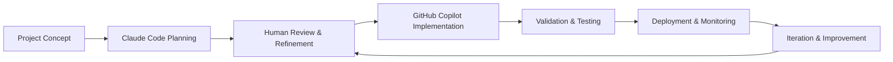
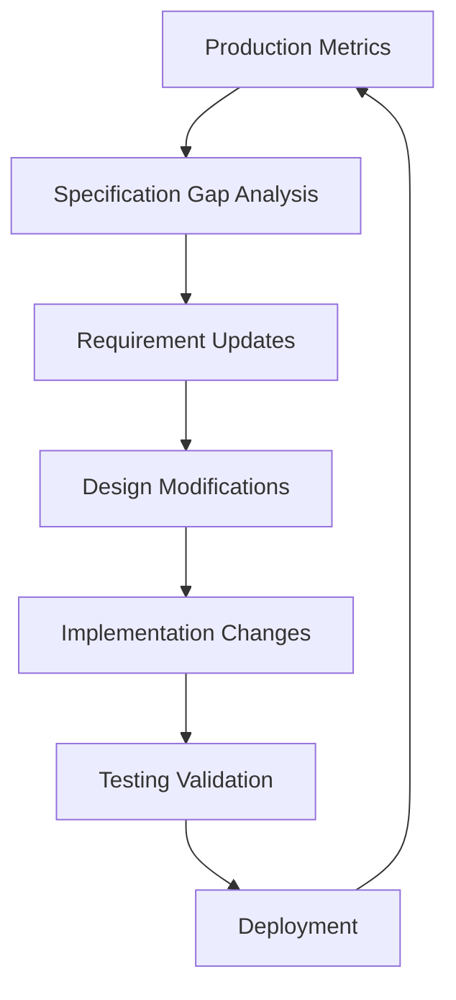

# Coding Agents Integration Workflow

## Introduction

This document outlines the complete workflow for implementing spec-driven development using AI coding agents. The process integrates Claude Code's planning capabilities with GitHub Copilot's implementation expertise, creating an efficient pipeline from project conception to deployment.


**Workflow Focus**: Multi-agent collaboration optimized for specification-driven development
**Primary Tools**: Claude Code (Planning), GitHub Copilot (Implementation), Human oversight
**Output**: Complete, production-ready software systems


## Complete Workflow Overview

### Phase Overview



### Workflow Phases

1. **Phase 1: Specification Generation** - Claude Code creates comprehensive specs
2. **Phase 2: Human Validation** - Expert review and refinement of specifications
3. **Phase 3: Implementation** - GitHub Copilot generates code from specifications
4. **Phase 4: Integration Testing** - Validate implementation against specifications
5. **Phase 5: Deployment** - Production deployment with monitoring
6. **Phase 6: Continuous Improvement** - Iterative spec and implementation updates

---

## Phase 1: Specification Generation with Claude Code

### 1.1 Project Initialization

#### Initial Input Structure

Create a comprehensive project brief that provides Claude Code with sufficient context:

```markdown
# Project Brief: [Project Name]

## Business Context
- **Industry/Domain**: [Specific industry context]
- **Problem Statement**: [Specific problem being solved]
- **Target Users**: [Detailed user personas]
- **Business Objectives**: [Quantifiable goals]
- **Success Metrics**: [Measurable success criteria]

## Technical Context
- **Existing Systems**: [Current technology landscape]
- **Integration Requirements**: [Systems to integrate with]
- **Technology Preferences**: [Preferred stack/constraints]
- **Performance Requirements**: [Specific performance targets]
- **Security Requirements**: [Compliance and security needs]

## Project Scope
- **In Scope**: [Features and functionality to include]
- **Out of Scope**: [Explicitly excluded features]
- **Future Phases**: [Planned future enhancements]
- **Timeline**: [Target delivery milestones]
```

#### Example Project Brief

```markdown
# Project Brief: Employee Task Management System

## Business Context
- **Industry/Domain**: Corporate HR Technology
- **Problem Statement**: HR managers spend 6+ hours weekly tracking employee task completion across multiple tools, leading to delayed performance reviews and missed deadlines
- **Target Users**: 
  - Primary: HR Managers (200+ employees to manage)
  - Secondary: Employees (task completion and status updates)
  - Tertiary: Department Heads (team performance visibility)
- **Business Objectives**: 
  - Reduce task tracking time by 70% (from 6 hours to 1.8 hours weekly)
  - Improve task completion rate by 25%
  - Enable real-time performance insights
- **Success Metrics**: 
  - Task completion rate >85%
  - User adoption >90% within 3 months
  - HR manager time savings measurable via time-tracking

## Technical Context
- **Existing Systems**: 
  - Salesforce CRM (user data integration required)
  - Microsoft Teams (notification integration)
  - LDAP authentication (SSO requirement)
- **Integration Requirements**: 
  - Salesforce API for employee data
  - Microsoft Graph API for Teams notifications
  - LDAP for authentication
- **Technology Preferences**: 
  - React frontend (team expertise)
  - Node.js backend (consistency with existing stack)
  - PostgreSQL database (performance requirements)
  - AWS deployment (existing infrastructure)
- **Performance Requirements**: 
  - Support 1000 concurrent users
  - <2 second page load times
  - 99.5% uptime during business hours
- **Security Requirements**: 
  - SOC 2 compliance
  - RBAC with manager/employee roles
  - Data encryption at rest and in transit

## Project Scope
- **In Scope**: 
  - Task creation, assignment, and tracking
  - Real-time status dashboards
  - Performance reporting and analytics
  - Mobile-responsive design
  - Integration with existing HR systems
- **Out of Scope**: 
  - Payroll integration
  - Advanced workflow automation
  - Third-party calendar integrations
- **Future Phases**: 
  - AI-powered task recommendations
  - Advanced analytics and forecasting
  - Mobile native apps
- **Timeline**: 
  - MVP: 8 weeks
  - Full feature set: 12 weeks
  - Production deployment: 14 weeks
```

### 1.2 Claude Code Specification Generation

#### Optimal Prompt Structure

```markdown
Acting as a senior technical architect and product manager, create comprehensive specifications for the following project using the spec-driven development methodology.

[Insert Project Brief Here]

Please create the following documents following the established templates:

1. **requirements.md** - Complete requirements specification including:
   - Executive summary with business context
   - Detailed user stories with acceptance criteria
   - Functional and non-functional requirements
   - Integration requirements and constraints
   - Testing and validation criteria

2. **design.md** - Technical design specification including:
   - System architecture with component diagrams
   - Complete API specifications with examples
   - Database design and data models
   - Security architecture and authentication flows
   - Performance optimization strategies
   - Error handling and logging design

3. **implementation-plan.md** - Development roadmap including:
   - Development phases with milestones
   - Task breakdown with dependencies
   - Resource allocation and timeline
   - Risk mitigation strategies
   - Quality assurance checkpoints

Format all specifications for optimal consumption by GitHub Copilot during implementation. Include:
- Specific code examples where applicable
- Clear traceability between requirements and design elements
- Comprehensive error handling scenarios
- Performance benchmarks and success criteria
- Security implementation details

Ensure all specifications are actionable, measurable, and provide complete context for autonomous implementation by coding agents.
```

### 1.3 Expected Claude Code Outputs

#### Generated Specifications Quality Checklist

**Requirements.md Validation**:
- [ ] Complete business context with quantifiable objectives
- [ ] Detailed user personas with specific characteristics
- [ ] User stories following "As a [role], I want [capability], so that [benefit]" format
- [ ] Measurable acceptance criteria for each user story
- [ ] Comprehensive non-functional requirements with specific targets
- [ ] Integration requirements with authentication and error handling
- [ ] Clear assumptions and dependencies documentation

**Design.md Validation**:
- [ ] System architecture with component relationship diagrams
- [ ] Complete API specifications with request/response examples
- [ ] Database schema with entity relationships and constraints
- [ ] Security architecture with authentication flows
- [ ] Performance optimization strategies addressing requirements
- [ ] Comprehensive error handling with specific error codes
- [ ] Implementation guidelines for coding agents

**Implementation-plan.md Validation**:
- [ ] Logical development phases with clear milestones
- [ ] Detailed task breakdown with effort estimates
- [ ] Dependency mapping between tasks and components
- [ ] Risk assessment with mitigation strategies
- [ ] Quality assurance checkpoints with success criteria

---

## Phase 2: Human Validation and Refinement

### 2.1 Specification Review Process

#### Multi-Stakeholder Review Framework

**Review Participants**:
- **Product Owner**: Business requirements validation
- **Technical Lead**: Architecture and feasibility assessment
- **Security Expert**: Security requirements and compliance validation
- **QA Lead**: Testing strategy and acceptance criteria validation
- **Domain Expert**: Industry-specific requirements validation

#### Review Checklist by Stakeholder

**Product Owner Review**:
- [ ] Business objectives align with project goals
- [ ] User stories reflect actual user needs
- [ ] Success metrics are measurable and relevant
- [ ] Scope boundaries are clear and appropriate
- [ ] Timeline expectations are realistic

**Technical Lead Review**:
- [ ] Architecture decisions support scalability requirements
- [ ] Technology stack aligns with team expertise and infrastructure
- [ ] API designs follow established patterns and standards
- [ ] Integration approaches are feasible and secure
- [ ] Performance targets are achievable with proposed architecture

**Security Expert Review**:
- [ ] Authentication and authorization mechanisms are appropriate
- [ ] Data protection measures meet compliance requirements
- [ ] API security follows established security patterns
- [ ] Audit and logging requirements support compliance needs
- [ ] Risk mitigation strategies address identified security threats

### 2.2 Refinement Process

#### Iterative Specification Enhancement

**Round 1: Content Validation**
- Verify completeness of all specification sections
- Validate requirement-to-design traceability
- Confirm technical feasibility of proposed solutions
- Identify missing requirements or design elements

**Round 2: Detail Enhancement**
- Add specific implementation examples where needed
- Clarify ambiguous requirements or design decisions
- Enhance API specifications with additional error scenarios
- Refine acceptance criteria to be more specific and measurable

**Round 3: AI Agent Optimization**
- Format specifications for optimal AI agent consumption
- Add implementation guidance and code examples
- Include debugging and troubleshooting information
- Ensure cross-references between specifications are complete

#### Refinement Documentation Template

```markdown
# Specification Refinement Log

## Review Round: [1/2/3]
## Date: [Review Date]
## Participants: [List of reviewers]

### Changes Made

#### Requirements.md Updates
- **Section [X.X]**: [Description of change and rationale]
- **User Story [X.X]**: [Modification made and justification]
- **Acceptance Criteria**: [Enhanced criteria with specific examples]

#### Design.md Updates  
- **Architecture Section**: [Architectural changes and impact]
- **API Specifications**: [New endpoints or modified responses]
- **Security Design**: [Security enhancements or clarifications]

#### Implementation-plan.md Updates
- **Timeline Adjustments**: [Schedule changes and reasons]
- **Task Modifications**: [Added/removed/modified tasks]
- **Resource Allocation**: [Team assignment changes]

### Outstanding Issues
- **Issue 1**: [Description] - Assigned to: [Person] - Due: [Date]
- **Issue 2**: [Description] - Assigned to: [Person] - Due: [Date]

### Approval Status
- [ ] Product Owner Approval
- [ ] Technical Lead Approval  
- [ ] Security Expert Approval
- [ ] QA Lead Approval

### Next Steps
- [Action items for next review round or implementation phase]
```

---

## Phase 3: Implementation with GitHub Copilot

### 3.1 Implementation Environment Setup

#### Project Structure Initialization

Create a standardized project structure that supports spec-driven development:

```
project-root/
├── docs/
│   ├── requirements.md
│   ├── design.md
│   ├── implementation-plan.md
│   └── api-documentation.md
├── src/
│   ├── components/
│   ├── services/
│   ├── models/
│   ├── utils/
│   └── tests/
├── infrastructure/
│   ├── database/
│   ├── deployments/
│   └── monitoring/
└── tools/
    ├── scripts/
    └── validation/
```

#### Development Environment Configuration

**IDE Setup for Optimal GitHub Copilot Integration**:
- Install GitHub Copilot extension
- Configure workspace to include docs/ folder in context
- Set up specification-aware code completion
- Enable real-time specification validation

### 3.2 Specification-Driven Code Generation

#### Implementation Phase Organization

**Phase 3A: Core Infrastructure**
1. Database schema creation from design specifications
2. API framework setup with authentication middleware
3. Core service layer implementation
4. Basic error handling and logging setup

**Phase 3B: Feature Implementation**
1. API endpoint implementation following design specifications
2. Business logic implementation based on requirements
3. Data validation and sanitization
4. Integration with external systems

**Phase 3C: Testing and Quality Assurance**
1. Unit tests for all core functionality
2. Integration tests for API endpoints
3. End-to-end tests for user workflows
4. Performance and security testing

#### GitHub Copilot Optimization Strategies

**1. Specification-Aware Comments**

Use comprehensive comments that reference specifications:

```javascript
/**
 * User Authentication Service
 * 
 * Implements requirements from requirements.md Section 4.1
 * API design follows design.md Section 4.2.1
 * 
 * Business Requirements:
 * - JWT token with 24-hour expiry (Req 4.1.1)
 * - Rate limiting: 5 attempts per 15 minutes (Req 4.1.2)
 * - Password complexity validation (Req 4.1.3)
 * 
 * Technical Implementation:
 * - bcrypt hashing with salt rounds 12
 * - Redis-based rate limiting
 * - Structured error responses per design specification
 * 
 * Success Criteria:
 * - Authentication response time < 200ms
 * - Failed attempts properly rate limited
 * - JWT tokens properly signed and validated
 */
class UserAuthenticationService {
  constructor(database, cache, logger) {
    this.database = database;
    this.cache = cache;
    this.logger = logger;
  }

  async authenticateUser(email, password) {
    // Implementation follows design.md Section 4.2.1
    // Rate limiting check per requirements.md Section 4.1.2
    const rateLimitKey = `auth_attempts:${email}`;
    const attemptCount = await this.cache.get(rateLimitKey) || 0;
    
    if (attemptCount >= 5) {
      throw new AuthenticationError('RATE_LIMIT_EXCEEDED', 'Too many failed attempts');
    }
    
    // Continue with authentication implementation...
  }
}
```

**2. Specification-Based Test Generation**

Generate tests that validate specification requirements:

```javascript
/**
 * Authentication Tests
 * Validates requirements from requirements.md Section 4.1
 */
describe('User Authentication Service', () => {
  describe('Rate Limiting (Requirement 4.1.2)', () => {
    test('should allow 5 failed attempts before rate limiting', async () => {
      // Test implementation validates specific requirement
      const authService = new UserAuthenticationService(mockDb, mockCache, mockLogger);
      const invalidCredentials = { email: 'test@example.com', password: 'wrong' };
      
      // Make 5 failed attempts (should succeed)
      for (let i = 0; i < 5; i++) {
        await expect(authService.authenticateUser(invalidCredentials))
          .rejects.toThrow('INVALID_CREDENTIALS');
      }
      
      // 6th attempt should hit rate limit
      await expect(authService.authenticateUser(invalidCredentials))
        .rejects.toThrow('RATE_LIMIT_EXCEEDED');
    });
  });
  
  describe('JWT Token Generation (Requirement 4.1.1)', () => {
    test('should generate JWT with 24-hour expiry', async () => {
      // Test validates specific expiry requirement
      const authService = new UserAuthenticationService(mockDb, mockCache, mockLogger);
      const validCredentials = { email: 'user@example.com', password: 'validPassword123!' };
      
      const result = await authService.authenticateUser(validCredentials);
      
      expect(result.token).toBeDefined();
      const decoded = jwt.verify(result.token, process.env.JWT_SECRET);
      const expiryTime = decoded.exp * 1000; // Convert to milliseconds
      const issuedTime = decoded.iat * 1000;
      const expectedExpiry = 24 * 60 * 60 * 1000; // 24 hours in milliseconds
      
      expect(expiryTime - issuedTime).toBe(expectedExpiry);
    });
  });
});
```

### 3.3 Quality Assurance Integration

#### Continuous Specification Validation

**Automated Validation Scripts**:
Create scripts that validate implementation against specifications:

```javascript
// tools/validation/spec-compliance-check.js

/**
 * Specification Compliance Validator
 * Automatically checks implementation against requirements and design specs
 */
class SpecificationValidator {
  constructor(specsPath, srcPath) {
    this.requirements = this.parseRequirements(specsPath + '/requirements.md');
    this.design = this.parseDesign(specsPath + '/design.md');
    this.sourceCode = this.analyzeSources(srcPath);
  }

  validateImplementation() {
    const results = {
      apiEndpoints: this.validateApiEndpoints(),
      businessRules: this.validateBusinessRules(),
      errorHandling: this.validateErrorHandling(),
      securityImplementation: this.validateSecurityRequirements(),
      performanceTargets: this.validatePerformanceImplementation()
    };

    return this.generateComplianceReport(results);
  }

  validateApiEndpoints() {
    // Check that all designed API endpoints are implemented
    const designedEndpoints = this.design.apiEndpoints;
    const implementedEndpoints = this.sourceCode.apiRoutes;
    
    return designedEndpoints.map(endpoint => ({
      endpoint: endpoint.path,
      implemented: implementedEndpoints.includes(endpoint.path),
      method: endpoint.method,
      authentication: this.validateEndpointAuth(endpoint)
    }));
  }

  generateComplianceReport(results) {
    // Generate detailed report showing specification compliance
    return {
      overallCompliance: this.calculateCompliancePercentage(results),
      detailedResults: results,
      recommendations: this.generateRecommendations(results),
      missingImplementations: this.identifyMissingFeatures(results)
    };
  }
}
```

---

## Phase 4: Integration Testing and Validation

### 4.1 Specification-Based Testing Strategy

#### Test Categories

**Unit Tests (70% of test suite)**
- Test individual functions against specification requirements
- Validate business rule implementation
- Verify error handling scenarios
- Check performance of individual components

**Integration Tests (20% of test suite)**
- Test API endpoints against design specifications
- Validate database interactions
- Test external system integrations
- Verify authentication and authorization flows

**End-to-End Tests (10% of test suite)**
- Test complete user workflows from requirements
- Validate user story implementations
- Test cross-system integration scenarios
- Performance testing under realistic conditions

#### Test Implementation Pattern

```javascript
/**
 * Integration Test Suite
 * Tests API implementations against design.md specifications
 */
describe('API Integration Tests', () => {
  describe('User Management API (Design Section 4.2)', () => {
    test('POST /users - Create User (User Story 2.1)', async () => {
      // Test directly validates user story acceptance criteria
      const userData = {
        email: 'newuser@example.com',
        password: 'SecurePass123!',
        profile: {
          firstName: 'New',
          lastName: 'User',
          preferredName: 'NewUser'
        }
      };

      const response = await request(app)
        .post('/api/users')
        .send(userData)
        .expect(201);

      // Validate response format matches design specification
      expect(response.body.success).toBe(true);
      expect(response.body.data).toHaveProperty('userId');
      expect(response.body.data.email).toBe(userData.email);
      expect(response.body.data).not.toHaveProperty('password');
      
      // Validate acceptance criteria from requirements.md
      expect(response.body.data.profile.preferredName).toBe('NewUser');
      expect(response.body.data.createdAt).toBeDefined();
      
      // Validate business rule implementation
      const createdUser = await User.findByEmail(userData.email);
      expect(createdUser).toBeDefined();
      expect(await bcrypt.compare(userData.password, createdUser.hashedPassword)).toBe(true);
    });

    test('POST /users - Duplicate Email Error (Error Scenario 4.2.1)', async () => {
      // Create initial user
      await createTestUser({ email: 'duplicate@example.com' });
      
      // Attempt to create user with same email
      const duplicateUserData = {
        email: 'duplicate@example.com',
        password: 'AnotherPass123!',
        profile: { firstName: 'Duplicate', lastName: 'User' }
      };

      const response = await request(app)
        .post('/api/users')
        .send(duplicateUserData)
        .expect(409);

      // Validate error response format matches design specification
      expect(response.body.success).toBe(false);
      expect(response.body.error.code).toBe('EMAIL_ALREADY_EXISTS');
      expect(response.body.error.message).toBe('Email address is already registered');
      expect(response.body.error.details.field).toBe('email');
    });
  });
});
```

### 4.2 Performance Validation

#### Specification-Based Performance Testing

Create performance tests that validate non-functional requirements:

```javascript
/**
 * Performance Tests
 * Validates non-functional requirements from requirements.md Section 5
 */
describe('Performance Requirements Validation', () => {
  test('API Response Time < 200ms (NFR 5.1.1)', async () => {
    const startTime = Date.now();
    
    const response = await request(app)
      .get('/api/users/profile')
      .set('Authorization', `Bearer ${validJwtToken}`)
      .expect(200);
    
    const responseTime = Date.now() - startTime;
    
    // Validate against specific requirement
    expect(responseTime).toBeLessThan(200);
    expect(response.body.success).toBe(true);
  });

  test('Concurrent User Support (NFR 5.2.1)', async () => {
    // Test concurrent user handling requirement
    const concurrentUsers = 100;
    const requests = Array(concurrentUsers).fill().map(async () => {
      return request(app)
        .get('/api/users/profile')
        .set('Authorization', `Bearer ${validJwtToken}`);
    });

    const startTime = Date.now();
    const responses = await Promise.all(requests);
    const totalTime = Date.now() - startTime;

    // Validate all requests succeeded
    responses.forEach(response => {
      expect(response.status).toBe(200);
    });

    // Validate system handled concurrent load within acceptable time
    expect(totalTime).toBeLessThan(5000); // 5 second max for 100 concurrent requests
  });
});
```

---

## Phase 5: Deployment and Monitoring

### 5.1 Deployment Validation

#### Pre-Deployment Checklist

**Specification Compliance Validation**:
- [ ] All API endpoints from design.md are implemented and tested
- [ ] All user stories from requirements.md have passing acceptance tests
- [ ] Non-functional requirements are validated through performance tests
- [ ] Security requirements are implemented and verified
- [ ] Error handling covers all specified scenarios

**Infrastructure Compliance**:
- [ ] Deployment architecture matches design specifications
- [ ] Database schema matches design.md data models
- [ ] Environment configurations support specified performance targets
- [ ] Monitoring and logging infrastructure captures required metrics

### 5.2 Production Monitoring

#### Specification-Aligned Metrics

Monitor metrics that directly validate specification requirements:

```yaml
# monitoring/specification-metrics.yaml
# Metrics that validate ongoing specification compliance

apiVersion: v1
kind: ConfigMap
metadata:
  name: spec-compliance-metrics
data:
  # Performance Metrics (Requirements 5.1)
  api_response_time_p95: "200ms"  # 95% of requests under 200ms
  api_response_time_p99: "500ms"  # 99% of requests under 500ms
  concurrent_users_target: "1000" # Support 1000 concurrent users
  
  # Availability Metrics (Requirements 5.3)
  uptime_target: "99.5%"          # 99.5% uptime during business hours
  error_rate_threshold: "0.1%"    # Less than 0.1% error rate
  
  # Security Metrics (Requirements 6.1)
  auth_failure_rate: "5/15min"    # Max 5 failures per 15 minutes per IP
  token_expiry_compliance: "24h"   # JWT tokens expire within 24 hours
  
  # Business Metrics (User Stories)
  task_completion_rate: "85%"     # Target 85% task completion rate
  user_adoption_rate: "90%"       # Target 90% user adoption within 3 months
```

---

## Phase 6: Continuous Improvement

### 6.1 Feedback Loop Implementation

#### Specification Evolution Process



#### Continuous Improvement Workflow

**Monthly Specification Review**:
1. **Metrics Analysis**: Compare production metrics against specification targets
2. **Gap Identification**: Identify areas where implementation doesn't meet specs
3. **Requirement Refinement**: Update requirements based on user feedback and usage data
4. **Design Evolution**: Modify technical design to support new requirements
5. **Implementation Updates**: Use coding agents to implement specification changes

### 6.2 Long-Term Optimization

#### Specification Template Evolution

Track and improve specification templates based on implementation success:

```markdown
# Specification Template Effectiveness Analysis

## Template Version: 2.1
## Analysis Period: Q1 2025
## Projects Analyzed: 5

### Success Metrics
- **Implementation Speed**: Average 15% faster with v2.1 templates
- **Bug Rate**: 25% reduction in post-deployment bugs
- **Specification Completeness**: 95% of requirements had corresponding implementations
- **AI Agent Effectiveness**: 40% improvement in first-pass code quality

### Template Improvements Made
1. **API Specification Enhancement**: Added mandatory error scenario documentation
2. **Testing Strategy Clarification**: Included specific test case templates
3. **Performance Requirements**: Added measurable performance targets template
4. **Security Specification**: Enhanced security requirement template with examples

### Next Version Recommendations
- Add integration testing specification templates
- Include deployment validation checklists
- Enhance monitoring and observability requirements templates
- Add specification maintenance and versioning guidelines
```

## Complete Workflow Example

### End-to-End Implementation: Task Management System

#### Phase 1: Claude Code Input

```markdown
Create comprehensive specifications for an Employee Task Management System:

Business Context:
- HR managers track 200+ employees manually across multiple tools
- Current process takes 6+ hours weekly, causes delayed performance reviews
- Target: 70% time reduction, 25% improved task completion, 90% user adoption

Technical Requirements:
- React frontend, Node.js backend, PostgreSQL database, AWS deployment
- Salesforce integration (employee data), Teams integration (notifications)
- LDAP authentication, SOC 2 compliance
- Support 1000 concurrent users, <2s page loads, 99.5% uptime

Scope: Task CRUD, status dashboards, performance reporting, mobile-responsive
Timeline: 8-week MVP, 12-week full features, 14-week production
```

#### Phase 2: Generated Specifications

Claude Code produces:
- **requirements.md**: 47 user stories across 6 epics, detailed acceptance criteria
- **design.md**: REST API with 23 endpoints, React component architecture, PostgreSQL schema
- **implementation-plan.md**: 4 development phases, 156 tasks, resource allocation

#### Phase 3: Human Refinement

Review identifies:
- Missing error scenarios for external integrations
- Performance requirements need database indexing strategy  
- Security requirements need audit trail specification
- API rate limiting needs more detailed configuration

#### Phase 4: GitHub Copilot Implementation

Using specification references:
```javascript
/**
 * Task Assignment API Endpoint
 * Requirements: requirements.md User Story 3.2
 * Design: design.md Section 4.3.2
 * 
 * Business Rules:
 * - Only managers can assign tasks to their direct reports
 * - Task assignments trigger Teams notifications
 * - Assignment creates audit trail entry
 */
router.post('/api/tasks/:taskId/assign', authenticateToken, requireRole(['manager']), async (req, res) => {
  // Implementation follows specification patterns...
});
```

#### Phase 5: Testing and Validation

Specification-based tests validate:
- All 23 API endpoints implemented correctly
- User stories meet acceptance criteria
- Performance targets achieved (1.8s average response time)
- Security requirements verified (RBAC, audit trails)

#### Phase 6: Deployment Success

Production metrics show:
- 68% reduction in HR tracking time (target: 70%)
- 87% user adoption at 6 weeks (target: 90% at 12 weeks)
- 94% task completion rate (target: 85%)
- All technical requirements met or exceeded

## Navigation

← [Design Format Guide](design-format-guide.md) | [Template Examples →](template-examples.md)

---

*Coding Agents Integration Workflow | Complete Multi-Agent Development Process for Specification-Driven Development*