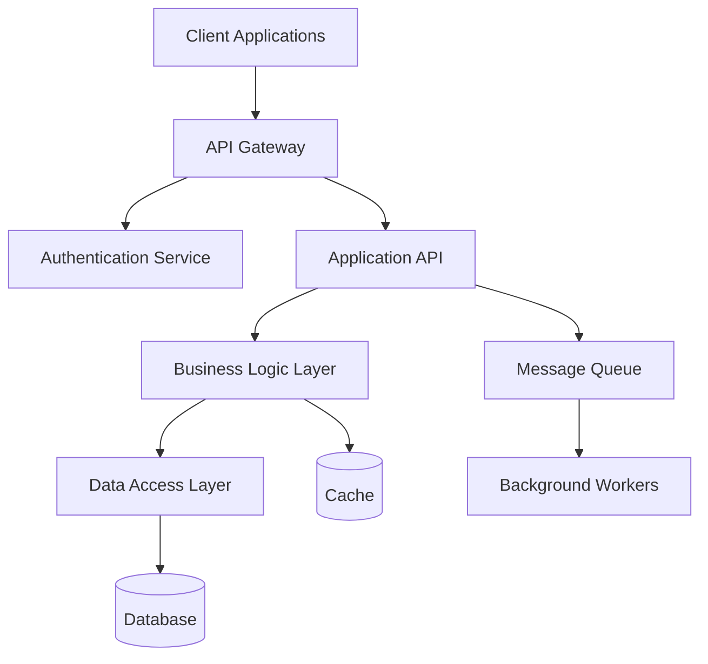
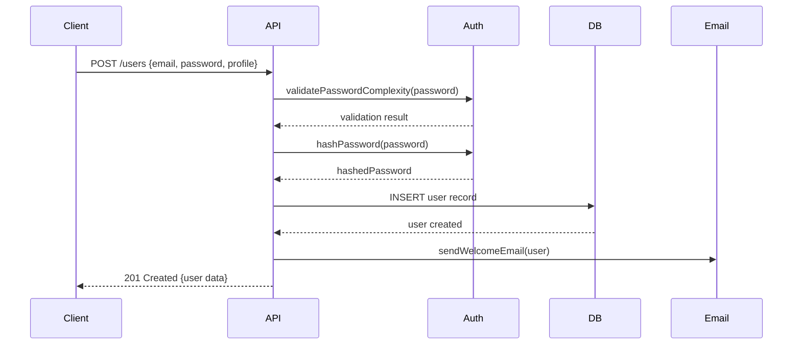

# Design.md Format Guide

## Introduction

This guide provides a comprehensive template and structure for creating effective `design.md` files optimized for AI coding agents. The design specification serves as the technical blueprint that translates business requirements into implementable system architecture, API definitions, and development guidance.


**Purpose**: Technical specification that bridges requirements and implementation for AI-driven development
**Relationship**: Directly implements all requirements specified in `requirements.md`
**AI Optimization**: Structured for optimal consumption by GitHub Copilot and other coding agents


## Template Structure

### Complete Design.md Template

```markdown
# Technical Design: [Project Name]

## Document Information
- **Version**: 1.0
- **Last Updated**: [Date]
- **Status**: Draft | Under Review | Approved | Implementation
- **Related Documents**: 
  - Requirements: [Link to requirements.md]
  - Implementation Plan: [Link to implementation-plan.md]
- **Review Date**: [Next scheduled review]

---

## 1. Design Overview

### System Purpose
[Clear statement of what the system does and why it exists - directly from requirements]

### Design Principles
1. **[Principle 1]**: [Description and rationale]
2. **[Principle 2]**: [Description and rationale]
3. **[Principle 3]**: [Description and rationale]

### Architecture Style
**Selected Pattern**: [e.g., Microservices, Monolithic, Event-Driven, etc.]

**Rationale**: [Why this architectural style was chosen based on requirements]

**Trade-offs Considered**:
- **Alternative 1**: [Description, pros, cons, why not selected]
- **Alternative 2**: [Description, pros, cons, why not selected]

---

## 2. System Architecture

### High-Level Architecture



### Component Overview
| Component | Responsibility | Technology | Rationale |
|-----------|----------------|------------|-----------|
| API Gateway | Request routing, rate limiting | [Technology] | [Why selected] |
| Authentication Service | User authentication/authorization | [Technology] | [Why selected] |
| Application API | Business logic orchestration | [Technology] | [Why selected] |
| Data Access Layer | Database interactions | [Technology] | [Why selected] |
| Message Queue | Asynchronous processing | [Technology] | [Why selected] |

### Technology Stack

#### Backend Technologies
- **Runtime Environment**: [e.g., Node.js 18+, Python 3.11+]
  - **Rationale**: [Performance, team expertise, ecosystem]
- **Framework**: [e.g., Express.js, FastAPI, Spring Boot]
  - **Rationale**: [Development speed, community support, features]
- **Database**: [e.g., PostgreSQL 14+, MongoDB 6+]
  - **Rationale**: [Data structure fit, performance, scalability]

#### Infrastructure Technologies
- **Containerization**: Docker with Kubernetes orchestration
- **Cloud Platform**: [AWS/Azure/GCP] with specific services
- **CI/CD**: [GitHub Actions, Jenkins, etc.]
- **Monitoring**: [Observability stack]

---

## 3. Data Architecture

### Data Models

#### Core Entities

**Entity: User**
```javascript
{
  "id": "string (UUID)", // Primary key
  "email": "string", // Unique, required
  "hashedPassword": "string", // bcrypt hash
  "profile": {
    "firstName": "string",
    "lastName": "string",
    "preferredName": "string?", // Optional
    "avatar": "string?" // URL to avatar image
  },
  "roles": ["string"], // Array of role names
  "createdAt": "datetime",
  "updatedAt": "datetime",
  "lastLoginAt": "datetime?"
}
```

**Business Rules**:
- Email must be unique across all users
- Password must meet complexity requirements before hashing
- Roles must reference valid role definitions
- Profile.preferredName defaults to firstName if not provided

**Entity: [Other Core Entity]**
[Follow same pattern as User entity]

### Database Schema

#### Relational Schema (if using SQL database)

```sql
-- Users table
CREATE TABLE users (
    id UUID PRIMARY KEY DEFAULT gen_random_uuid(),
    email VARCHAR(255) UNIQUE NOT NULL,
    hashed_password VARCHAR(255) NOT NULL,
    first_name VARCHAR(100) NOT NULL,
    last_name VARCHAR(100) NOT NULL,
    preferred_name VARCHAR(100),
    avatar_url VARCHAR(500),
    created_at TIMESTAMP WITH TIME ZONE DEFAULT NOW(),
    updated_at TIMESTAMP WITH TIME ZONE DEFAULT NOW(),
    last_login_at TIMESTAMP WITH TIME ZONE
);

-- Indexes
CREATE INDEX idx_users_email ON users(email);
CREATE INDEX idx_users_created_at ON users(created_at);

-- Additional tables follow same pattern
```

### Data Flow Patterns

#### Create User Flow


---

## 4. API Design

### API Standards

#### REST API Conventions
- **Base URL**: `https://api.[domain]/v1`
- **Authentication**: Bearer JWT tokens in Authorization header
- **Content Type**: `application/json` for all requests/responses
- **HTTP Status Codes**: Standard codes with consistent error format

#### Response Format Standard
```javascript
// Success Response
{
  "success": true,
  "data": {
    // Actual response data
  },
  "meta": {
    "timestamp": "2025-01-19T10:30:00Z",
    "version": "1.0"
  }
}

// Error Response
{
  "success": false,
  "error": {
    "code": "ERROR_CODE",
    "message": "Human-readable error message",
    "details": {
      // Additional error context
    }
  },
  "meta": {
    "timestamp": "2025-01-19T10:30:00Z",
    "requestId": "req_123456789"
  }
}
```

### API Endpoints

#### Authentication Endpoints

**POST /auth/login**
- **Purpose**: Authenticate user and return JWT token
- **Requirements Mapping**: User Story 2.1 - User Authentication

**Request**:
```javascript
{
  "email": "user@example.com",
  "password": "userPassword123!"
}
```

**Success Response** (200):
```javascript
{
  "success": true,
  "data": {
    "token": "eyJhbGciOiJIUzI1NiIsInR5cCI6IkpXVCJ9...",
    "expiresAt": "2025-01-20T10:30:00Z",
    "user": {
      "id": "usr_123456789",
      "email": "user@example.com",
      "profile": {
        "firstName": "John",
        "lastName": "Doe",
        "preferredName": "Johnny"
      }
    }
  }
}
```

**Error Responses**:
- **401 Unauthorized**: Invalid credentials
- **429 Too Many Requests**: Rate limit exceeded (from requirements)
- **400 Bad Request**: Validation errors

**Implementation Notes**:
- Rate limiting: 5 attempts per 15 minutes per IP (Requirement 4.1.2)
- JWT expiry: 24 hours (Requirement 4.1.1)
- Failed attempt logging for security monitoring

**POST /auth/logout**
- **Purpose**: Invalidate user session token
- **Authentication**: Required (Bearer token)

**POST /auth/refresh**
- **Purpose**: Refresh expired JWT token
- **Authentication**: Required (valid refresh token)

#### User Management Endpoints

**GET /users/profile**
- **Purpose**: Get current user's profile information
- **Authentication**: Required
- **Requirements Mapping**: User Story 2.3 - View Profile

**PUT /users/profile**
- **Purpose**: Update user profile information
- **Authentication**: Required
- **Requirements Mapping**: User Story 2.4 - Update Profile

**Request**:
```javascript
{
  "profile": {
    "firstName": "John",
    "lastName": "Smith", // Changed from Doe
    "preferredName": "Johnny",
    "avatar": "https://example.com/new-avatar.jpg"
  }
}
```

**Validation Rules**:
- firstName: Required, 1-100 characters
- lastName: Required, 1-100 characters  
- preferredName: Optional, 1-100 characters
- avatar: Optional, valid URL format

#### [Additional API Sections]
[Continue with other API endpoints following same detailed pattern]

---

## 5. Security Design

### Authentication Architecture

#### JWT Token Structure
```javascript
{
  "header": {
    "alg": "HS256",
    "typ": "JWT"
  },
  "payload": {
    "sub": "usr_123456789", // User ID
    "email": "user@example.com",
    "roles": ["user", "admin"],
    "iat": 1642694400, // Issued at
    "exp": 1642780800  // Expires at (24 hours)
  }
}
```

#### Authorization Patterns

**Role-Based Access Control (RBAC)**:
```javascript
// Middleware implementation pattern
const requireRole = (requiredRoles) => {
  return (req, res, next) => {
    const userRoles = req.user.roles;
    const hasRequiredRole = requiredRoles.some(role => 
      userRoles.includes(role)
    );
    
    if (!hasRequiredRole) {
      return res.status(403).json({
        success: false,
        error: {
          code: "INSUFFICIENT_PERMISSIONS",
          message: "Access denied"
        }
      });
    }
    
    next();
  };
};
```

### Data Protection

#### Sensitive Data Handling
- **Passwords**: bcrypt hashing with salt rounds 12
- **PII**: Encryption at rest using AES-256
- **API Keys**: Stored in secure key management service
- **Audit Trail**: Log all data access and modifications

#### Input Validation and Sanitization
```javascript
// Validation schema example (using Joi or similar)
const userUpdateSchema = {
  profile: {
    firstName: Joi.string().min(1).max(100).required(),
    lastName: Joi.string().min(1).max(100).required(),
    preferredName: Joi.string().min(1).max(100).optional(),
    avatar: Joi.string().uri().optional()
  }
};
```

---

## 6. Performance Design

### Performance Requirements Implementation

#### Response Time Targets (from Requirements 5.1)
- **API Endpoints**: < 200ms for 95% of requests
- **Database Queries**: < 100ms for single-record lookups
- **Complex Reports**: < 5 seconds for data aggregation

#### Scalability Architecture

**Horizontal Scaling Strategy**:
- **API Layer**: Stateless design enables multiple instances
- **Database**: Read replicas for query scaling
- **Caching**: Redis cluster for session and data caching

**Caching Strategy**:
```javascript
// Cache implementation pattern
const cacheUser = async (userId) => {
  const cacheKey = `user:${userId}`;
  const cachedUser = await redis.get(cacheKey);
  
  if (cachedUser) {
    return JSON.parse(cachedUser);
  }
  
  const user = await database.getUserById(userId);
  await redis.setex(cacheKey, 3600, JSON.stringify(user)); // 1 hour TTL
  return user;
};
```

### Resource Optimization

#### Database Performance
- **Indexing Strategy**: Index all frequently queried columns
- **Query Optimization**: Use EXPLAIN to validate query performance
- **Connection Pooling**: Limit database connections per service instance

---

## 7. Error Handling and Logging

### Error Handling Strategy

#### Error Classification
1. **Client Errors (4xx)**: User input validation, authentication failures
2. **Server Errors (5xx)**: System failures, database connectivity issues
3. **Business Logic Errors**: Domain-specific validation failures

#### Error Response Format
```javascript
// Standardized error response
{
  "success": false,
  "error": {
    "code": "VALIDATION_ERROR", // Machine-readable code
    "message": "Invalid input provided", // Human-readable message
    "details": {
      "field": "email",
      "constraint": "must be unique",
      "value": "user@example.com" // Sanitized value
    },
    "timestamp": "2025-01-19T10:30:00Z",
    "requestId": "req_123456789"
  }
}
```

### Logging Strategy

#### Log Levels and Content
- **ERROR**: System failures, uncaught exceptions
- **WARN**: Handled errors, performance degradation
- **INFO**: Business events, user actions
- **DEBUG**: Detailed execution flow (development only)

#### Structured Logging Format
```javascript
{
  "timestamp": "2025-01-19T10:30:00Z",
  "level": "INFO",
  "service": "user-api",
  "requestId": "req_123456789",
  "userId": "usr_123456789",
  "event": "user_login",
  "metadata": {
    "ip": "192.168.1.100",
    "userAgent": "Mozilla/5.0...",
    "duration": 150
  }
}
```

---

## 8. Testing Strategy

### Testing Architecture

#### Test Pyramid Implementation
- **Unit Tests**: 70% of total tests, individual function/method testing
- **Integration Tests**: 20% of total tests, API endpoint and database testing  
- **End-to-End Tests**: 10% of total tests, complete user workflow testing

#### Test Data Management
```javascript
// Test data factory pattern
const createTestUser = (overrides = {}) => ({
  email: 'test@example.com',
  password: 'TestPassword123!',
  profile: {
    firstName: 'Test',
    lastName: 'User',
    preferredName: 'Tester'
  },
  ...overrides
});
```

### API Testing Specifications

#### Authentication Endpoint Tests
```javascript
describe('POST /auth/login', () => {
  test('successful login returns JWT token', async () => {
    // Implements requirement validation from requirements.md 4.1
    const userData = createTestUser();
    await createUser(userData);
    
    const response = await request(app)
      .post('/auth/login')
      .send({ email: userData.email, password: userData.password });
    
    expect(response.status).toBe(200);
    expect(response.body.success).toBe(true);
    expect(response.body.data.token).toBeDefined();
    expect(response.body.data.user.email).toBe(userData.email);
  });
  
  test('rate limiting prevents brute force attacks', async () => {
    // Implements requirement 4.1.2 - Rate limiting
    const invalidCredentials = { 
      email: 'test@example.com', 
      password: 'wrongpassword' 
    };
    
    // Make 6 failed attempts (exceeds 5-attempt limit)
    for (let i = 0; i < 6; i++) {
      await request(app).post('/auth/login').send(invalidCredentials);
    }
    
    const response = await request(app)
      .post('/auth/login')
      .send(invalidCredentials);
    
    expect(response.status).toBe(429);
    expect(response.body.error.code).toBe('RATE_LIMIT_EXCEEDED');
  });
});
```

---

## 9. Deployment Architecture

### Infrastructure Design

#### Container Architecture
```dockerfile
# Multi-stage Docker build
FROM node:18-alpine AS builder
WORKDIR /app
COPY package*.json ./
RUN npm ci --only=production

FROM node:18-alpine AS runtime
WORKDIR /app
COPY --from=builder /app/node_modules ./node_modules
COPY . .
EXPOSE 3000
CMD ["node", "server.js"]
```

#### Kubernetes Deployment
```yaml
apiVersion: apps/v1
kind: Deployment
metadata:
  name: user-api
spec:
  replicas: 3
  selector:
    matchLabels:
      app: user-api
  template:
    metadata:
      labels:
        app: user-api
    spec:
      containers:
      - name: user-api
        image: user-api:latest
        ports:
        - containerPort: 3000
        env:
        - name: DATABASE_URL
          valueFrom:
            secretKeyRef:
              name: database-secret
              key: url
```

### Environment Configuration

#### Environment Variables
| Variable | Purpose | Example Value | Required |
|----------|---------|---------------|----------|
| DATABASE_URL | Database connection string | postgresql://... | Yes |
| JWT_SECRET | JWT token signing secret | complex-random-string | Yes |
| REDIS_URL | Cache connection string | redis://... | Yes |
| LOG_LEVEL | Application log level | info | No |

---

## 10. Implementation Guidelines for AI Agents

### Claude Code Integration

#### Design-to-Implementation Mapping
When creating implementation plans from this design:
- Map each API endpoint to specific code modules
- Generate database migration scripts from schema definitions
- Create test specifications that validate design requirements
- Include error handling for all specified error conditions

#### Code Generation Guidance
```markdown
For each API endpoint in this design:
1. Generate Express.js route handler with specified request/response format
2. Include input validation using the specified schema
3. Implement authentication/authorization as specified
4. Add error handling for all documented error conditions
5. Include comprehensive unit tests that validate design requirements
```

### GitHub Copilot Optimization

#### Code Comment Patterns
```javascript
/**
 * User Authentication Endpoint
 * 
 * Design Reference: design.md Section 4.2.1
 * Requirements: requirements.md User Story 2.1
 * 
 * Implementation Details:
 * - JWT token generation (24-hour expiry)
 * - Rate limiting: 5 attempts per 15 minutes
 * - bcrypt password verification
 * - Structured error responses
 * 
 * Security: Bearer token required for protected endpoints
 * Performance: < 200ms response time target
 */
const authenticateUser = async (req, res) => {
  // Implementation follows design specification
};
```

### Implementation Validation

#### Design-Code Traceability
- [ ] All API endpoints implemented according to specifications
- [ ] Database schema matches data model definitions
- [ ] Error handling covers all documented scenarios
- [ ] Performance requirements addressed in implementation
- [ ] Security measures implemented as designed

---

## 11. Maintenance and Evolution

### Design Review Process

#### Regular Review Checkpoints
- **Sprint Reviews**: Validate implementation against design
- **Quarterly Architecture Reviews**: Assess design effectiveness
- **Performance Reviews**: Validate against performance requirements
- **Security Reviews**: Ensure security design implementation

### Design Documentation Maintenance

#### Version Control Strategy
- Link design changes to requirement changes
- Document design decision rationale
- Maintain implementation traceability
- Regular stakeholder review and approval

---

## Navigation

← [Requirements Format Guide](requirements-format-guide.md) | [Coding Agents Workflow →](coding-agents-workflow.md)
```

## Section-by-Section Implementation Guidance

### 1. Architecture Documentation Best Practices

**Visual Architecture Requirements**:
- Use Mermaid diagrams for system architecture
- Include component interaction flows
- Document data flow between services
- Show external system integrations

### 2. API Design Standards

**Complete API Documentation Requirements**:
- Request/response examples for every endpoint
- All possible error conditions documented
- Authentication requirements specified
- Rate limiting and performance characteristics

### 3. Database Design Specifications

**Comprehensive Data Modeling**:
- Entity relationship diagrams
- Database schema with indexes
- Data validation rules
- Migration strategies

### 4. Security Implementation Details

**Security-First Design**:
- Authentication flow diagrams
- Authorization matrix by role
- Data encryption specifications
- Audit trail requirements

## AI Agent Optimization Strategies

### 1. Structured Information Architecture

**Consistent Section Organization**:
- Use numbered sections for easy reference
- Include cross-references to requirements
- Provide implementation examples
- Document decision rationale

### 2. Implementation-Ready Specifications

**Code-Generation Friendly Format**:
- Include code examples and patterns
- Specify validation rules clearly
- Document error handling comprehensively
- Provide test case specifications

## Navigation

← [Requirements Format Guide](requirements-format-guide.md) | [Coding Agents Workflow →](coding-agents-workflow.md)

---

*Design.md Format Guide | Technical Blueprint for AI-Optimized System Implementation*