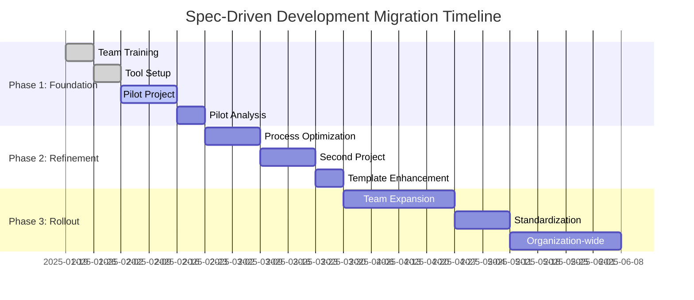

# Migration Strategy

## Introduction

This document provides a comprehensive strategy for transitioning existing development teams and projects from traditional development methodologies to spec-driven development with coding agents. The migration approach is designed to minimize disruption while maximizing the benefits of AI-assisted development workflows.


**Migration Focus**: Practical transition strategies for teams moving to spec-driven development
**Risk Management**: Structured approach to minimize disruption and maximize success
**Timeline**: Phased implementation over 3-6 months depending on organization size


## Migration Assessment

### Current State Analysis

#### Team Readiness Assessment

**Technical Skills Evaluation**:
```markdown
# Team Assessment Checklist

## Documentation Practices
- [ ] Team maintains project documentation consistently
- [ ] Requirements are documented before implementation
- [ ] Design decisions are recorded and accessible
- [ ] API documentation is current and comprehensive

## AI Tool Experience
- [ ] Team has experience with AI coding assistants
- [ ] Developers comfortable with GitHub Copilot or similar tools
- [ ] Team familiar with AI-generated content review and validation
- [ ] Experience with prompt engineering for development tasks

## Process Maturity
- [ ] Structured development workflow in place
- [ ] Code review processes established
- [ ] Testing strategies comprehensive and automated
- [ ] Project planning and tracking systems operational

## Change Management Readiness
- [ ] Team open to adopting new development methodologies
- [ ] Leadership support for process improvements
- [ ] Time allocated for learning and adaptation
- [ ] Success metrics and measurement systems available
```

#### Project Portfolio Analysis

**Project Classification Framework**:
```markdown
# Project Migration Priority Matrix

## High Priority (Start Here)
- **Characteristics**: New projects, well-defined scope, medium complexity
- **Benefits**: Immediate spec-driven development adoption
- **Risk Level**: Low (no existing codebase to maintain)
- **Timeline**: Immediate implementation

## Medium Priority (Phase 2)
- **Characteristics**: Active development, ongoing features, flexible timeline
- **Benefits**: Gradual transition with learning opportunities
- **Risk Level**: Medium (requires parallel maintenance)
- **Timeline**: 2-4 weeks after pilot success

## Lower Priority (Phase 3)
- **Characteristics**: Legacy systems, maintenance mode, complex architecture
- **Benefits**: Long-term maintainability improvement
- **Risk Level**: High (extensive existing codebase)
- **Timeline**: 6-12 weeks after process establishment

## Not Suitable (Exclude)
- **Characteristics**: End-of-life systems, emergency fixes, external vendor code
- **Benefits**: Limited value for migration effort
- **Risk Level**: Very High (potential business disruption)
- **Timeline**: Consider for future major refactoring only
```

### Migration Readiness Score

Calculate organization readiness using weighted criteria:

```javascript
// Migration Readiness Calculator
const migrationReadiness = {
  technicalSkills: {
    weight: 0.25,
    factors: {
      documentationPractices: 8, // Score 1-10
      aiToolExperience: 6,
      processMaturity: 7,
      technicalArchitecture: 8
    }
  },
  
  organizationalReadiness: {
    weight: 0.30,
    factors: {
      leadershipSupport: 9,
      changeManagementExperience: 7,
      resourceAvailability: 6,
      timelineFlexibility: 8
    }
  },
  
  projectSuitability: {
    weight: 0.25,
    factors: {
      newProjectAvailability: 9,
      activeProjectFlexibility: 7,
      legacySystemComplexity: 4, // Lower is better
      businessCriticality: 8
    }
  },
  
  businessAlignment: {
    weight: 0.20,
    factors: {
      developmentEfficiencyGoals: 9,
      qualityImprovementObjectives: 8,
      stakeholderBuyIn: 7,
      successMetricsClarity: 8
    }
  }
};

// Calculate weighted score (target: >7.0 for high success probability)
const calculateReadiness = (assessment) => {
  let totalScore = 0;
  let totalWeight = 0;
  
  Object.entries(assessment).forEach(([category, data]) => {
    const categoryAverage = Object.values(data.factors)
      .reduce((sum, score) => sum + score, 0) / Object.keys(data.factors).length;
    
    totalScore += categoryAverage * data.weight;
    totalWeight += data.weight;
  });
  
  return totalScore / totalWeight;
};
```

---

## Migration Phases

### Phase 1: Foundation and Pilot (Weeks 1-4)

#### Week 1: Team Preparation

**Training and Skill Development**:
```markdown
# Week 1 Training Schedule

## Day 1-2: Spec-Driven Development Fundamentals
- Overview of spec-driven development methodology
- Benefits and ROI analysis from successful implementations
- Comparison with current development practices
- Introduction to AWS Kiro framework principles

## Day 3: AI Agent Integration Training
- Claude Code capabilities and optimal usage patterns
- GitHub Copilot advanced features and best practices
- Multi-agent workflow coordination
- Prompt engineering for specification generation

## Day 4: Hands-on Template Workshop
- Template selection and customization exercises
- Practice specification creation with provided examples
- Quality validation and review processes
- Tool setup and configuration (development environments)

## Day 5: Pilot Project Planning
- Pilot project selection and scope definition
- Success criteria establishment and measurement planning
- Risk assessment and mitigation strategy development
- Timeline and resource allocation finalization
```

#### Week 2: Tool and Process Setup

**Infrastructure Preparation**:
```markdown
# Technical Infrastructure Setup

## Development Environment Configuration
- AI agent integration (Claude Code, GitHub Copilot access)
- Specification template library deployment
- Quality validation pipeline setup
- Documentation and tracking system preparation

## Process Framework Implementation
- Specification review and approval workflow
- Quality gates and validation checkpoints
- Success metrics collection and reporting
- Communication channels and feedback mechanisms

## Template Library Creation
- Organization-specific template customization
- Project type categorization and mapping
- Template versioning and maintenance procedures
- Access controls and modification processes
```

#### Week 3-4: Pilot Project Execution

**Pilot Project Implementation**:
```markdown
# Pilot Project Execution Plan

## Week 3: Specification Creation
- Business requirements gathering using new methodology
- Claude Code specification generation with business stakeholders
- Human review and refinement process validation
- Stakeholder approval and sign-off procedures

## Week 4: Implementation and Validation
- GitHub Copilot implementation following specifications
- Quality assurance and testing against specifications
- Performance measurement against established baselines
- Feedback collection and process refinement
```

**Pilot Success Metrics**:
```yaml
# Pilot Project Success Criteria
specification_quality:
  completeness_score: ">= 85%"
  stakeholder_satisfaction: ">= 8/10"
  ai_agent_compatibility: ">= 90%"

implementation_effectiveness:
  development_velocity: ">= baseline + 15%"
  code_quality_score: ">= baseline + 10%"
  first_pass_accuracy: ">= 80%"

process_efficiency:
  specification_creation_time: "<= 1 week"
  implementation_time: "<= 2 weeks"
  total_project_time: "<= baseline + 0%"
```

### Phase 2: Process Refinement and Expansion (Weeks 5-8)

#### Week 5-6: Pilot Analysis and Optimization

**Results Analysis Framework**:
```markdown
# Pilot Project Analysis Process

## Quantitative Analysis
- Development velocity comparison (before/after spec-driven)
- Code quality metrics analysis (defect rates, complexity)
- Time allocation analysis (specification vs implementation)
- AI agent effectiveness measurement (acceptance rates, accuracy)

## Qualitative Analysis
- Developer feedback and experience assessment
- Stakeholder satisfaction with specification-driven approach
- Process pain points and improvement opportunities
- Tool integration effectiveness and usability

## Process Optimization
- Template refinement based on pilot experience
- AI agent prompt optimization for better results
- Quality validation process enhancement
- Success metric adjustment and calibration
```

**Process Improvements Implementation**:
```markdown
# Improvement Implementation Strategy

## Template Updates
- Add missing sections identified during pilot
- Clarify ambiguous language or instructions
- Enhance AI agent optimization based on usage patterns
- Include pilot project examples as template references

## Workflow Optimization
- Streamline specification review and approval process
- Automate quality validation checks where possible
- Improve handoff processes between specification and implementation
- Enhance feedback loops for continuous improvement

## Training Enhancement
- Update training materials with pilot lessons learned
- Create troubleshooting guides for common issues
- Develop advanced techniques documentation
- Establish mentoring and support systems
```

#### Week 7-8: Second Project Implementation

**Scaled Implementation**:
- Apply improved processes to second project
- Test process scalability with larger team or more complex project
- Validate template improvements and workflow optimizations
- Measure improvement in metrics compared to pilot project

### Phase 3: Organization-wide Rollout (Weeks 9-16)

#### Week 9-12: Team Expansion

**Gradual Team Onboarding**:
```markdown
# Team Onboarding Strategy

## Wave 1: Core Development Teams (Week 9-10)
- Teams with highest readiness scores
- Projects with suitable characteristics for spec-driven development
- Strong mentorship and support availability
- Clear success criteria and measurement systems

## Wave 2: Extended Development Teams (Week 11-12)
- Teams with medium readiness requiring additional support
- Projects with moderate complexity and flexibility
- Peer mentoring from Wave 1 teams
- Enhanced training and documentation resources
```

**Support Structure Implementation**:
```markdown
# Organizational Support Framework

## Center of Excellence Establishment
- Dedicated spec-driven development expertise team
- Template maintenance and improvement responsibility
- Best practice documentation and sharing
- Cross-team mentoring and support coordination

## Quality Assurance Integration
- Specification quality validation processes
- Implementation compliance auditing
- Success metrics monitoring and reporting
- Continuous improvement feedback collection

## Change Management Support
- Regular communication of successes and benefits
- Address concerns and resistance proactively
- Celebrate wins and share success stories
- Adjust processes based on feedback and results
```

#### Week 13-16: Process Standardization

**Organization Standards Development**:
```markdown
# Standardization Framework

## Specification Standards
- Mandatory template usage across all new projects
- Quality gates required before implementation begins
- Regular specification maintenance and updates
- Compliance monitoring and reporting

## AI Agent Usage Standards
- Approved AI agent tools and usage patterns
- Prompt engineering standards and examples
- Output validation and quality assurance requirements
- Usage metrics collection and analysis

## Success Measurement Standards
- Consistent metrics across all teams and projects
- Regular reporting and review processes
- Benchmarking against industry standards
- Continuous improvement based on results
```

---

## Risk Management

### Common Migration Risks and Mitigation Strategies

#### Risk 1: Team Resistance to Change

**Risk Description**: Developers may resist adopting new specification-driven processes, preferring familiar ad-hoc development approaches.

**Impact Assessment**: 
- **Probability**: Medium-High (60-70% of teams experience some resistance)
- **Impact**: High (can delay adoption by 4-8 weeks)
- **Risk Level**: High Priority

**Mitigation Strategies**:
```markdown
# Change Management Mitigation

## Early Engagement Strategy
- Involve team members in pilot project selection and planning
- Demonstrate clear benefits through successful pilot implementations
- Address concerns and questions transparently and promptly
- Provide adequate training and support during transition

## Incentive Alignment
- Align individual performance goals with spec-driven development adoption
- Recognize and reward successful implementations publicly
- Provide career development opportunities related to AI-assisted development
- Create mentorship opportunities for experienced adopters

## Gradual Transition Approach
- Start with voluntary adoption for suitable projects
- Allow teams to maintain existing processes for critical/time-sensitive work
- Provide fallback options if spec-driven approach doesn't work for specific cases
- Measure and communicate benefits regularly to build confidence
```

#### Risk 2: Specification Quality Issues

**Risk Description**: Poor quality specifications could lead to implementation problems, potentially discrediting the entire approach.

**Impact Assessment**:
- **Probability**: Medium (30-40% chance of significant quality issues)
- **Impact**: Very High (could halt adoption organization-wide)
- **Risk Level**: Critical Priority

**Mitigation Strategies**:
```markdown
# Quality Assurance Mitigation

## Multi-Layer Quality Validation
- Automated specification completeness checking
- Peer review processes before implementation begins
- Stakeholder validation and approval workflows
- Expert review for complex or critical specifications

## Template and Process Improvement
- Regular template updates based on implementation feedback
- Best practice documentation and sharing
- Quality scoring and continuous improvement
- Training enhancement based on quality issues identified

## Support and Mentoring
- Experienced practitioners available for consultation
- Regular specification writing workshops and training
- Code review processes that include specification compliance
- Quality metrics tracking and improvement planning
```

#### Risk 3: AI Agent Limitations

**Risk Description**: AI agents may not perform as expected, producing poor quality specifications or code that doesn't meet requirements.

**Impact Assessment**:
- **Probability**: Medium (40-50% chance of significant AI limitations)
- **Impact**: Medium (could slow development but not halt adoption)
- **Risk Level**: Medium Priority

**Mitigation Strategies**:
```markdown
# AI Agent Optimization Mitigation

## Human Oversight and Validation
- Mandatory human review of all AI-generated specifications
- Clear validation criteria and quality gates
- Expert validation for complex or critical components
- Fallback to human-generated specifications when needed

## AI Agent Training and Optimization
- Prompt engineering optimization based on results
- Regular evaluation of AI agent effectiveness
- Alternative AI agent options for different project types
- Continuous monitoring and improvement of AI interactions

## Hybrid Approach Implementation
- Use AI agents for initial draft generation with human refinement
- Identify specific areas where AI agents excel vs. need human input
- Develop processes that combine AI efficiency with human expertise
- Maintain flexibility to adjust AI usage based on results
```

### Success Probability Assessment

```javascript
// Migration Success Probability Calculator
const calculateSuccessProbability = (assessment) => {
  const riskFactors = {
    teamReadiness: assessment.teamReadiness,           // 1-10 scale
    leadershipSupport: assessment.leadershipSupport, // 1-10 scale
    projectSuitability: assessment.projectSuitability, // 1-10 scale
    resourceAvailability: assessment.resourceAvailability, // 1-10 scale
    changeManagementSupport: assessment.changeManagementSupport // 1-10 scale
  };
  
  const weights = {
    teamReadiness: 0.25,
    leadershipSupport: 0.20,
    projectSuitability: 0.20,
    resourceAvailability: 0.15,
    changeManagementSupport: 0.20
  };
  
  let weightedScore = 0;
  Object.entries(riskFactors).forEach(([factor, score]) => {
    weightedScore += score * weights[factor];
  });
  
  // Convert to success probability
  const successProbability = Math.min(weightedScore * 10, 95); // Cap at 95%
  
  return {
    overallScore: weightedScore,
    successProbability: successProbability,
    riskLevel: successProbability > 80 ? 'Low' : 
               successProbability > 60 ? 'Medium' : 'High',
    recommendations: generateRecommendations(riskFactors)
  };
};
```

---

## Migration Timeline and Milestones

### Detailed Implementation Schedule



### Milestone Validation Criteria

**Phase 1 Completion Criteria**:
```yaml
# Phase 1 Success Gates
pilot_project_success:
  specification_quality_score: ">= 8/10"
  implementation_accuracy: ">= 85%"
  stakeholder_satisfaction: ">= 8/10"
  development_velocity: ">= baseline"

team_readiness:
  training_completion: "100%"
  tool_proficiency: ">= 7/10"
  process_understanding: ">= 8/10"
  confidence_level: ">= 7/10"

process_validation:
  workflow_effectiveness: ">= 8/10"
  quality_gate_success: ">= 90%"
  ai_agent_integration: ">= 85%"
  documentation_completeness: "100%"
```

**Phase 2 Completion Criteria**:
```yaml
# Phase 2 Success Gates  
process_optimization:
  template_effectiveness: ">= 9/10"
  workflow_efficiency: ">= 15% improvement"
  quality_consistency: ">= 90%"
  team_adoption_rate: ">= 80%"

scalability_validation:
  multiple_project_success: ">= 85%"
  cross_team_knowledge_transfer: ">= 8/10"
  support_system_effectiveness: ">= 8/10"
  continuous_improvement_evidence: "documented"
```

**Phase 3 Completion Criteria**:
```yaml
# Phase 3 Success Gates
organization_adoption:
  team_coverage: ">= 80% of development teams"
  project_coverage: ">= 70% of new projects"
  compliance_rate: ">= 90%"
  success_metric_achievement: ">= 85%"

sustainability:
  center_of_excellence_operational: "yes"
  continuous_improvement_process: "established"
  success_measurement_system: "operational"
  long_term_commitment: "confirmed"
```

## Success Measurement and Optimization

### Key Performance Indicators

```yaml
# Migration Success Metrics
adoption_metrics:
  team_adoption_rate:
    target: ">= 80% of teams using spec-driven development"
    measurement: "Percentage of teams actively using methodology"
  
  project_adoption_rate:
    target: ">= 70% of new projects using spec-driven approach"
    measurement: "New projects starting with comprehensive specifications"

effectiveness_metrics:
  development_velocity:
    target: ">= 20% improvement over baseline"
    measurement: "Time from requirements to working implementation"
  
  code_quality:
    target: ">= 25% reduction in post-deployment defects"
    measurement: "Defect rate comparison before/after adoption"
  
  stakeholder_satisfaction:
    target: ">= 8/10 average satisfaction score"
    measurement: "Regular stakeholder feedback surveys"

efficiency_metrics:
  specification_creation_time:
    target: "<= 20% of total project time"
    measurement: "Time spent on specification creation vs implementation"
  
  ai_agent_effectiveness:
    target: ">= 70% code acceptance rate for GitHub Copilot"
    measurement: "Percentage of AI-generated code accepted without modification"
  
  rework_reduction:
    target: ">= 40% reduction in implementation rework"
    measurement: "Changes required after initial implementation"
```

### Long-term Optimization Strategy

```markdown
# Post-Migration Continuous Improvement

## Quarterly Reviews (Every 3 Months)
- Success metrics analysis and trending
- Process effectiveness evaluation and optimization
- Template and tool enhancement based on usage patterns
- Best practice identification and sharing

## Annual Strategic Assessment
- Organization-wide impact evaluation
- Return on investment calculation and validation
- Strategic alignment with business objectives
- Future enhancement and expansion planning

## Continuous Innovation
- New AI agent capabilities evaluation and integration
- Industry best practice research and adoption
- Advanced technique development and testing
- Community contribution and knowledge sharing
```

## Navigation

← [Implementation Best Practices](implementation-best-practices.md) | [Main Research Hub →](README.md)

---

*Migration Strategy | Comprehensive Transition Plan for Adopting Spec-Driven Development with Coding Agents*