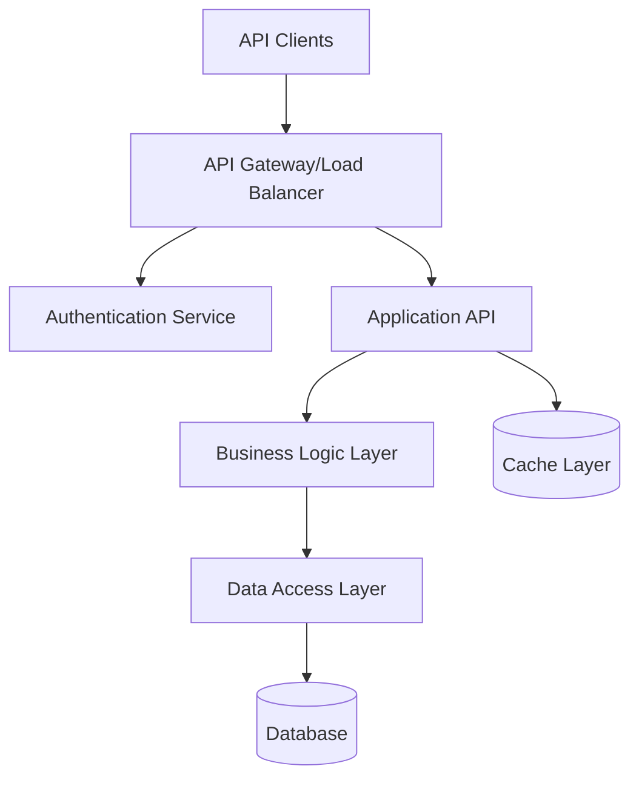

# Template Examples

## Introduction

This document provides practical, ready-to-use templates for different types of projects implementing spec-driven development with coding agents. Each template is optimized for specific project categories and includes complete examples of requirements.md, design.md, and implementation guidance.


**Template Categories**: Web Applications, APIs, Mobile Apps, Data Processing, E-commerce Systems
**Customization**: All templates include placeholders and guidance for project-specific adaptation
**AI Optimization**: Formatted for optimal consumption by Claude Code and GitHub Copilot


## Template Categories Overview

| Template Type | Best For | Complexity | Time to Customize |
|---------------|----------|------------|-------------------|
| **REST API Service** | Backend services, microservices | Medium | 30 minutes |
| **Full-Stack Web App** | Complete web applications | High | 60 minutes |
| **E-commerce Platform** | Online stores, marketplaces | High | 90 minutes |
| **Data Processing System** | ETL pipelines, analytics | Medium | 45 minutes |
| **Mobile Backend** | Mobile app backends | Medium | 45 minutes |

---

## Template 1: REST API Service

### Use Cases
- Microservices architecture components
- Backend APIs for web/mobile applications
- Integration services between systems
- Data processing APIs

### Project Brief Template

```markdown
# Project Brief: [API Service Name]

## Business Context
- **Service Purpose**: [Specific business capability this API provides]
- **Target Users**: [Primary consumers - internal services, external clients, mobile apps]
- **Business Value**: [Quantifiable business impact]
- **Integration Context**: [Systems this API connects or supports]

## Technical Context
- **Architecture**: RESTful API with [authentication type]
- **Data Storage**: [Database choice with rationale]
- **Deployment**: [Cloud platform and deployment strategy]
- **Performance**: [Request volume, response time requirements]

## Functional Scope
- **Core Operations**: [CRUD operations and business logic]
- **Integration Points**: [External systems to connect]
- **Data Processing**: [Data transformation requirements]
- **Business Rules**: [Key business logic constraints]

## Non-Functional Requirements
- **Performance**: [Concurrent users, response times]
- **Security**: [Authentication, authorization, compliance]
- **Reliability**: [Uptime, error handling, recovery]
- **Scalability**: [Growth expectations, scaling strategy]
```

### Requirements.md Template Structure

```markdown
# API Service Requirements: [Service Name]

## 1. Service Overview
**Purpose**: [Single sentence describing API's primary function]
**Business Value**: [Quantifiable business impact metrics]
**Primary Users**: [API consumers with usage patterns]

## 2. Functional Requirements

### 2.1 Core API Operations

#### Epic 1: [Core Entity] Management
**User Story 1.1**: CRUD Operations
- **As a** client application
- **I want** to perform CRUD operations on [entity]
- **So that** I can manage [business capability]

**API Endpoints Required**:
- `GET /api/[entities]` - List entities with filtering
- `GET /api/[entities]/{id}` - Get specific entity
- `POST /api/[entities]` - Create new entity
- `PUT /api/[entities]/{id}` - Update entity
- `DELETE /api/[entities]/{id}` - Delete entity

**Acceptance Criteria**:
- [ ] All endpoints return consistent response format
- [ ] List endpoint supports pagination (default 20 items)
- [ ] Create/Update endpoints validate required fields
- [ ] Delete operation includes confirmation mechanism
- [ ] All operations include proper error handling

### 2.2 Business Logic Implementation

#### Rule 2.1: [Business Rule Name]
**Description**: [Specific business rule]
**Implementation**: [How rule is enforced]
**Error Handling**: [What happens when rule is violated]

## 3. API Specifications

### 3.1 Authentication
**Method**: [JWT, API Keys, OAuth, etc.]
**Implementation**: [Specific authentication flow]
**Token Expiry**: [Token lifetime and refresh strategy]

### 3.2 Response Format Standard
```json
{
  "success": true,
  "data": {
    // Response payload
  },
  "meta": {
    "timestamp": "ISO-8601",
    "version": "API version"
  }
}
```

### 3.3 Error Response Standard
```json
{
  "success": false,
  "error": {
    "code": "ERROR_CODE",
    "message": "Human readable message",
    "details": {}
  }
}
```

## 4. Non-Functional Requirements

### 4.1 Performance Requirements
- **Response Time**: 95% of requests under [X]ms
- **Throughput**: Support [X] requests per second
- **Concurrent Users**: Support [X] simultaneous connections

### 4.2 Security Requirements
- **Authentication**: [Specific auth requirements]
- **Authorization**: [Role-based or permission-based access]
- **Data Protection**: [Encryption and privacy requirements]
- **Rate Limiting**: [Request throttling specifications]

### 4.3 Reliability Requirements
- **Uptime**: [Availability target percentage]
- **Error Rate**: [Acceptable error rate threshold]
- **Recovery**: [Disaster recovery requirements]
```

### Design.md Template Structure

```markdown
# API Service Design: [Service Name]

## 1. Architecture Overview

### System Architecture


### Technology Stack
- **Runtime**: [e.g., Node.js 18+, Python 3.11+]
- **Framework**: [e.g., Express.js, FastAPI, Spring Boot]
- **Database**: [e.g., PostgreSQL, MongoDB]
- **Cache**: [e.g., Redis, Memcached]
- **Authentication**: [e.g., JWT, Passport.js]

## 2. API Design

### 2.1 Endpoint Specifications

#### GET /api/[entities]
**Purpose**: Retrieve list of entities with optional filtering
**Authentication**: Required

**Query Parameters**:
- `page`: Page number (default: 1)
- `limit`: Items per page (default: 20, max: 100)
- `sortBy`: Sort field (default: createdAt)
- `sortOrder`: asc|desc (default: desc)
- `filter[field]`: Filter by field value

**Response Example**:
```json
{
  "success": true,
  "data": {
    "items": [
      {
        "id": "entity_123",
        "name": "Example Entity",
        "status": "active",
        "createdAt": "2025-01-19T10:30:00Z"
      }
    ],
    "pagination": {
      "page": 1,
      "limit": 20,
      "total": 150,
      "totalPages": 8
    }
  }
}
```

#### POST /api/[entities]
**Purpose**: Create new entity
**Authentication**: Required

**Request Body**:
```json
{
  "name": "string (required, 1-100 chars)",
  "description": "string (optional, max 500 chars)",
  "status": "string (enum: active|inactive, default: active)"
}
```

**Validation Rules**:
- Name must be unique within organization
- Description supports markdown formatting
- Status must be valid enum value

**Success Response** (201):
```json
{
  "success": true,
  "data": {
    "id": "entity_124",
    "name": "New Entity",
    "description": "Entity description",
    "status": "active",
    "createdAt": "2025-01-19T11:00:00Z",
    "updatedAt": "2025-01-19T11:00:00Z"
  }
}
```

## 3. Database Design

### Entity Schema
```sql
CREATE TABLE entities (
    id UUID PRIMARY KEY DEFAULT gen_random_uuid(),
    name VARCHAR(100) NOT NULL,
    description TEXT,
    status VARCHAR(20) DEFAULT 'active' CHECK (status IN ('active', 'inactive')),
    created_at TIMESTAMP WITH TIME ZONE DEFAULT NOW(),
    updated_at TIMESTAMP WITH TIME ZONE DEFAULT NOW(),
    UNIQUE(name)
);

CREATE INDEX idx_entities_status ON entities(status);
CREATE INDEX idx_entities_created_at ON entities(created_at);
```

## 4. Implementation Guidelines

### 4.1 Code Structure
```
src/
├── controllers/     # API endpoint handlers
├── services/        # Business logic
├── models/          # Data models
├── middleware/      # Authentication, validation
├── utils/           # Helper functions
└── tests/           # Test files
```

### 4.2 Error Handling Pattern
```javascript
// Standardized error handling for all endpoints
const handleAsyncRoute = (fn) => {
  return (req, res, next) => {
    Promise.resolve(fn(req, res, next)).catch(next);
  };
};

// Global error handler
app.use((error, req, res, next) => {
  const statusCode = error.statusCode || 500;
  const response = {
    success: false,
    error: {
      code: error.code || 'INTERNAL_ERROR',
      message: error.message || 'Internal server error',
      ...(error.details && { details: error.details })
    }
  };
  
  res.status(statusCode).json(response);
});
```
```

---

## Template 2: Full-Stack Web Application

### Use Cases
- Complete web applications with user interfaces
- Dashboard and admin panels
- Customer-facing web platforms
- Content management systems

### Project Brief Template

```markdown
# Project Brief: [Application Name]

## Business Context
- **Application Purpose**: [What this application accomplishes for users]
- **Target Users**: [Detailed user personas with roles and needs]
- **User Experience Goals**: [UX objectives and success criteria]
- **Business Metrics**: [KPIs and success measurements]

## Technical Context
- **Frontend Framework**: [React, Vue, Angular preference with rationale]
- **Backend Framework**: [API framework preference]
- **Database Strategy**: [Relational vs NoSQL choice and rationale]
- **Authentication**: [User authentication and session management]
- **Real-time Features**: [WebSocket, SSE requirements if applicable]

## Functional Scope
- **User Management**: [Registration, profiles, roles]
- **Core Features**: [Primary application functionality]
- **Content Management**: [Data creation, editing, management]
- **Reporting & Analytics**: [User insights and business intelligence]
- **Integration Requirements**: [Third-party services and APIs]

## User Experience Requirements
- **Responsive Design**: [Mobile-first, desktop optimization]
- **Accessibility**: [WCAG compliance level required]
- **Performance**: [Page load times, interactivity requirements]
- **Browser Support**: [Supported browser versions]
```

### Abbreviated Requirements Structure

```markdown
# Full-Stack Application Requirements: [App Name]

## 1. User Experience Requirements

### 1.1 User Registration and Authentication
**User Story 1.1**: Account Creation
- **As a** new user
- **I want** to create an account with email verification
- **So that** I can access the application securely

**Acceptance Criteria**:
- [ ] Email/password registration form with validation
- [ ] Email verification required before account activation
- [ ] Password strength requirements enforced
- [ ] Social login options available (Google, GitHub)
- [ ] Account recovery via email reset

### 1.2 User Interface Requirements
**Responsive Design**: Mobile-first approach supporting:
- Mobile phones (320px-768px)
- Tablets (768px-1024px)  
- Desktop (1024px+)

**Accessibility**: WCAG 2.1 AA compliance including:
- Keyboard navigation support
- Screen reader compatibility
- Color contrast ratios >4.5:1
- Focus indicators on interactive elements

## 2. Core Application Features

### 2.1 Dashboard and Navigation
**User Story 2.1**: Main Dashboard
- **As a** logged-in user
- **I want** a personalized dashboard showing key information
- **So that** I can quickly access relevant data and actions

**Dashboard Components**:
- [ ] Summary statistics relevant to user role
- [ ] Recent activity feed
- [ ] Quick action buttons for common tasks
- [ ] Navigation menu with role-based visibility
- [ ] Search functionality across application data

### 2.2 Data Management
**User Story 2.2**: [Core Entity] Management
- **As a** user with appropriate permissions
- **I want** to create, view, edit, and delete [entities]
- **So that** I can manage [business capability]

**Data Management Features**:
- [ ] Form-based data entry with validation
- [ ] List/grid view with sorting and filtering
- [ ] Bulk operations (select multiple, batch actions)
- [ ] Export functionality (CSV, PDF)
- [ ] Import capabilities with error handling

## 3. Technical Architecture Requirements

### 3.1 Frontend Architecture
**Framework**: React 18+ with TypeScript
**State Management**: Redux Toolkit or Context API
**UI Components**: Material-UI or similar component library
**Routing**: React Router with protected routes

### 3.2 Backend API Requirements
**Architecture**: RESTful API with GraphQL consideration
**Authentication**: JWT with refresh token strategy
**File Upload**: Support for images and documents up to 10MB
**Real-time Updates**: WebSocket connections for live data updates

### 3.3 Database Design
**Primary Database**: PostgreSQL for transactional data
**Caching Layer**: Redis for session management and caching
**File Storage**: AWS S3 or equivalent for user uploads
**Search**: Elasticsearch for full-text search capabilities
```

---

## Template 3: E-commerce Platform

### Project Brief Template

```markdown
# Project Brief: E-commerce Platform

## Business Context
- **Platform Purpose**: [B2B, B2C, marketplace, niche market]
- **Target Market**: [Customer demographics, buying behaviors]
- **Business Model**: [Revenue streams, commission structure]
- **Competitive Advantage**: [Unique value proposition]

## E-commerce Requirements
- **Product Catalog**: [Product types, categories, variations]
- **Inventory Management**: [Stock tracking, multi-location, suppliers]
- **Order Processing**: [Order flow, fulfillment, shipping]
- **Payment Processing**: [Payment methods, currencies, tax handling]
- **Customer Management**: [Accounts, loyalty, support]

## Integration Requirements
- **Payment Gateways**: [Stripe, PayPal, regional processors]
- **Shipping Providers**: [FedEx, UPS, postal services]
- **Inventory Systems**: [ERP integration, supplier APIs]
- **Marketing Tools**: [Email marketing, analytics, social media]

## Compliance Requirements
- **PCI DSS**: [Payment card data security compliance]
- **GDPR/Privacy**: [Data protection and privacy regulations]
- **Tax Compliance**: [Sales tax, VAT, international tax]
- **Accessibility**: [ADA compliance for inclusive access]
```

### Key Requirements Sections

```markdown
## E-commerce Core Features

### Product Management
**User Story**: Product Catalog Management
- **As a** store administrator
- **I want** to manage product listings with variants and inventory
- **So that** customers can browse and purchase available products

**Features Required**:
- [ ] Product CRUD with images, descriptions, specifications
- [ ] Product variants (size, color, style) with separate inventory
- [ ] Category and tag management with hierarchical structure
- [ ] Inventory tracking with low-stock alerts
- [ ] Product reviews and ratings system
- [ ] SEO optimization (meta tags, URLs, sitemaps)

### Shopping Cart and Checkout
**User Story**: Seamless Purchase Experience
- **As a** customer
- **I want** a streamlined cart and checkout process
- **So that** I can complete purchases quickly and securely

**Checkout Requirements**:
- [ ] Persistent cart across sessions for logged-in users
- [ ] Guest checkout option without forced registration
- [ ] Multiple payment methods (credit cards, PayPal, digital wallets)
- [ ] Real-time shipping calculation based on location
- [ ] Tax calculation with regional compliance
- [ ] Order confirmation and email receipts

### Order Management
**User Story**: Order Processing and Fulfillment
- **As a** store administrator
- **I want** to efficiently process and fulfill customer orders
- **So that** customers receive their products promptly

**Order Processing Features**:
- [ ] Order status tracking (pending, processing, shipped, delivered)
- [ ] Inventory reservation during checkout process
- [ ] Automated shipping label generation
- [ ] Return and refund processing
- [ ] Customer communication automation
- [ ] Analytics and reporting dashboard
```

---

## Template 4: Data Processing System

### Use Cases
- ETL (Extract, Transform, Load) pipelines
- Data analytics and reporting systems
- Real-time data processing
- Data integration between systems

### Project Brief Template

```markdown
# Project Brief: Data Processing System

## Business Context
- **Data Purpose**: [What business decisions this data supports]
- **Data Sources**: [Systems, APIs, files providing data]
- **Data Consumers**: [Who uses the processed data and how]
- **Processing Requirements**: [Real-time vs batch, frequency]

## Technical Context
- **Data Volume**: [Expected data volumes and growth]
- **Processing Pattern**: [ETL, ELT, streaming, micro-batch]
- **Technology Preferences**: [Big data tools, cloud services]
- **Performance Requirements**: [Processing speed, latency targets]

## Data Flow Requirements
- **Ingestion**: [How data enters the system]
- **Transformation**: [Data cleaning, enrichment, aggregation]
- **Storage**: [Data warehouse, lake, operational databases]
- **Output**: [APIs, files, dashboards, alerts]

## Quality and Governance
- **Data Quality**: [Validation, cleansing, monitoring]
- **Security**: [Encryption, access control, audit trails]
- **Compliance**: [GDPR, HIPAA, industry regulations]
- **Monitoring**: [Error handling, alerting, observability]
```

---

## Template 5: Mobile Backend

### Use Cases
- Backend services for mobile applications
- API-first mobile development
- Push notification services
- Mobile-specific authentication and security

### Project Brief Template

```markdown
# Project Brief: Mobile Backend Service

## Mobile Context
- **App Platform**: [iOS, Android, React Native, Flutter]
- **User Base**: [Expected users, growth projections]
- **Usage Patterns**: [Online/offline usage, data sync needs]
- **Device Considerations**: [Storage, bandwidth, battery optimization]

## Backend Services Required
- **User Management**: [Registration, authentication, profiles]
- **Data Synchronization**: [Offline-first, conflict resolution]
- **Push Notifications**: [Targeted messaging, user engagement]
- **File Management**: [Image uploads, document handling]
- **Analytics**: [User behavior, app performance metrics]

## Mobile-Specific Requirements
- **Offline Support**: [Data caching, sync strategies]
- **Performance**: [Low latency, minimal data usage]
- **Security**: [Mobile-specific threats, certificate pinning]
- **Scalability**: [Handling mobile traffic patterns]
```

## Template Selection Guide

### Decision Matrix

| Project Type | User Interface | Data Complexity | Integration Needs | Recommended Template |
|--------------|---------------|-----------------|-------------------|---------------------|
| Internal Tool | Simple Admin | Low-Medium | Few Systems | REST API Service |
| Customer Portal | Rich Web UI | Medium | Multiple Systems | Full-Stack Web App |
| Online Store | E-commerce UI | High | Many Integrations | E-commerce Platform |
| Analytics Platform | Dashboard | Very High | Data Sources | Data Processing System |
| Mobile App Backend | Mobile Focused | Medium | Push/Social | Mobile Backend |

### Customization Guidelines

#### Step 1: Template Selection
1. Identify primary use case and user interface needs
2. Assess data complexity and processing requirements
3. Evaluate integration and third-party service needs
4. Select closest matching template from options above

#### Step 2: Project Brief Customization
1. Replace all [bracketed placeholders] with project-specific information
2. Add project-specific business context and requirements
3. Modify technology stack based on team expertise and infrastructure
4. Adjust scope and timeline based on project constraints

#### Step 3: Requirements Adaptation
1. Customize user stories to match actual user personas
2. Modify acceptance criteria for project-specific business rules
3. Adjust non-functional requirements for project scale
4. Add project-specific integration and compliance requirements

#### Step 4: AI Agent Optimization
1. Ensure all business rules are clearly articulated
2. Add specific examples for complex business logic
3. Include comprehensive error handling scenarios
4. Provide implementation guidance for coding agents

## Template Usage with Coding Agents

### Claude Code Instructions

When using templates with Claude Code:

```markdown
Use the [Template Type] template as a starting point to create comprehensive specifications for:

[Your Project Brief]

Customize the template by:
1. Replacing all placeholder content with project-specific information
2. Adding additional user stories that match the specific business requirements
3. Enhancing API specifications with project-specific endpoints and data models
4. Including integration requirements with the specific third-party services mentioned
5. Adjusting non-functional requirements to match the scale and performance needs

Ensure the final specifications are optimized for GitHub Copilot implementation by including:
- Specific code examples and patterns
- Clear implementation guidance
- Comprehensive error handling scenarios
- Traceability between requirements and design elements
```

### GitHub Copilot Integration

Templates include standardized comment patterns for optimal GitHub Copilot integration:

```javascript
/**
 * [Feature Name] Implementation
 * 
 * Template: [Template Type] - Section [X.X]
 * Requirements: requirements.md User Story [X.X]
 * Design: design.md Section [X.X]
 * 
 * Business Rules:
 * - [Rule 1 from template]
 * - [Rule 2 from template]
 * 
 * Implementation Notes:
 * - [Template-specific implementation guidance]
 * - [Error handling patterns from template]
 */
```

## Navigation

← [Coding Agents Workflow](coding-agents-workflow.md) | [Implementation Best Practices →](implementation-best-practices.md)

---

*Template Examples | Ready-to-Use Specifications for Common Project Types*