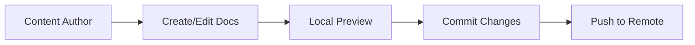
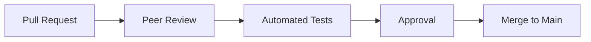
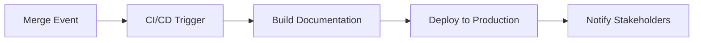

# Documentation as Code Fundamentals

## What is Documentation as Code?

Documentation as Code (DaC) is a methodology that applies software development practices to documentation creation and maintenance. It treats documentation with the same level of importance and rigor as source code, using version control, automated testing, and continuous integration/continuous deployment (CI/CD) practices.

## Core Principles

### 1. Version Control Integration
Documentation lives alongside code in version control systems (Git), ensuring:
- **Change tracking**: Every modification is recorded with author and timestamp
- **Branching strategies**: Feature branches for documentation changes
- **Merge reviews**: Peer review process for documentation updates
- **Release synchronization**: Documentation versions align with software releases

### 2. Collaborative Workflows
- **Pull/Merge requests** for documentation changes
- **Issue tracking** for documentation bugs and improvements
- **Team collaboration** through comments and reviews
- **Automated notifications** for stakeholder updates

### 3. Automation & Integration
- **Automated builds** generate updated documentation sites
- **Testing pipelines** validate links, spelling, and formatting
- **Deployment automation** publishes changes without manual intervention
- **Integration hooks** trigger updates from code changes

### 4. Single Source of Truth
- **Centralized repository** eliminates documentation silos
- **Cross-references** maintain consistency across documents
- **API documentation** generated directly from code annotations
- **Consistent formatting** through templates and style guides

## Benefits for EdTech Businesses

### Content Management Advantages
- **Rapid content updates** for curriculum changes and exam updates
- **Multi-author collaboration** for subject matter experts
- **Content versioning** to track educational material evolution
- **Quality assurance** through peer review processes

### Business Scalability
- **Reduced maintenance costs** through automation
- **Faster onboarding** with consistent documentation practices
- **Improved user experience** through up-to-date content
- **Better SEO performance** with automated sitemap generation

### Remote Team Benefits
- **Asynchronous collaboration** across different time zones (AU/UK/US)
- **Clear change attribution** for accountability
- **Reduced communication overhead** through self-documenting processes
- **Standardized workflows** regardless of geographical location

## Documentation as Code Workflow

### 1. Content Creation Phase


### 2. Review & Approval Phase


### 3. Publication Phase


## Technical Implementation Models

### Model 1: Git-Centric Approach
**Tools**: GitBook, Docusaurus, Sphinx + GitHub/GitLab
- Documentation files stored in Git repositories
- Markdown/reStructuredText as primary format
- Static site generators for publication
- CI/CD pipelines for automated deployment

### Model 2: Hybrid SaaS Approach
**Tools**: GitBook + Git integration, Notion API + Git sync
- SaaS platform for ease of use
- Git integration for developer workflows
- API-driven content synchronization
- Balance between usability and technical control

### Model 3: API-First Approach
**Tools**: Headless CMS + Static site generators
- Content managed through APIs
- Multiple output formats (web, PDF, mobile)
- Programmatic content generation
- Advanced personalization capabilities

## Content Formats & Standards

### Markdown Advantages
- **Universal format** supported by all major platforms
- **Human-readable** source format
- **Version control friendly** with clear diff visualization
- **Extensible** with custom syntax and plugins

### reStructuredText (Sphinx)
- **Advanced formatting** capabilities
- **Citation support** for academic content
- **Cross-reference system** for complex documentation
- **LaTeX integration** for mathematical content

### MDX (Docusaurus)
- **React component integration** for interactive content
- **Dynamic content generation** through JavaScript
- **Custom widget support** for specialized educational tools
- **Responsive design** components

## Quality Assurance Practices

### Automated Testing
```yaml
# Example CI/CD testing pipeline
documentation_tests:
  - link_checker: Validate all internal and external links
  - spell_checker: Automated spelling and grammar validation
  - style_guide: Enforce consistent formatting and style
  - accessibility: Check for WCAG compliance
  - performance: Monitor page load times and optimization
```

### Content Governance
- **Style guides** for consistent voice and formatting
- **Review templates** for systematic content evaluation
- **Update schedules** for regular content maintenance
- **Metrics tracking** for usage and engagement analysis

## Integration Patterns

### Code-to-Documentation Sync
```javascript
// Example: API documentation generation
/**
 * @api {post} /api/exams Create Exam
 * @apiName CreateExam
 * @apiGroup Exams
 * @apiDescription Creates a new licensure exam
 * @apiParam {String} title Exam title
 * @apiParam {String} category Exam category (nursing, engineering, etc.)
 */
app.post('/api/exams', createExam);
```

### Documentation-to-Code Sync
```yaml
# OpenAPI specification driving both docs and code generation
openapi: 3.0.0
info:
  title: Philippine Licensure Exam API
  version: 1.0.0
paths:
  /exams:
    post:
      summary: Create new exam
      # Documentation and code generated from this spec
```

## Common Implementation Challenges

### Technical Challenges
- **Learning curve** for non-technical content creators
- **Complex build pipelines** requiring DevOps expertise
- **Integration complexity** with existing systems
- **Performance optimization** for large documentation sites

### Organizational Challenges
- **Cultural resistance** to new workflows
- **Training requirements** for team adoption
- **Process standardization** across departments
- **Maintenance overhead** for automation systems

### Solutions & Mitigation Strategies
- **Gradual adoption** starting with pilot projects
- **Comprehensive training** programs for team members
- **Template standardization** to reduce complexity
- **Vendor support** for managed solutions when appropriate

## Philippine EdTech Context Considerations

### Language & Localization
- **Multi-language support** for English/Tagalog content
- **Cultural adaptation** of educational materials
- **Regional exam variations** across different provinces
- **Accessibility compliance** for diverse user needs

### Technical Infrastructure
- **CDN optimization** for Philippine internet infrastructure
- **Mobile-first approach** for smartphone-prevalent market
- **Offline capability** for areas with limited connectivity
- **Progressive web app** features for app-like experience

### Regulatory Compliance
- **Data Privacy Act** compliance for user data
- **Educational content standards** alignment
- **Professional licensing** requirement documentation
- **Audit trail maintenance** for regulatory reporting

---

## Navigation

⬅️ **Previous**: [Executive Summary](./executive-summary.md)
➡️ **Next**: [GitBook Platform Analysis](./gitbook-platform-analysis.md)

### Related Topics
- 📊 [Comparison Analysis](./comparison-analysis.md)
- 🛠️ [Implementation Guide](./implementation-guide.md)
- 📈 [Best Practices](./best-practices.md)
- 🏫 [EdTech Business Considerations](./edtech-business-considerations.md)